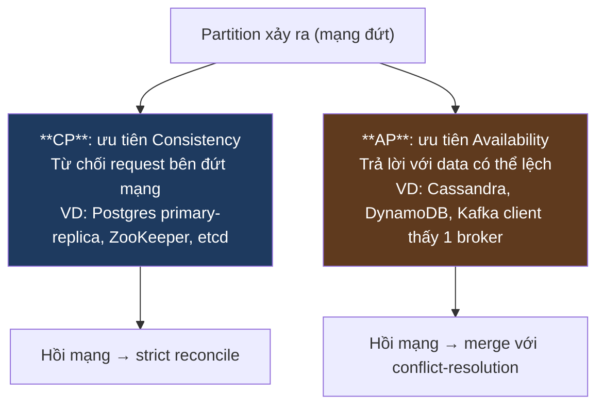
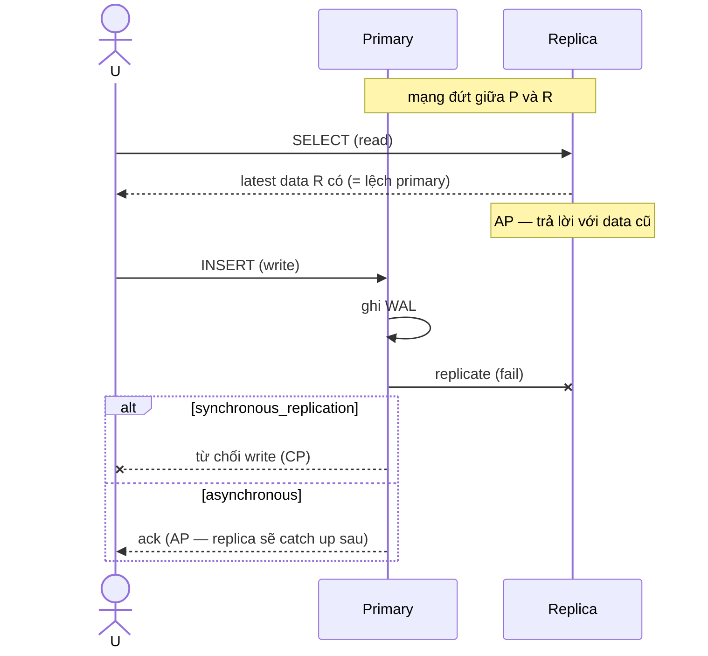

# KU 01/07 — CAP theorem: chọn 2 trong 3

> Khi mạng tách (partition), bạn buộc phải chọn: hoặc đợi (consistency) hoặc trả lời (availability). Bạn không thể có cả hai. Đó là CAP.

**Module:** [01 — Foundations](./README.md)
**Đọc trong:** ~10 phút

---

## 🎯 Nó là gì?

Bạn có **3 chi nhánh quán bún** ở Q1, Q3, Q7. Mỗi chi nhánh có sổ ghi doanh thu, đồng bộ qua app cloud.

**Một ngày mạng hỏng** — Q3 mất kết nối với Q1 và Q7.

Khách đến Q3 hỏi: "Bây giờ tổng doanh thu hôm nay 3 quán là bao nhiêu?"

Q3 có 2 lựa chọn:

- **Trả lời ngay** (Availability): nói số mình biết riêng Q3, không có Q1/Q7. **Nhưng số này không nhất quán** với 2 chi nhánh kia.
- **Đợi mạng hồi** (Consistency): không trả lời cho đến khi đồng bộ được với Q1/Q7. **Khách phải đợi**.

Bạn KHÔNG thể vừa "trả lời ngay" vừa "số đúng tuyệt đối" trong khi mạng đứt. Đó là **CAP theorem**.

> *Định nghĩa hàn lâm:* Trong hệ phân tán, khi network partition (P) xảy ra, hệ thống **chỉ có thể chọn 1 trong 2**: Consistency (C: mọi node thấy data như nhau) hoặc Availability (A: mọi request được trả lời).

---

## 💡 Nó làm được gì?

CAP **không phải** công thức tính. Nó là **lăng kính** để bạn phân loại system:

- **CP** (Consistency + Partition tolerance): khi mất kết nối → từ chối request thay vì trả lời sai. Ví dụ: traditional RDB với strict consistency, ZooKeeper, etcd.
- **AP** (Availability + Partition tolerance): khi mất kết nối → vẫn trả lời, chấp nhận có thể "lệch" tạm. Ví dụ: Cassandra mặc định, DynamoDB, Riak.
- **CA**: chỉ tồn tại khi **không bao giờ có partition** — tức là single-node hoặc cluster cùng switch không bao giờ chia. Trong distributed thực, CA không tồn tại.

---

## 🧩 Nó là mảnh ghép nào trong tổng thể?

---

## 🚀 Nó giúp ích gì?

Khi chọn tool, hỏi: **system này CP hay AP?**

| Tool | CAP class | Lý do |
|---|---|---|
| Kafka / Redpanda | Tunable AP/CP | `acks=all + min.insync.replicas` = CP-ish |
| Postgres primary | CP | Primary down → no writes |
| Postgres read replica | AP (đọc) | Replica trả lời dù primary down |
| Cassandra | AP default | LWW |
| ZooKeeper, etcd | CP | Coordination yêu cầu C |
| MinIO | tunable | erasure coding + quorum |
| ClickHouse | AP | Trả lời với latest seen |
| DynamoDB | AP default | Eventual; `ConsistentRead=true` đổi CP |

→ **Không có "tốt nhất"** — đúng cho use case mới là tốt.

---

## ⏰ Khi nào dùng / KHÔNG dùng?

| Use case | Chọn |
|---|---|
| Số dư ngân hàng | CP (thà từ chối còn hơn trả sai) |
| Order ID generation | CP |
| Authentication / lock | CP (etcd, ZK) |
| Feed mạng xã hội | AP (thà thấy bài cũ còn hơn trắng trang) |
| Shopping cart | AP (merge conflict ở checkout) |
| Search index | AP |
| IoT telemetry | AP |
| Lakehouse offline batch | AP (consistency đạt cuối ngày) |

---

## 🤔 Vì sao chọn nó (vs alternatives)?

CAP là **mô hình đơn giản hoá**. Các mô hình tinh tế hơn:

| Mô hình | Nói gì thêm |
|---|---|
| **CAP** (cái này) | Phân loại C/A khi P |
| **PACELC** | Khi không P: chọn giữa Latency và Consistency. Nghĩa là "tuning consistency vs latency luôn luôn", không chỉ khi partition. |
| **Harvest & Yield** | Harvest = % data trả về; Yield = % request thành công. Hệ thống có thể trade hai trục. |

→ **PACELC** thực tế hơn CAP. Câu trả lời "MongoDB là CP hay AP?" thực ra phụ thuộc readConcern + writeConcern config.

---

## 🔧 Nó vận hành ra sao?

### Kịch bản partition trong Postgres primary-replica

→ **Config quyết định** Postgres là CP hay AP. Đây là pattern "tunable consistency".

### Trong Kafka

`acks=all` + `min.insync.replicas=2`: producer chỉ ack khi 2 replica đồng bộ. Mất 2 replica → produce fail → **CP behavior**.

`acks=1`: ack ngay khi leader nhận. Mất leader sau ack → mất data → **AP behavior**.

→ Project này dùng `acks=all` mặc định cho durability.

---

## 🧠 Self-test

1. CAP theorem không phải lựa chọn 2 trong 3. Vậy phát biểu chính xác là gì?
2. "MongoDB là CP" — câu này đúng hay sai? Vì sao tinh tế hơn cần PACELC?
3. Quán bún 3 chi nhánh mất kết nối — bạn là chủ → ưu tiên Availability hay Consistency? Tại sao?
4. Postgres primary chỉ ack write khi cả replica đồng bộ. Latency cao hơn nhưng được gì?
5. ZooKeeper là CP — vì sao K8s, Kafka cũ, Hadoop đều cần coordination service CP, không thể AP?

---

## 🔗 Trong repo này

- Topic catalog có `acks=all` (CP-leaning): [`docs/06-event-backbone.md`](../../docs/06-event-backbone.md)
- CDC từ Postgres dùng async replication (AP): [`docs/07-cdc-design.md`](../../docs/07-cdc-design.md)
- Burst test với 3-broker Redpanda test CP under partition: [`docs/18-benchmark-strategy.md`](../../docs/18-benchmark-strategy.md)

---

## 📖 Đọc thêm (chính thống, hạn chế)

- Eric Brewer — "CAP Twelve Years Later" (2012) — bản update của ông tổ CAP.
- Daniel Abadi — "Consistency Tradeoffs in Modern Distributed Database System Design" (PACELC paper).
