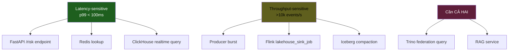
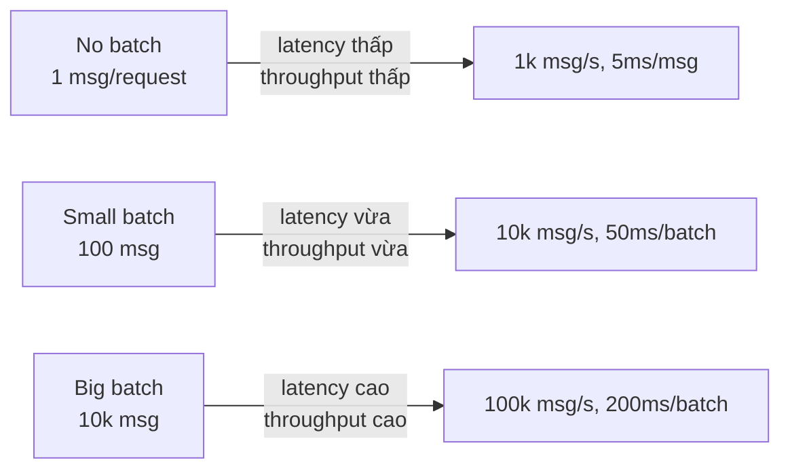
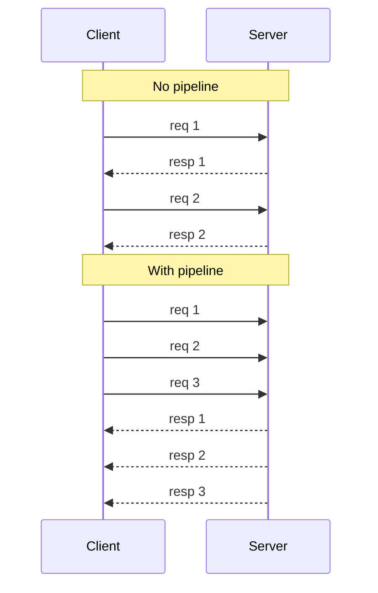

# KU 01/08 — Latency vs Throughput: tốc độ vs khối lượng

> Xe đạp nhanh tới đích (latency thấp). Xe tải chở được nhiều (throughput cao). Khác nhau hoàn toàn. Hệ thống tốt cho 1 chưa chắc tốt cho 2.

**Module:** [01 — Foundations](./README.md)
**Đọc trong:** ~8 phút

---

## 🎯 Nó là gì?

Bạn cần chuyển 100kg gạo từ chợ về nhà 1km.

- **Xe đạp:** đi 1 chuyến mất 5 phút, chở 10kg → 10 chuyến = 50 phút. **Latency 5 phút/chuyến**, **throughput 100kg/50min = 2kg/min**.
- **Xe tải:** đi 1 chuyến mất 15 phút (đường vào nhỏ phải đi vòng), chở 200kg. **Latency 15 phút**, **throughput 100kg/15min ≈ 6.7kg/min**.

Xe tải **chậm hơn 1 chuyến** nhưng **chở nhiều hơn về tổng thể**.

Đó là **latency vs throughput**:
- **Latency** = thời gian 1 request hoàn thành (1 chuyến).
- **Throughput** = số request / giây (tổng kg/phút).

> *Định nghĩa hàn lâm:* Latency là thời gian end-to-end của 1 operation. Throughput là số operation hoàn thành per unit time. 2 metric độc lập — system có thể tối ưu 1 mà hi sinh cái kia.

---

## 💡 Nó làm được gì?

Hiểu khác biệt giúp:

- **Đọc benchmark đúng:** "Kafka làm 1M msg/s" — đó là throughput. "p99 latency 5ms" — đó là latency.
- **Hiểu trade-off:** tăng batch size → throughput tăng, latency tăng (chờ batch đầy).
- **Chọn tool đúng:** real-time fraud detection cần latency thấp; ETL daily cần throughput cao.
- **Hiểu vì sao "nhanh" không đủ.** Phải hỏi "nhanh ở khía cạnh nào?"

---

## 🧩 Nó là mảnh ghép nào trong tổng thể?



→ Chia đúng workload → tuning đúng tool → đỡ phí tài nguyên.

---

## 🚀 Nó giúp ích gì?

**Không phân biệt** → bạn tối ưu sai:
- "Kafka chậm quá!" → tăng `linger.ms` (gom batch) → throughput tăng nhưng latency tăng → realtime API bị chậm.
- "API /risk chậm" → cache nhiều → latency giảm nhưng cache invalidation phức tạp.

**Phân biệt** → bạn tối ưu trục đúng:
- Producer burst → tăng `batch.size`, `linger.ms` → throughput tăng (latency 1 record không quan trọng).
- API /risk → cache Redis 60s + ClickHouse mat. view → latency p99 < 100ms (throughput đủ).

---

## ⏰ Khi nào ưu tiên cái nào?

| Workload | Ưu tiên |
|---|---|
| Trading, fraud realtime | Latency |
| User-facing API | Latency |
| ETL hàng giờ | Throughput |
| Backfill historical | Throughput |
| Streaming continuous (Flink) | Cân bằng — tùy use case |
| Compaction job | Throughput |
| Search query | Latency |
| Log ingestion | Throughput |

---

## 🤔 Vì sao chọn nó (vs alternatives)?

Latency 1 giá trị p50 không đủ. Phải nhìn **distribution**:

| Percentile | Ý nghĩa |
|---|---|
| **p50** (median) | 50% request nhanh hơn giá trị này |
| **p95** | 95% request nhanh hơn |
| **p99** | 99% nhanh hơn |
| **p99.9** | 99.9% nhanh hơn |

→ p50 đẹp nhưng p99 xấu = **1% user trải nghiệm tệ**. Senior nhìn p95/p99, không nhìn average.

---

## 🔧 Nó vận hành ra sao?

### Little's Law

Một định luật queue cổ điển:

```
Throughput × Latency = số request đang xử lý (concurrency)
```

Ví dụ: throughput = 1000 req/s, latency = 50ms/req → concurrency = 1000 × 0.05 = 50 request đồng thời trong hệ thống.

→ Nếu pool connection chỉ 30 → throttle, không thể đạt 1000 req/s.

### Batching trade-off



Kafka producer: `linger.ms` + `batch.size` chính là tuning điểm này.

### Pipelining

Gửi nhiều request **không đợi response** từng cái. Tăng throughput không tăng latency từng request:



HTTP/2, Kafka producer-batching, Redis pipelining đều dùng kỹ thuật này.

---

## 🧠 Self-test

1. Xe đạp 5'/chuyến/10kg vs xe tải 15'/chuyến/200kg. Hệ nào latency thấp hơn? Hệ nào throughput cao hơn?
2. Kafka producer `linger.ms=20`: client đợi 20ms gom batch rồi gửi. Ảnh hưởng latency vs throughput thế nào?
3. p50 = 5ms, p99 = 800ms. Hệ thống "nhanh" hay "chậm"? Vì sao senior nhìn p99 không nhìn p50?
4. Throughput = 5000 req/s, latency = 100ms. Concurrency tối thiểu là bao nhiêu? (Little's Law)
5. Trong project này, Flink `lakehouse_sink_job` ưu tiên latency hay throughput? `/risk/customer/{id}` API thì sao?

---

## 🔗 Trong repo này

- p95 latency targets: [`docs/11-serving-layer.md`](../../docs/11-serving-layer.md)
- Burst test 1000 eps đo throughput recovery: [`docs/18-benchmark-strategy.md`](../../docs/18-benchmark-strategy.md)
- Grafana dashboard có p50/p95/p99 panels: [`observability/grafana/dashboards/api.json`](../../observability/) (Phase 9)

---

## 📖 Đọc thêm (chính thống, hạn chế)

- Gil Tene — "How NOT to Measure Latency" (talk + slides) — coordinated omission trap.
- Brendan Gregg — "USE Method" — kết hợp utilization + saturation + errors.
