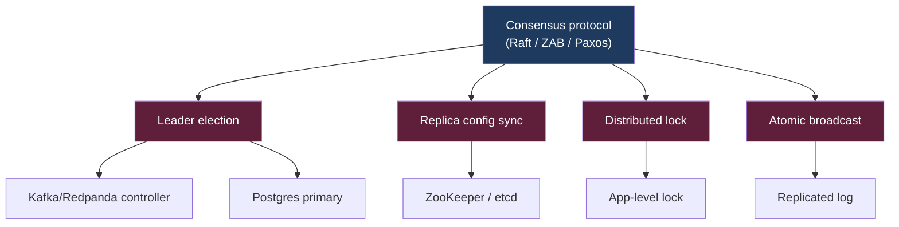
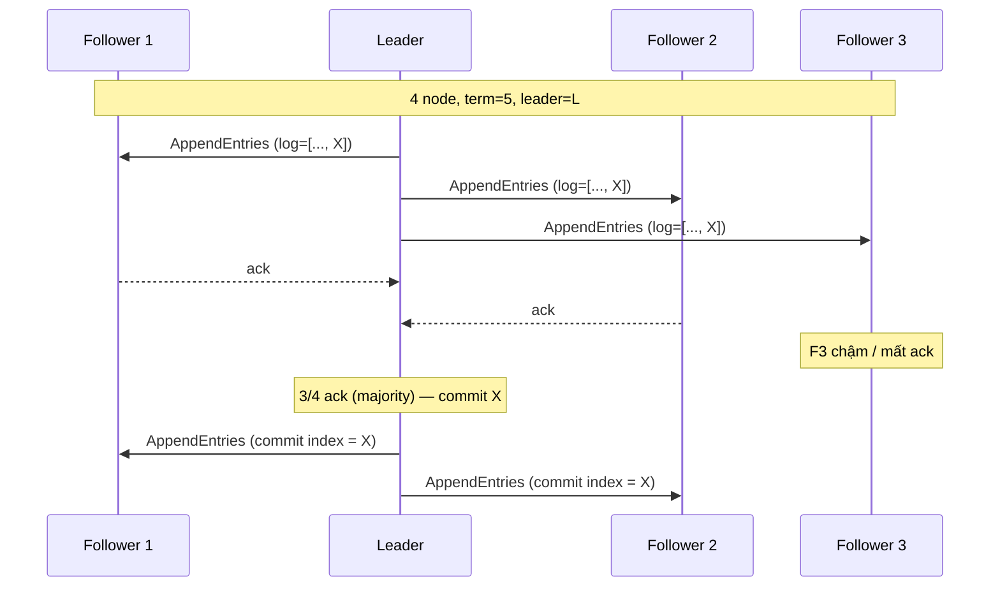
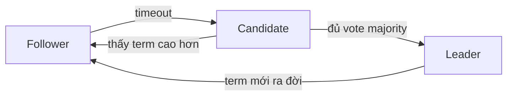

# KU 01/09 — Consensus: bỏ phiếu trong nhóm

> 5 người bạn quyết định đi ăn ở đâu. Mỗi người 1 ý. Phải đồng thuận — đó là consensus. Trong distributed system, consensus là **cách nhiều node đồng ý 1 quyết định** dù mạng chậm, dù vài node chết.

**Module:** [01 — Foundations](./README.md)
**Đọc trong:** ~10 phút

---

## 🎯 Nó là gì?

5 người bạn đứng giữa phố quyết định đi đâu ăn.

- **Cách 1 — chủ tịch quyết:** anh trưởng nhóm chỉ "đi quán A". Nhanh nhưng nếu anh ấy đi vệ sinh không trả lời → mọi người đứng đợi.
- **Cách 2 — bỏ phiếu majority:** mỗi người đề xuất 1 quán, ai được > 50% phiếu thắng. Cần 3/5 phiếu đồng ý → bền hơn (1 người vắng vẫn quyết được).

Trong distributed system:
- Cách 1 ≈ **leader-based** (Raft, ZAB của ZooKeeper).
- Cách 2 ≈ **quorum-based**.

> *Định nghĩa hàn lâm:* Consensus là vấn đề khiến tập hợp các node đồng ý về 1 giá trị duy nhất, dù có **f node failure** (f < N/2). Các thuật toán phổ biến: Paxos, Raft, ZAB, PBFT.

---

## 💡 Nó làm được gì?

Consensus là **nền tảng** cho:

- **Leader election:** chọn 1 node làm "trưởng" (Kafka controller, Postgres primary trong patroni).
- **Distributed lock:** đảm bảo chỉ 1 node làm 1 việc tại 1 thời điểm.
- **Configuration store:** etcd, ZooKeeper lưu config cho cả cluster.
- **Atomic broadcast:** mọi replica nhận message cùng thứ tự.
- **Transaction commit:** 2-phase commit, Spanner-style.

Trong project này:
- **Redpanda Raft:** mỗi partition có 1 leader, replicas đồng thuận qua Raft.
- **Postgres replica failover** (production): patroni dùng etcd consensus.
- **Flink JobManager HA** (production): dùng ZooKeeper hoặc K8s lease.

---

## 🧩 Nó là mảnh ghép nào trong tổng thể?

→ Consensus là **lớp móng** cho coordination. Mọi distributed system production-grade đều dựa lên.

---

## 🚀 Nó giúp ích gì?

**Không** consensus:
- 2 node cùng nghĩ mình là leader → split-brain → ghi data conflict.
- Replica lệch nhau → reconciliation đau.
- 1 node down → không biết bầu ai thay → manual intervention.

**Có** consensus:
- 1 leader duy nhất tại mọi thời điểm (trừ window chuyển giao ngắn).
- Replica state đồng bộ chặt.
- Failover tự động trong vài giây.

---

## ⏰ Khi nào dùng / KHÔNG dùng?

| Tình huống | Có cần consensus? |
|---|---|
| Choose primary DB | Có |
| Distributed lock cho job daily | Có (etcd, Redis Redlock dù Redlock có tranh cãi) |
| Kafka partition leader | Có (Raft built-in) |
| Eventual consistency OK | Không (CRDT, gossip thay thế) |
| Stateless service scaling | Không |

Consensus đắt — đừng dùng khi không cần. Ví dụ: chỉ là cache → eventual consistency đủ.

---

## 🤔 Vì sao chọn nó (vs alternatives)?

| Thuật toán | Năm | Đặc điểm | Dùng ở |
|---|---:|---|---|
| **Paxos** | 1989 | Khó hiểu, mạnh | Spanner, Megastore |
| **Raft** | 2014 | Dễ hiểu hơn Paxos, leader-based | etcd, Redpanda, Consul |
| **ZAB** | 2008 | Raft-like, dùng cho ZooKeeper | ZooKeeper |
| **PBFT** | 1999 | Chịu được Byzantine | Permissioned blockchain |
| **Gossip / CRDT** | — | Không phải consensus thực sự, eventual | Cassandra, Riak |

→ Modern: Raft thắng vì dễ implement + dễ debug.

---

## 🔧 Nó vận hành ra sao?

### Raft cơ bản (đơn giản hoá)

**Key idea:**
- Cần **majority** (N/2 + 1) ack mới commit.
- Cluster 5 node → chịu được mất 2 node, vẫn quorum.
- Cluster 3 node → chịu được mất 1 node.
- Cluster 4 node? → vẫn cần 3 = same as 5 nhưng kém hiệu quả → **odd number tốt hơn**.

### Term + leader election

Mỗi node có **term** (kỳ). Khi follower không nhận heartbeat từ leader → tự promote candidate → tăng term → request vote. Node khác vote nếu term cao hơn term mình.

### Split-brain prevention

Cluster bị partition 3-2. Bên 3 vẫn có majority → bầu được leader, hoạt động bình thường. Bên 2 không đủ majority → **không bầu được leader → không write được**. → Khi mạng hồi, bên 2 join lại, sync từ leader.

→ Đây là lý do **odd number của node** (3, 5, 7). Bên 2 vs 2 → cả 2 không majority → cluster đứng hình.

---

## 🧠 Self-test

1. Cluster Raft 5 node. Mất bao nhiêu node thì cluster còn hoạt động? Mất N+1 thì sao?
2. Vì sao "odd number" được khuyến nghị cho consensus cluster? 4 node có gì xấu?
3. Hai node trong cluster cùng nghĩ mình là leader. Đây gọi là gì? Raft phòng chống bằng cơ chế gì?
4. CAP theorem: Raft cluster là CP. Khi partition xảy ra với bên thiểu số — bên đó respond hay đứng hình?
5. Gossip protocol (Cassandra) **không** dùng consensus. Vậy nó đảm bảo gì? (Gợi ý: eventual).

---

## 🔗 Trong repo này

- Redpanda dùng Raft cho mỗi partition (built-in, không cần ZK): [`adr/0002-redpanda-over-kafka.md`](../../adr/0002-redpanda-over-kafka.md)
- Chaos N5 spine-down test ECMP fallback, **không phải** consensus test: [`docs/17-network-failure-storyline.md`](../../docs/17-network-failure-storyline.md)
- Burst 3-broker test ISR semantics (subset của consensus): [`docs/18-benchmark-strategy.md`](../../docs/18-benchmark-strategy.md)

---

## 📖 Đọc thêm (chính thống, hạn chế)

- Diego Ongaro — "In Search of an Understandable Consensus Algorithm" (Raft paper, 2014).
- "Raft visualization" (raft.github.io) — animation tương tác cực hay.
