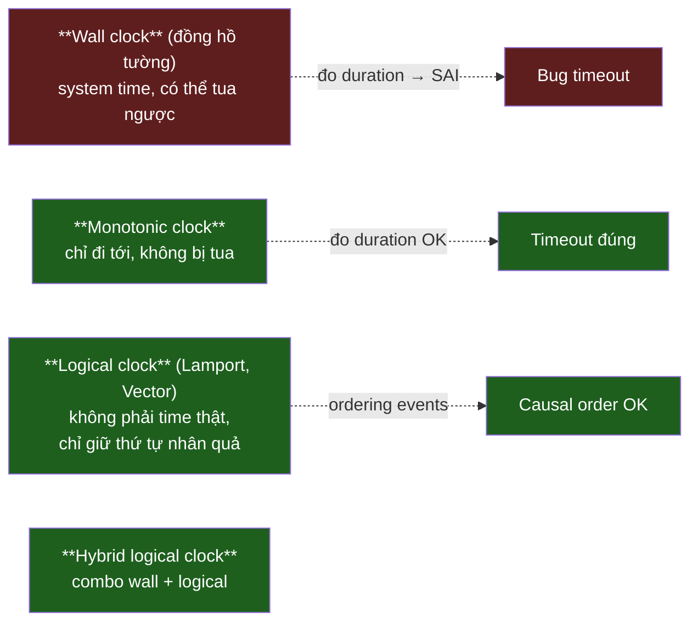
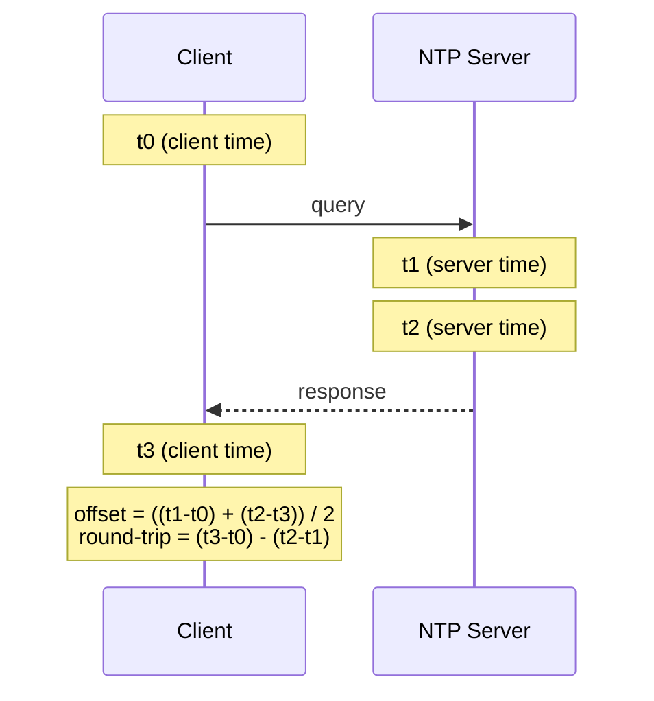

# KU 01/10 — Clock skew: 5 đồng hồ không đồng bộ

> Mỗi server có đồng hồ riêng — chúng **không bao giờ giống nhau tuyệt đối**. Vài ms đến vài giây sai khác là chuyện thường. Code không hiểu điều này sẽ ra kết quả sai.

**Module:** [01 — Foundations](./README.md)
**Đọc trong:** ~8 phút

---

## 🎯 Nó là gì?

Bạn đeo 1 đồng hồ. Trong nhà có 4 đồng hồ khác (treo tường, oven, microwave, smartphone).

Để ý: chúng **lệch nhau vài giây đến vài phút**. Mỗi đồng hồ "tích tắc" với nhịp hơi khác — gọi là **clock drift**. Lâu ngày → lệch hơn.

Trong server:
- Mỗi máy có 1 đồng hồ phần cứng (RTC).
- Đồng hồ có thể chạy chậm/nhanh hơn thật ~10 ppm (10 phần triệu) → 1 ngày lệch ~1 giây.
- NTP (Network Time Protocol) đồng bộ định kỳ — vẫn lệch vài ms đến vài chục ms giữa các server.

→ Đó là **clock skew**: thời gian hiển thị ở 2 server khác nhau tại "cùng một lúc thực".

> *Định nghĩa hàn lâm:* Clock skew là khác biệt giá trị thời gian giữa 2 đồng hồ tại cùng instant thực. Trong distributed system, không tồn tại "global clock" — đây là 1 trong 8 fallacies (Deutsch).

---

## 💡 Nó làm được gì? (Hay đúng hơn: nó gây ra điều gì?)

Clock skew có thể gây bug **rất khó debug**:

- Log timestamp 2 service không khớp → vẽ timeline sai.
- "Last-write-wins" giữa 2 replica → write từ server đồng hồ nhanh hơn luôn "thắng" sai.
- Token JWT hết hạn không khớp giữa server validate và server cấp.
- Distributed lock với "lease 30s" có thể vượt ngưỡng nếu đồng hồ chạy chậm.

---

## 🧩 Nó là mảnh ghép nào trong tổng thể?

→ **Nguyên tắc senior:** đo khoảng thời gian (duration) bằng **monotonic clock**. Hiển thị thời gian thực dùng wall clock. Đừng nhầm.

---

## 🚀 Nó giúp ích gì?

Hiểu clock skew giúp:

- **Không đo timeout bằng `system_time()`.** Nếu admin tua đồng hồ → timeout bị "hết hạn" hoặc "không bao giờ hết".
- **Log có timezone + nanosecond + nguồn server.** So sánh log cross-server cần tolerance.
- **Distributed transaction cần consensus**, không tin clock.
- **Spanner (Google) phát minh TrueTime** — clock có uncertainty interval — để giải bài toán này.

---

## ⏰ Khi nào dùng / KHÔNG dùng?

| Tình huống | Dùng clock nào |
|---|---|
| Đo `latency` giữa 2 mốc | Monotonic |
| Log timestamp | Wall (kèm timezone + source) |
| Cache TTL | Monotonic |
| JWT `exp` | Wall (nhưng tolerance ± skew) |
| Ordering events distributed | Logical / HLC |
| LWW (last-write-wins) conflict | Wall (chấp nhận sai) hoặc Vector clock |

---

## 🤔 Vì sao chọn nó (vs alternatives)?

| Loại clock | Khi dùng |
|---|---|
| **Wall (system time)** | Hiển thị, log, compare cross-process trong cùng host (cẩn thận) |
| **Monotonic** | Đo duration, timeout |
| **NTP-synced wall** | Cross-host nhưng cần tolerance |
| **PTP (Precision Time Protocol)** | Khi cần submillisec (trading, telecom) |
| **TrueTime (Google)** | Globally consistent — chỉ có ở Google cloud |
| **Lamport / Vector clock** | Ordering không cần time thật |
| **Hybrid Logical Clock (HLC)** | Cockroach DB, YugabyteDB — combo |

---

## 🔧 Nó vận hành ra sao?

### NTP cách hoạt động

NTP có thể chỉnh đồng hồ. Có 2 chế độ:
- **Step:** nếu lệch > 128ms → đặt lại ngay → **đồng hồ tua nhảy** (bad cho monotonic-style code).
- **Slew:** chỉnh dần (chậm vài microsec mỗi giây) → an toàn hơn.

→ Linux chrony mặc định slew khi lệch nhỏ, step khi lệch lớn.

### Bug khét tiếng: leap second 2012

30/6/2012 23:59:60 — leap second được chèn. Nhiều hệ thống (Java, Linux, Reddit) crash vì code không handle.

→ "Đồng hồ luôn đi tới" là giả định **sai** với wall clock.

### Trong project này

- Mọi node DSX Air chạy `chronyd` đồng bộ NTP (ansible playbook 00-bootstrap.yml).
- Event payload có **2 timestamp**: `event_time` (từ client/producer) và `producer_time` (lúc gửi). Flink dùng event_time với bounded out-of-orderness tolerance — chấp nhận skew.
- Log container ghi UTC + nanosec, Loki gắn `source=node-xxx` để biết log từ đồng hồ nào.

---

## 🧠 Self-test

1. Bạn đo "API mất bao lâu" bằng `System.currentTimeMillis()` (wall clock) hay `System.nanoTime()` (monotonic)? Vì sao?
2. NTP chỉnh đồng hồ "step" có hệ quả gì với code đếm duration?
3. 2 server log cùng 1 event lúc `13:42:00.123` — chắc cùng lúc thật chưa? Vì sao?
4. Distributed lock "lease 30s". Đồng hồ server A chậm 2s so với B. Bug có thể xảy ra ra sao?
5. Trong project này, Flink dùng `event_time` từ payload thay vì server time. Lý do liên hệ clock skew là gì?

---

## 🔗 Trong repo này

- Watermark policy bounded out-of-orderness chính là tolerance clock skew: [`docs/08-stream-processing.md`](../../docs/08-stream-processing.md)
- chrony cấu hình trong ansible: [`infra/ansible/playbooks/00-bootstrap.yml`](../../infra/ansible/playbooks/00-bootstrap.yml)
- Event schema có 2 timestamp: [`schemas/payment/payment.authorized.v1.json`](../../schemas/payment/payment.authorized.v1.json)

---

## 📖 Đọc thêm (chính thống, hạn chế)

- "Time, Clocks, and the Ordering of Events" — Leslie Lamport (1978) — bài gốc.
- "Spanner: Google's Globally-Distributed Database" — paper introducing TrueTime.
