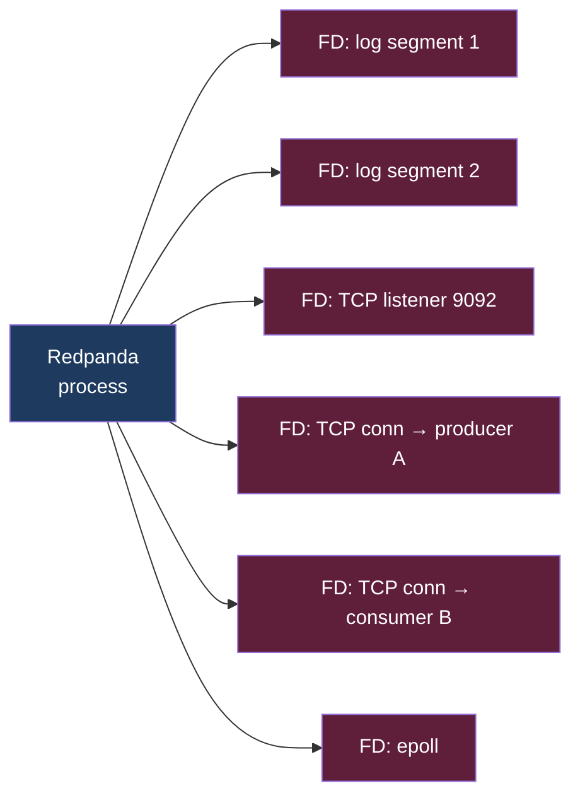
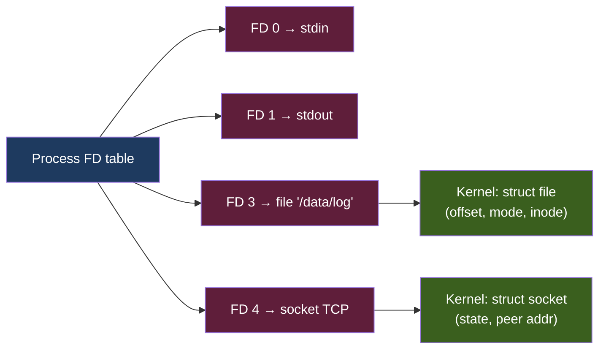

# KU 01/11 — File descriptor: chìa khoá phòng

> Mỗi tệp / socket / pipe đang mở là 1 "chìa khoá" mà process cầm. Có hạn số chìa. Hết chìa → không mở thêm được file → service crash.

**Module:** [01 — Foundations](./README.md)
**Đọc trong:** ~6 phút

---

## 🎯 Nó là gì?

Khách sạn có **200 phòng**. Mỗi khách check-in nhận **1 chìa khoá**. Hết chìa → không nhận thêm khách.

Linux: mỗi process khi mở file / network socket / pipe → nhận 1 **file descriptor (FD)** — số nguyên định danh resource. Có giới hạn `ulimit -n` (default 1024 hoặc 65535). Process vượt → `EMFILE: Too many open files`.

```
stdin  = FD 0
stdout = FD 1
stderr = FD 2
open("/etc/passwd") = FD 3
socket() = FD 4
...
```

> *Định nghĩa hàn lâm:* File descriptor là số nguyên không âm trong process, index vào bảng file descriptor của kernel; kernel ánh xạ FD → struct file (file thật, socket, pipe, eventfd, ...).

---

## 💡 Nó làm được gì?

FD trừu tượng hoá "thứ có thể đọc/ghi":
- File trên disk.
- Socket TCP/UDP.
- Pipe giữa 2 process.
- Device (`/dev/null`, `/dev/sda`).
- epoll / kqueue (event poll FD).

→ `read()`, `write()`, `close()` đều dùng FD thống nhất. **Unix philosophy: everything is a file.**

---

## 🧩 Nó là mảnh ghép nào trong tổng thể?

Mỗi service trong project mở rất nhiều FD:



→ Redpanda với 1000 connection + 100 partition + 5 segment/partition → có thể tới **vài nghìn FD**.

---

## 🚀 Nó giúp ích gì? (Hay: nó gây ra điều gì?)

Senior nhận diện FD exhaustion bug:

- `Too many open files` trong log → cần raise `ulimit -n`.
- Postgres: `max_connections` thực ra bị giới hạn bởi FD limit.
- Nginx: mỗi keepalive connection 1 FD → high traffic dễ vỡ.
- Tail nhiều file (Loki promtail) → FD nhiều.

**Default 1024 trên Linux** quá nhỏ cho production data service. Project này sẽ set ulimit cao trong systemd / docker.

---

## ⏰ Khi nào cần lo?

- App network-heavy (Redpanda, Postgres, nginx).
- Workload có nhiều connection đồng thời.
- Log-tailing nhiều file.
- Container có ulimit thấp do default Docker.

| Service | FD typical | Cần ulimit |
|---|---:|---|
| Redpanda | 5k-50k | 65535+ |
| Postgres | 100-1000 | 4096+ |
| ClickHouse | 500-2000 | 65535 |
| Nginx | thousand | 65535 |
| Simple CLI | <100 | default OK |

---

## 🤔 Vì sao chọn nó (vs alternatives)?

FD là **OS primitive**, không có alternative — chỉ có cách quản lý:

- **Connection pool:** giảm tổng FD (1 pool dùng chung).
- **epoll/kqueue:** 1 FD theo dõi nhiều FD khác (event-driven I/O).
- **io_uring** (modern Linux): pattern mới, performance cao hơn epoll.
- **Async I/O:** giảm FD per request.

---

## 🔧 Nó vận hành ra sao?

### Mỗi FD = 1 entry trong bảng kernel



`close(fd)` → giải phóng entry. **Forget close → leak FD** → eventually crash.

### Check tools

```bash
# total FD limit
ulimit -n

# how many FD a process has
ls /proc/<PID>/fd/ | wc -l

# system-wide
cat /proc/sys/fs/file-nr
# fields: opened_count, free_count, max_count
```

### Tune trong project

`/etc/security/limits.conf`:
```
*  soft  nofile  65535
*  hard  nofile  65535
```

Systemd unit:
```
LimitNOFILE=65535
```

Docker compose:
```yaml
services:
  redpanda:
    ulimits:
      nofile:
        soft: 65535
        hard: 65535
```

→ Ansible playbook trong project sẽ set những giá trị này.

---

## 🧠 Self-test

1. Khách sạn 200 phòng, 200 chìa. Hết chìa. Khách tiếp theo bị gì? Liên hệ FD exhaustion.
2. Process nginx leak FD (không close socket sau request). Sau N request đầu → bug gì?
3. `lsof -p <PID>` cho thấy 30000 FD. Bình thường hay bất thường? Phụ thuộc gì?
4. `epoll` dùng "1 FD theo dõi nhiều FD khác". Lợi gì khi handle 10000 connection đồng thời so với 10000 thread?
5. Trong project này, set `LimitNOFILE=65535` cho services nào quan trọng nhất?

---

## 🔗 Trong repo này

- Ansible bootstrap có sysctl + limits cho ulimit: [`infra/ansible/playbooks/00-bootstrap.yml`](../../infra/ansible/playbooks/00-bootstrap.yml)
- Docker compose ulimit per service (sẽ có ở Phase 4): `platform/docker-compose.*.yml`

---

## 📖 Đọc thêm (chính thống, hạn chế)

- Linux man page `epoll(7)` — kernel docs cho event poll.
- "The C10K problem" (Dan Kegel) — bài kinh điển về xử lý nhiều connection.
