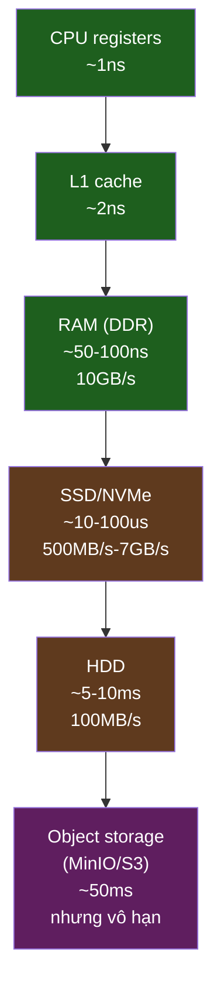
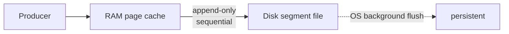
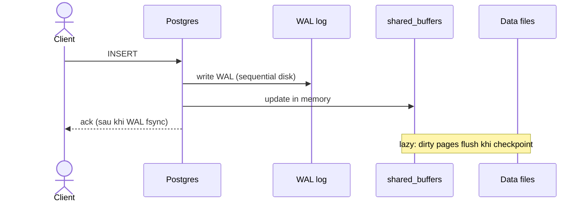

# KU 01/12 — Disk vs Memory: tủ vs bàn

> Memory = bàn làm việc — nhanh, nhỏ, mất khi cúp điện. Disk = tủ tài liệu — chậm, lớn, giữ lâu. Mọi hệ data đều dance giữa 2 trục này.

**Module:** [01 — Foundations](./README.md)
**Đọc trong:** ~6 phút

---

## 🎯 Nó là gì?

Bạn làm việc tại bàn (memory) — lấy ra 1 tập tài liệu xử lý nhanh. Tài liệu khác chưa cần thì đặt trong tủ (disk).

- **Bàn nhỏ** (RAM ~8-64GB) — đắt, nhanh (~ns).
- **Tủ lớn** (Disk SSD ~500GB-10TB) — rẻ, chậm (~us-ms cho SSD; ~ms-s cho HDD).
- **Cúp điện** → tài liệu trên bàn mất sạch. Tài liệu trong tủ vẫn còn.

Hệ thống thông minh: **prefetch** tài liệu từ tủ ra bàn trước khi cần (cache); **flush** lên tủ trước khi quên (durability).

> *Định nghĩa hàn lâm:* Memory hierarchy gồm: registers → L1/L2/L3 cache → RAM → SSD/NVMe → HDD → tape. Mỗi tầng: nhanh hơn + nhỏ hơn + đắt hơn so với tầng dưới. Khoảng cách performance giữa tầng có thể 100x-10000x.

---

## 💡 Nó làm được gì?

Hệ data quyết định **dữ liệu gì để bàn, dữ liệu gì để tủ**:

| Tool | Strategy |
|---|---|
| **Redis** | All in memory, optionally persist to disk |
| **Postgres** | Working set in memory (shared_buffers), data on disk |
| **Kafka/Redpanda** | Persist on disk, OS page cache + sequential I/O |
| **ClickHouse** | Disk-resident columnar, mark index in memory |
| **Flink RocksDB state** | Disk + memory tier |
| **MinIO** | Disk (object storage) |
| **Iceberg** | Disk (file format on object storage) |
| **Prometheus TSDB** | Memory recent, disk for older blocks |

---

## 🧩 Nó là mảnh ghép nào trong tổng thể?

Mỗi mũi tên là **bước nhảy 10x-100x latency**.

---

## 🚀 Nó giúp ích gì?

Hiểu trục disk/memory giúp:

- **Đặt sizing đúng:** ClickHouse RAM = "mark index + query memory", không phải "all data trong RAM".
- **Hiểu OS page cache:** Linux dùng RAM trống làm cache cho disk. Redpanda dựa heavy vào đây → tránh fsync mỗi message.
- **Tuning Flink state:** working set fit RAM → nhanh; spill RocksDB to disk → giảm tốc nhưng survive lớn state.
- **Hiểu warmup:** lần query đầu chậm vì cache cold; lần 2 nhanh vì hot.

---

## ⏰ Khi nào dùng cái nào?

| Use case | Tier |
|---|---|
| Online feature lookup (p99 < 20ms) | Memory (Redis) |
| Realtime aggregate dashboard | Memory + SSD (ClickHouse mark cache + data) |
| Lakehouse history | Object storage (đủ rẻ, không cần latency) |
| Stream state (small) | Memory (Flink heap) |
| Stream state (large) | RocksDB on disk + memory cache |
| Kafka log | Disk (sequential write fast even on HDD) |
| Backup | Object storage / archive disk |

---

## 🤔 Vì sao chọn nó (vs alternatives)?

| Tier | Cost/GB | Latency | Throughput | Persistence |
|---|---:|---:|---:|---:|
| RAM | $5-10/GB/month | ns | GB/s | NO |
| SSD/NVMe | $0.1-0.5/GB/month | us | GB/s | YES |
| HDD | $0.02-0.05/GB/month | ms | MB/s | YES |
| Object storage | $0.005-0.02/GB/month | 10-100ms | network-bound | YES |

→ Mỗi tier rẻ hơn 10x, chậm hơn 10x-100x. Pick tier theo: budget × latency × persistence requirement.

---

## 🔧 Nó vận hành ra sao?

### Kafka/Redpanda log = sequential disk write

Sequential write trên cả HDD đạt ~100MB/s. Random write chỉ ~1MB/s. Đó là lý do Kafka chọn append-only segment.

### Postgres write path

**Trick:** WAL fsync nhanh (sequential), data files flush async. Tốt nhất của cả memory & disk.

### Cache invalidation

Cache là 1 trong 2 hard problems của CS (Phil Karlton):
> "There are only two hard things in Computer Science: cache invalidation and naming things."

Khi data đổi → cache phải invalidate. Strategies:
- **TTL** (Redis 60s expiry).
- **Write-through** (write cả cache + disk).
- **Write-behind** (cache trước, disk sau — risk).
- **Read-through** (cache miss → fetch + populate).

Project này dùng TTL 60s cho Redis `risk:*` và pub-sub invalidation cho hot keys.

---

## 🧠 Self-test

1. Bạn cúp điện 5 giây. Bàn vs tủ — cái nào mất?
2. Sequential vs random disk write — sao khác biệt 100x performance? (Gợi ý: HDD spinning head).
3. Redis "persist to disk" mỗi giây (`appendfsync everysec`) — có thể mất data tối đa bao nhiêu giây nếu crash?
4. Postgres ack write sau khi WAL fsync, không đợi data file flush. Đây là pattern gì? Có an toàn không?
5. Cache TTL 60s nghĩa là gì? Sau 60s đọc lại sẽ thấy data mới? Nếu data đổi sau 5s thì sao?

---

## 🔗 Trong repo này

- Storage tier per service: [`docs/05-storage-layer.md`](../../docs/05-storage-layer.md)
- MinIO bucket 200GB cho node-lake: [`topologies/01-data-platform-mvp.json`](../../topologies/01-data-platform-mvp.json)
- Redis TTL 60s pattern: [`docs/11-serving-layer.md`](../../docs/11-serving-layer.md)
- Flink RocksDB state backend: [`docs/08-stream-processing.md`](../../docs/08-stream-processing.md)

---

## 📖 Đọc thêm (chính thống, hạn chế)

- Brendan Gregg — "Systems Performance" (book) — chương Memory + Disk.
- "Numbers Every Programmer Should Know" — Jeff Dean — latency cheat sheet.
