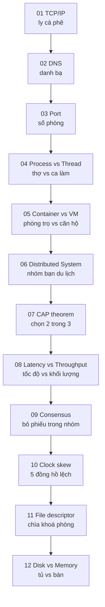

# Module 01 — Foundations: OS / Network / Distributed Systems

> 12 mảnh ghép nền tảng. Mỗi mảnh dạng analogy đời sống. Đây là **vốn chung** cho mọi tool: Kafka, Flink, Iceberg, ClickHouse… đều dựa trên cùng những concept này.

---

## Đường đi

---

## KU list

| # | KU | Đọc trong |
|---:|---|---:|
| 01 | [TCP/IP nhìn từ ly cà phê](./01-tcp-ip.md) | 10' |
| 02 | [DNS = danh bạ điện thoại](./02-dns.md) | 6' |
| 03 | [Port = số phòng trong toà nhà](./03-port.md) | 6' |
| 04 | [Process vs Thread = thợ vs ca làm](./04-process-thread.md) | 8' |
| 05 | [Container vs VM = phòng trọ vs căn hộ](./05-container-vs-vm.md) | 8' |
| 06 | [Distributed system = nhóm đi du lịch](./06-distributed-systems.md) | 10' |
| 07 | [CAP theorem = chọn 2 trong 3](./07-cap-theorem.md) | 10' |
| 08 | [Latency vs Throughput](./08-latency-throughput.md) | 8' |
| 09 | [Consensus = bỏ phiếu trong nhóm](./09-consensus.md) | 10' |
| 10 | [Clock skew = 5 đồng hồ không đồng bộ](./10-clock-skew.md) | 8' |
| 11 | [File descriptor = chìa khoá phòng](./11-file-descriptor.md) | 6' |
| 12 | [Disk vs Memory = tủ vs bàn](./12-disk-vs-memory.md) | 6' |
| Q | [Mini-quiz Module 01](./MINI-QUIZ.md) | 15' |

Tổng đọc: ~100 phút.

---

## Sau khi học xong

- Hiểu vì sao mỗi node có nhiều ports nhưng 1 port chỉ một service.
- Phân biệt process / thread đủ để debug container OOM.
- Trả lời được "CAP của Kafka là gì?" (= AP + tunable).
- Hiểu vì sao Flink cần consensus cho exactly-once.
- Biết vì sao "đồng hồ máy chủ" không bao giờ chính xác tuyệt đối.
