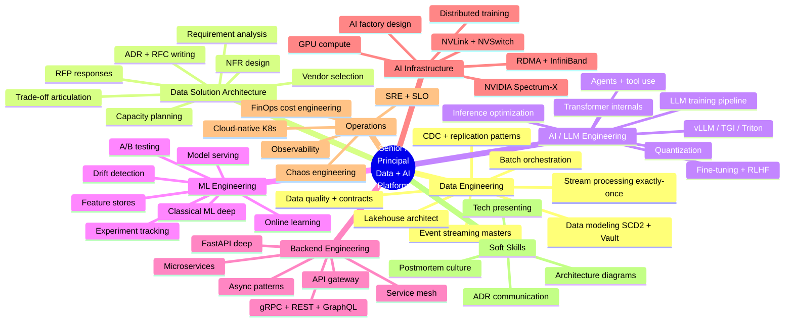
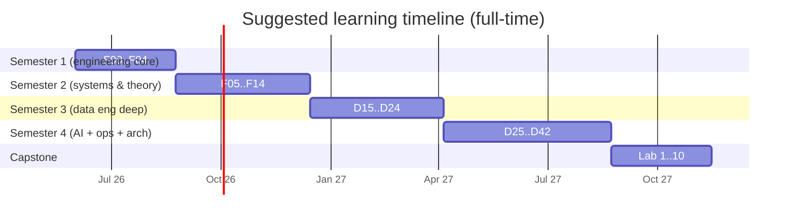

# 📚 CURRICULUM — Chương trình học 2 năm

> **Tổng quan:** 43 môn học (modules) · 662 Knowledge Units (KUs) · 10 capstone labs · ~1.85 triệu từ.
>
> **Mục tiêu:** đào tạo từ zero → **Senior / Principal Data + AI Platform Engineer** ở chuẩn 2026.
> Cover hết: Data Engineering, Data Solution Architecture, AI/LLM Engineering, ML Engineering, Backend Engineering kỹ thuật, AI Infrastructure (RDMA / GPU / Spectrum-X), và mọi nền tảng học thuật + thuật ngữ.

**Triết lý học:** xem [METHODOLOGY.md](./METHODOLOGY.md) — analogy đời sống → định nghĩa chính thức → terminology box → worked example → common pitfalls → advanced topics → self-test.

---

## 🎯 Vị trí mục tiêu (sau khi hoàn thành)



---

## 📐 Lộ trình tổng quan — 4 học kỳ

```mermaid
flowchart TB
    classDef y1h1 fill:#1e3a5f,color:#fff
    classDef y1h2 fill:#1e5f5f,color:#fff
    classDef y2h3 fill:#3a1e5f,color:#fff
    classDef y2h4 fill:#5f1e3a,color:#fff
    classDef cap fill:#5f1e1e,color:#fff

    subgraph S1["📘 Học kỳ 1 — Engineering Core (5 môn · 64 KUs)"]
        F00["F00 Mental Models<br/>12 KU"]:::y1h1
        F01["F01 CS Fundamentals<br/>18 KU"]:::y1h1
        F02["F02 Programming Paradigms<br/>14 KU"]:::y1h1
        F03["F03 Modern Python for Data<br/>12 KU"]:::y1h1
        F04["F04 Type Systems & Validation<br/>8 KU"]:::y1h1
    end

    subgraph S2["📗 Học kỳ 2 — Systems & Theory (10 môn · 174 KUs)"]
        F05["F05 Operating Systems<br/>18 KU"]:::y1h2
        F06["F06 Computer Networks<br/>20 KU"]:::y1h2
        F07["F07 Linux & DevOps<br/>16 KU"]:::y1h2
        F08["F08 Containers & K8s Basics<br/>14 KU"]:::y1h2
        F09["F09 Databases I — Relational<br/>18 KU"]:::y1h2
        F10["F10 Databases II — Beyond SQL<br/>16 KU"]:::y1h2
        F11["F11 Distributed Systems Theory<br/>22 KU"]:::y1h2
        F12["F12 System Design Fundamentals<br/>20 KU"]:::y1h2
        F13["F13 Security & Privacy<br/>16 KU"]:::y1h2
        F14["F14 Math for Data + AI<br/>14 KU"]:::y1h2
    end

    subgraph S3["📙 Học kỳ 3 — Data Engineering Deep (10 môn · 168 KUs)"]
        D15["D15 Data Modeling<br/>16 KU"]:::y2h3
        D16["D16 Event Streaming Deep<br/>22 KU"]:::y2h3
        D17["D17 Stream Processing Deep<br/>22 KU"]:::y2h3
        D18["D18 Batch Processing & Spark<br/>18 KU"]:::y2h3
        D19["D19 Lakehouse Deep<br/>20 KU"]:::y2h3
        D20["D20 Orchestration Deep<br/>16 KU"]:::y2h3
        D21["D21 Serving & Query Engines<br/>18 KU"]:::y2h3
        D22["D22 Data Quality & Contracts<br/>12 KU"]:::y2h3
        D23["D23 CDC & Replication<br/>10 KU"]:::y2h3
        D24["D24 Modern Data Stack 2026<br/>14 KU"]:::y2h3
    end

    subgraph S4["📕 Học kỳ 4 — AI + Operations + Architecture (18 môn · 256 KUs)"]
        D25["D25 Backend Engineering<br/>16 KU"]:::y2h4
        D26["D26 Observability & SRE<br/>20 KU"]:::y2h4
        D27["D27 Governance & Lineage<br/>12 KU"]:::y2h4
        D28["D28 ML Engineering Foundations<br/>18 KU"]:::y2h4
        D29["D29 Deep Learning Basics<br/>14 KU"]:::y2h4
        D30["D30 LLM Engineering<br/>18 KU"]:::y2h4
        D31["D31 Vector Search & Embeddings<br/>16 KU"]:::y2h4
        D32["D32 RAG Engineering Deep<br/>14 KU"]:::y2h4
        D33["D33 AI Agents & Tool Use<br/>12 KU"]:::y2h4
        D34["D34 MLOps & Model Serving<br/>16 KU"]:::y2h4
        D35["D35 GPU Compute & AI Infra<br/>14 KU"]:::y2h4
        D36["D36 Network Fabric ★<br/>16 KU"]:::y2h4
        D37["D37 Chaos & Reliability<br/>14 KU"]:::y2h4
        D38["D38 Cloud-Native & K8s Deep<br/>16 KU"]:::y2h4
        D39["D39 FinOps Cost Engineering<br/>8 KU"]:::y2h4
        D40["D40 Solution Architecture<br/>10 KU"]:::y2h4
        D41["D41 Experimentation & A/B<br/>10 KU"]:::y2h4
        D42["D42 Soft Skills + Communication<br/>12 KU"]:::y2h4
    end

    CAP["⭐ CAPSTONE — 10 lab projects<br/>End-to-end build & deploy"]:::cap

    S1 --> S2 --> S3 --> S4 --> CAP
```



---

## 📊 Số liệu chính thức

| Hạng mục | Số lượng |
|---|---:|
| Học kỳ | 4 (2 năm intensive) |
| Modules (môn) | **43** |
| Knowledge Units (KU) | **662** |
| Capstone labs | 10 |
| Mini-quizzes (per module) | 43 |
| Module READMEs | 43 |
| Cross-cutting docs | ~10 (glossary, concept maps, reading lists) |
| **Tổng file mới** | **~770** |
| Mermaid diagrams ước tính | ~2,000 |
| Words ước tính | **~1,850,000 (≈ 12 sách kỹ thuật / 7,000 trang)** |
| Thời gian học (người đọc) | 18-30 tháng |

---

## 📖 HỌC KỲ 1 — Engineering Core

### F00 — Mental Models (12 KUs)

> Tư duy nền cho mọi engineer. Phải đọc đầu tiên.

```
01 Data product thinking          07 Backpressure
02 Trade-off thinking             08 Eventual consistency
03 Biết vs Hiểu (Feynman)         09 Leaky abstractions
04 State + Change + Time          10 Premature optimization
05 Failure as a feature           11 Conway's Law
06 Idempotency                    12 Trade-off triangle: speed/cost/quality
```

### F01 — CS Fundamentals (18 KUs)

> Computer Science cơ bản — bytes, big-O, data structures, algorithms.

```
01 Bits, bytes, encoding (UTF-8, base64)     10 Compression basics (Snappy, gzip, LZ4, Zstd)
02 Big-O notation đời thường                 11 Checksums + hash for integrity
03 Data structures: array vs linked list     12 Bit manipulation cơ bản
04 Hash table — nguyên lý + collision        13 Pseudo-random vs crypto-random
05 Tree: BST, B-tree, B+tree, LSM            14 Floating point — bẫy precision
06 Graph + BFS/DFS                           15 String encoding bugs (UTF-8 vs Latin-1)
07 Sorting algorithms — khi nào dùng cái nào  16 Endianness (big vs little)
08 Recursion + iteration                     17 CRC, MD5, SHA hash families
09 Time vs space complexity                  18 Algorithmic complexity classes (P, NP)
```

### F02 — Programming Paradigms (14 KUs)

> Cách suy nghĩ về code. Không phải syntax — là paradigm.

```
01 Imperative vs declarative                 08 Type systems: static vs dynamic
02 OOP — basics + critique                   09 Type systems: strong vs weak
03 Functional thinking — pure functions      10 Error handling: exceptions vs Result/Either
04 Immutability                              11 Logging philosophy
05 Concurrency primitives                    12 Testing philosophy (unit/integration/e2e)
06 Async/await mental model                  13 Code review thinking
07 Event loop                                14 Design patterns (5 cốt yếu)
```

### F03 — Modern Python for Data (12 KUs)

> Python hiện đại cho data engineering 2026.

```
01 Python 3.12+ tính năng cốt lõi            07 polars vs pandas — khi nào dùng cái nào
02 Async + await Python deep                 08 PyArrow + Apache Arrow ecosystem
03 Type hints + mypy + pyright               09 PySpark mental model
04 Pydantic v2 deep                          10 Decorators + context managers
05 Dataclasses vs Pydantic vs attrs          11 Generators vs iterators vs async generators
06 pathlib, subprocess, multiprocessing       12 Python packaging 2026 (uv, hatch, poetry)
```

### F04 — Type Systems & Validation (8 KUs)

> Validate everywhere — từ JSON Schema đến runtime check.

```
01 JSON Schema (Draft 2020-12)               05 Avro vs Protobuf vs JSON Schema
02 Pydantic for runtime validation           06 Pandera for DataFrame validation
03 dataclasses + typing.TypedDict            07 OpenAPI spec generation
04 Pydantic ↔ JSON Schema interop            08 Type-driven design philosophy
```

---

## 📗 HỌC KỲ 2 — Systems & Theory

### F05 — Operating Systems (18 KUs)

> Linux internals đủ để debug + tune data services.

```
01 OS là gì — kernel space vs user space     10 File systems: ext4, XFS, ZFS so sánh
02 Process lifecycle + states                 11 I/O models: blocking, non-blocking, async
03 Thread vs process (mở rộng)               12 io_uring — async I/O hiện đại
04 Memory: virtual, paging, swapping         13 Signals: SIGTERM, SIGKILL, SIGHUP
05 Memory mapping (mmap) — Postgres dùng     14 File descriptor + ulimit deep
06 Page cache + swap (đừng dùng)             15 Linux process tools: ps, top, htop, lsof, strace
07 Cgroups v2 — limit CPU/RAM/IO             16 Linux net tools: ss, iptables, tcpdump
08 Namespaces: PID/NET/MNT/UTS/IPC/USER       17 systemd basics + journalctl
09 OOM-killer logic                          18 BPF / eBPF basics for observability
```

### F06 — Computer Networks (20 KUs)

> Network từ Ethernet đến HTTP/3.

```
01 OSI vs TCP/IP layers                      11 Subnet + CIDR notation
02 TCP three-way handshake + close           12 NAT + port forwarding
03 TCP sliding window + congestion control   13 IPv4 vs IPv6 — migration thực tế
04 UDP + khi nào dùng                        14 VPN — site-to-site vs remote access
05 HTTP/1.1 vs HTTP/2 vs HTTP/3 (QUIC)       15 Load balancing L4 vs L7
06 HTTPS + TLS handshake                     16 Connection pooling — vì sao cần
07 mTLS (mutual TLS)                         17 Network latency budget
08 DNS deep + DNSSEC + GeoDNS                18 Wireshark + tcpdump căn bản
09 Port + socket + ephemeral ports           19 Reverse proxy (Nginx, Envoy, HAProxy)
10 Socket programming concepts               20 WebSocket + Server-Sent Events
```

### F07 — Linux & DevOps (16 KUs)

> Skill cần thiết để vận hành infrastructure.

```
01 Shell scripting fundamentals              09 Backup strategies (3-2-1)
02 Bash vs zsh vs fish                       10 Disk: mount, LVM, RAID basics
03 File permissions + sudoers                11 Network troubleshooting workflow
04 Cron + systemd timers                     12 Package management (apt, dnf, brew)
05 SSH key + bastion patterns                13 Configuration management mental model
06 Process supervisor (systemd, supervisord) 14 Ansible cơ bản
07 Logs management + logrotate               15 Terraform / Pulumi cơ bản
08 Service management deep                   16 GitOps philosophy
```

### F08 — Containers & K8s Basics (14 KUs)

> Container ecosystem — phần lớn data platform deploy ở đây.

```
01 Container vs VM (deep dive)               08 K8s mental model: pod, service, deployment
02 Docker engine internals                   09 K8s networking căn bản
03 Image layering + registry                 10 K8s storage: PV, PVC, StorageClass
04 Dockerfile best practices                 11 Helm charts basics
05 docker-compose patterns                   12 K8s vs Docker compose — khi nào dùng nào
06 Container networking modes                13 K8s Operator pattern (cho data services)
07 Volume vs bind mount vs tmpfs             14 K8s alternatives: Nomad, k3s, k0s
```

### F09 — Databases I — Relational (18 KUs)

> Postgres-first deep dive.

```
01 Relational model — table, row, key        10 WAL (Write-Ahead Log) deep
02 SQL fundamentals (DDL, DML, DQL)          11 Replication: physical, logical, sync, async
03 Joins: inner, outer, cross, lateral       12 Vacuum + bloat + autovacuum
04 Subqueries vs CTE vs window functions     13 Postgres extensions ecosystem
05 Index: B-tree, hash, GIN, GiST, BRIN      14 PgBouncer / Pgpool — connection pooling
06 Query plan + EXPLAIN ANALYZE              15 Logical decoding (foundation cho Debezium)
07 ACID properties deep                      16 PostgreSQL high availability (patroni)
08 Isolation levels (read uncommitted → serializable) 17 Time-series in Postgres (TimescaleDB)
09 MVCC (Postgres-style)                     18 Partitioning — declarative + inheritance
```

### F10 — Databases II — Beyond SQL (16 KUs)

> Khi nào KHÔNG dùng relational.

```
01 Key-value (Redis, DynamoDB) cơ chế        09 File formats: Parquet — internals
02 Document (MongoDB, Couchbase) when&why    10 File formats: ORC, Avro, Arrow
03 Column-family (Cassandra) Wide-column     11 Lakehouse table formats overview
04 Columnar OLAP (ClickHouse, Druid, Pinot)  12 Embedded DB: DuckDB, SQLite
05 Time-series (InfluxDB, TimescaleDB)       13 Embedded DB: LMDB, RocksDB internals
06 Search (Elasticsearch, OpenSearch, Lucene) 14 New-SQL: CockroachDB, YugabyteDB, TiDB
07 Graph (Neo4j, JanusGraph, ArangoDB)       15 Multi-model databases
08 Object storage (S3 API model)             16 Choosing the right DB framework (decision tree)
```

### F11 — Distributed Systems Theory (22 KUs)

> Lý thuyết bắt buộc cho data engineer senior.

```
01 What is distributed?                      12 Vector clocks + Lamport timestamps
02 8 fallacies of distributed computing       13 Hybrid Logical Clocks (HLC)
03 CAP theorem deep                          14 Failure detection algorithms
04 PACELC theorem                            15 Gossip protocols (Cassandra, Serf)
05 Consistency models (linearizable → eventual) 16 Anti-entropy / read repair
06 Strong eventual consistency + CRDT        17 Saga pattern
07 Paxos basics                              18 2-phase commit + 3PC
08 Raft consensus deep                       19 Distributed transactions vs sagas
09 Leader election algorithms                20 Idempotency at scale
10 Replication strategies (chain, primary-backup) 21 Exactly-once vs effectively-once
11 Sharding / partitioning strategies         22 Distributed snapshot algorithms (Chandy-Lamport)
```

### F12 — System Design Fundamentals (20 KUs)

> Patterns + templates cho design questions.

```
01 Designing for scale                       11 Bulkhead pattern
02 Designing for failure                     12 API design — REST principles
03 Capacity planning                         13 API design — GraphQL
04 Latency vs throughput trade-offs          14 API design — gRPC
05 Sync vs async patterns                    15 Pagination patterns (offset/cursor/keyset)
06 Queue patterns (work queue, pub-sub)      16 Idempotency keys for APIs
07 Cache patterns (aside, through, behind)   17 Service mesh basics
08 Rate limiting (token, leaky bucket)       18 Event-driven architecture overview
09 Circuit breaker pattern                   19 Request coalescing / batching
10 Retry + exponential backoff               20 Bin-packing vs spreading workloads
```

### F13 — Security & Privacy (16 KUs)

> Đủ để pass security review của senior architect.

```
01 Authn vs Authz                            09 SOPS + age key encryption
02 Identity: OAuth2, OIDC, SAML              10 PII handling: anonymize/pseudonymize/tokenize
03 JWT + JWS + JWE                           11 GDPR / CCPA / Vietnam data law cơ bản
04 RBAC vs ABAC vs PBAC                      12 Threat modeling (STRIDE)
05 Crypto: symmetric vs asymmetric           13 OWASP Top 10 (current)
06 Hashing for security (bcrypt, argon2)     14 Zero-trust architecture
07 TLS deep + cipher suites                  15 Network segmentation patterns
08 Secrets management (Vault, KMS, SOPS)     16 Audit log design
```

### F14 — Math for Data + AI (14 KUs)

> Đủ math để hiểu ML/LLM, không phải PhD.

```
01 Probability cơ bản đời sống               08 Calculus — chỉ derivative cần cho ML
02 Random variables + distributions          09 Information theory — entropy, KL, cross-entropy
03 Hypothesis testing — p-value sai lầm      10 Optimization: gradient descent
04 Bayesian thinking cơ bản                  11 Optimizers: SGD, Adam, AdamW
05 Statistics đời sống: mean, median, mode   12 Loss functions — MSE, cross-entropy
06 Variance, std, percentile                 13 Numerical stability (NaN, overflow)
07 Linear algebra: vector, matrix, dot       14 Sampling theory for data
```

---

## 📙 HỌC KỲ 3 — Data Engineering Deep

### D15 — Data Modeling (16 KUs)

```
01 Conceptual / logical / physical model     09 Star vs Snowflake schema
02 Normalization 1NF → 5NF                   10 Galaxy schema
03 Denormalization — khi và sao              11 SCD type 1, 2, 3, 4, 6
04 OLTP vs OLAP design difference            12 OBT (One Big Table) modern pattern
05 Dimensional modeling (Kimball)            13 Data Vault 2.0 basics
06 Fact vs dimension                         14 Anchor modeling
07 Grain — quan trọng nhất                   15 Activity schema
08 Surrogate vs natural key                  16 Choose-your-modeling decision framework
```

### D16 — Event Streaming Deep (22 KUs)

```
01 Event streaming vs message queue          12 Topic compaction deep
02 Kafka architecture deep                   13 Kafka Connect framework
03 Redpanda vs Kafka so sánh chi tiết         14 Schema Registry deep (Confluent, Karapace)
04 Apache Pulsar — multi-tier streaming      15 Schema evolution + compatibility modes
05 NATS JetStream                            16 Tiered storage (S3 offload)
06 Topic + partition + replica deep          17 KRaft mode (no ZooKeeper)
07 Producer internals (batching, linger)     18 Exactly-once producer
08 Consumer group + rebalance protocol       19 Transactional API
09 Offset management strategies              20 DLQ patterns
10 Retention policies                        21 Replay strategies
11 Compacted topic vs log topic              22 Lag monitoring patterns
```

### D17 — Stream Processing Deep (22 KUs)

```
01 Stream processing vs batch                12 Window aggregation patterns
02 Apache Flink architecture                 13 Window join (stream-stream)
03 Kafka Streams                             14 Stream-table join
04 Spark Structured Streaming                15 Side outputs (late events)
05 Materialize / RisingWave (streaming SQL)  16 Backpressure mechanism
06 Event time vs processing time             17 Watermark generators (custom)
07 Watermark — mép nước thuỷ triều           18 CEP (Complex Event Processing)
08 Allowed lateness + late event handling    19 State backends: heap vs RocksDB
09 State (keyed, operator)                   20 Checkpoint vs Savepoint
10 Checkpoint mechanism deep                 21 Async I/O in Flink
11 Exactly-once semantics — 2PC sink         22 Flink SQL vs DataStream API
```

### D18 — Batch Processing & Spark (18 KUs)

```
01 Batch processing nguyên lý                10 Spark SQL optimization
02 Apache Spark architecture                 11 Adaptive Query Execution (AQE)
03 RDD vs DataFrame vs Dataset               12 Spark on K8s vs YARN vs standalone
04 Lazy evaluation + DAG                     13 Spark + Delta Lake pattern
05 Wide vs narrow transformation             14 Spark + Iceberg pattern
06 Shuffle — cái đắt nhất                    15 PySpark vs Scala Spark performance
07 Partitioning + bucketing                  16 GPU-accelerated Spark (RAPIDS)
08 Broadcast join vs sort-merge              17 Memory management Spark
09 Caching + persistence levels              18 Tuning Spark workloads
```

### D19 — Lakehouse Deep (20 KUs)

```
01 Lakehouse = lake + warehouse              11 Snapshot isolation
02 Table format vs file format               12 Schema evolution patterns
03 Apache Iceberg deep                       13 Partition evolution
04 Delta Lake architecture                   14 Compaction strategies
05 Apache Hudi architecture                  15 Manifest files structure
06 Apache Paimon (streaming lakehouse)       16 Catalog: REST, Hive, Glue, Nessie
07 So sánh Iceberg/Delta/Hudi/Paimon         17 Lakehouse metadata growth
08 File format: Parquet internals            18 Trino + Iceberg architecture
09 File format: ORC internals                19 Lakehouse + ACID — how it works
10 File format: Apache Arrow                 20 Time travel + branching
```

### D20 — Orchestration Deep (16 KUs)

```
01 Workflow orchestration là gì              09 Backfill patterns
02 Apache Airflow internals                  10 Idempotent jobs
03 Dagster — asset-based                     11 SLA monitoring
04 Prefect 2.x — flow-based                  12 OpenLineage in orchestrator
05 dbt — SQL transformation                  13 Mage vs Kestra (newer tools)
06 DAG mental model deep                     14 Cron vs sensor vs event trigger
07 Asset vs task differences                 15 Materialization strategies
08 Sensor + trigger patterns                 16 Choose orchestrator framework
```

### D21 — Serving & Query Engines (18 KUs)

```
01 OLAP serving — patterns                   10 Trino architecture deep
02 ClickHouse architecture deep              11 Trino + Iceberg federation
03 ClickHouse MergeTree family               12 DuckDB — embedded analytics
04 Materialized views ClickHouse             13 StarRocks / Doris
05 Apache Druid architecture                 14 Redis architecture deep
06 Apache Pinot architecture                 15 Redis data structures (string, hash, sorted set, stream)
07 Druid vs Pinot vs ClickHouse              16 Redis persistence (RDB, AOF)
08 Elasticsearch architecture                17 FastAPI deep for serving
09 OpenSearch (fork rationale)               18 Query optimization patterns
```

### D22 — Data Quality & Contracts (12 KUs)

```
01 Data quality dimensions (6 chiều)         07 Schema contracts
02 Great Expectations deep                   08 Schema compatibility (forward/backward)
03 Soda Core / Soda Cloud                    09 Data contract YAML standard
04 Monte Carlo / Bigeye approach             10 Anomaly detection — statistical
05 Data observability vs quality             11 Data SLA + freshness monitoring
06 Quality gate vs quality check             12 Quality test in CI/CD
```

### D23 — CDC & Replication (10 KUs)

```
01 CDC concepts (log-based vs trigger)       06 Snapshot strategy
02 Debezium internals                        07 Schema evolution in CDC
03 Fivetran model                            08 CDC for analytics vs replication
04 Airbyte open-source model                 09 Kafka Connect framework
05 Postgres logical replication              10 CDC failure modes + runbook
```

### D24 — Modern Data Stack 2026 (14 KUs)

```
01 Snowflake architecture + Snowpark         08 dbt Cloud vs dbt Core
02 Databricks lakehouse platform             09 Hightouch / Census reverse ETL
03 Google BigQuery + BigLake                 10 Estuary / Striim CDC SaaS
04 Microsoft Fabric (Synapse next-gen)       11 Modern data catalog: Unity, Polaris, Atlan
05 Amazon Redshift + Spectrum                12 OneHouse + Streaming lakehouse
06 ClickHouse Cloud                          13 Vendor lock-in trade-offs
07 Tabular (Iceberg-native)                  14 Choosing modern stack — decision framework
```

---

## 📕 HỌC KỲ 4 — AI + Operations + Architecture

### D25 — Backend Engineering for Data (16 KUs)

```
01 FastAPI deep architecture                 09 Auth patterns for APIs (JWT, OAuth)
02 Uvicorn / Gunicorn / Hypercorn            10 Rate limiting + throttling
03 Pydantic v2 for API contracts             11 API versioning strategies
04 Async patterns in FastAPI                 12 gRPC architecture
05 WebSockets in FastAPI                     13 GraphQL với Strawberry / Ariadne
06 Background tasks + Celery                 14 Service mesh integration (Istio sidecar)
07 OpenAPI spec generation                   15 API gateway patterns (Kong, Tyk)
08 Dependency injection patterns             16 Microservice communication patterns
```

### D26 — Observability & SRE (20 KUs)

```
01 3 pillars: metrics, logs, traces          11 SLI / SLO / SLA hierarchy
02 OpenTelemetry framework                   12 Error budget concept
03 Prometheus architecture deep              13 Burn-rate alerts (multi-window)
04 PromQL essentials                         14 RED method (Rate, Errors, Duration)
05 Grafana — dashboards as code              15 USE method (Util, Saturation, Errors)
06 Loki for logs                             16 Golden signals
07 Tempo for traces                          17 Alert fatigue prevention
08 Mimir / Cortex / Thanos                   18 Postmortem culture (blameless)
09 Service-level vs system-level metrics     19 On-call rotation design
10 Cardinality control                       20 SRE workbook patterns
```

### D27 — Governance & Lineage (12 KUs)

```
01 Data governance definition                07 DataHub deep
02 OpenLineage specification                 08 OpenMetadata
03 Marquez deep                              09 Apache Atlas
04 Column-level lineage                      10 Unity Catalog (Databricks)
05 Data ownership patterns                   11 Polaris Catalog (Snowflake)
06 Data catalogs landscape                   12 Federated governance + data mesh
```

### D28 — ML Engineering Foundations (18 KUs)

```
01 ML lifecycle end-to-end                   10 Decision tree + Random Forest
02 Supervised vs unsupervised vs RL          11 Gradient boosting (XGBoost, LightGBM, CatBoost)
03 Feature engineering basics                12 Clustering: K-means, DBSCAN
04 Train / validation / test split           13 Dimensionality reduction (PCA, t-SNE, UMAP)
05 Cross-validation strategies               14 Anomaly detection algorithms
06 Bias-variance trade-off                   15 Recommendation systems basics
07 Overfitting + regularization              16 Time-series forecasting (ARIMA, Prophet)
08 Linear regression                         17 sklearn pipeline pattern
09 Logistic regression                       18 ML evaluation metrics map (classification/reg/clust)
```

### D29 — Deep Learning Basics (14 KUs)

```
01 Neural network — perceptron               08 Loss landscape + optimization
02 Backpropagation                           09 Batch norm / Layer norm
03 Activation functions                      10 Convolutional Neural Network (CNN)
04 Optimizers deep (SGD, Adam, AdamW)        11 Recurrent Neural Network (RNN, LSTM, GRU)
05 Learning rate scheduling                  12 Attention mechanism — pre-transformer
06 Regularization: dropout, weight decay     13 PyTorch vs TensorFlow vs JAX 2026
07 Initialization strategies                  14 Distributed training basics (DDP, FSDP)
```

### D30 — LLM Engineering (18 KUs)

```
01 Transformer architecture deep             10 In-context learning
02 Self-attention mechanism                  11 Function calling / tool use
03 Multi-head attention                      12 RLHF (Reinforcement Learning from Human Feedback)
04 Positional encoding                       13 DPO / KTO / SimPO alternatives
05 Tokenization (BPE, WordPiece, SentencePiece) 14 Quantization (INT8, FP8, AWQ, GPTQ)
06 Pretraining pipeline                      15 KV cache optimization
07 Supervised fine-tuning (SFT)              16 Speculative decoding
08 LoRA / QLoRA / DoRA                       17 Mixture of Experts (MoE)
09 Prompt engineering deep                   18 LLM evaluation (MMLU, HumanEval, custom evals)
```

### D31 — Vector Search & Embeddings (16 KUs)

```
01 Embedding cơ bản — toạ độ ý nghĩa          09 Qdrant deep
02 Sentence-transformers ecosystem           10 Weaviate
03 Embedding models 2026: BGE/E5/Cohere/OpenAI 11 Milvus
04 Cosine vs dot vs Euclidean distance       12 Pinecone (managed)
05 Vector dimensions + curse of dimensionality 13 pgvector (Postgres extension)
06 HNSW algorithm deep                       14 lancedb (lake-native)
07 IVF + IVFPQ                              15 Hybrid search (BM25 + vector + rerank)
08 Quantization vector (PQ, OPQ, RaBitQ)     16 Vector DB selection framework
```

### D32 — RAG Engineering Deep (14 KUs)

```
01 RAG basics — retrieval + generation       08 Reranker models (Cohere, Jina, BGE)
02 Chunking strategies (fixed, semantic, agentic) 09 RAGAS evaluation
03 Embed chunking pipeline                   10 TruLens / DeepEval
04 Query understanding                       11 GraphRAG (Microsoft)
05 HyDE (Hypothetical Document Embeddings)   12 Agentic RAG
06 Multi-query / decomposition               13 Multi-hop reasoning RAG
07 Hybrid retrieval — BM25 + vector          14 RAG observability (Phoenix, LangSmith)
```

### D33 — AI Agents & Tool Use (12 KUs)

```
01 Agent là gì — vs single-LLM-call          07 LangGraph framework
02 ReAct pattern                             08 AutoGen + multi-agent
03 Tool / function calling                   09 CrewAI patterns
04 Planning + execution loop                 10 Anthropic computer-use / browser-use
05 Agent memory (short-term, long-term)      11 MCP (Model Context Protocol)
06 Multi-agent coordination                  12 Agent evaluation framework
```

### D34 — MLOps & Model Serving (16 KUs)

```
01 MLOps mental model                        09 Model registry (MLflow, W&B)
02 Experiment tracking                       10 Feature store deep (Feast, Tecton)
03 MLflow architecture                       11 Online vs offline features
04 Weights & Biases / Comet                  12 A/B testing for ML
05 Model serving patterns                    13 Shadow deployment
06 vLLM internals                            14 Drift detection (data, concept)
07 Triton Inference Server                   15 Model monitoring metrics
08 TGI (Text Generation Inference)           16 ML CI/CD pipelines
```

### D35 — GPU Compute & AI Infra (14 KUs)

```
01 GPU architecture vs CPU                   08 NVIDIA NCCL — collective communication
02 CUDA mental model                         09 DGX / HGX systems
03 GPU memory hierarchy                      10 NVIDIA BlueField DPU
04 Tensor cores                              11 GPU virtualization (MIG)
05 RAPIDS ecosystem (cuDF, cuML, cuGraph)    12 Distributed training (DP, DDP, FSDP, ZeRO)
06 GPU profiling (Nsight)                    13 Inference at scale (batching, KV cache)
07 NVLink + NVSwitch fabric                  14 AI factory architecture (NVIDIA vision)
```

### D36 — Network Fabric ★ (16 KUs)

> Differentiator của project DSX Air. Học sâu nhất ở đây.

```
01 Switch vs router deep                     09 ECMP (Equal-Cost Multi-Path)
02 VLAN — chia tầng toà nhà                  10 MAC learning + bridging
03 VXLAN — overlay tunnel                    11 MTU + jumbo frames
04 Underlay vs overlay networks              12 Asymmetric routing
05 BGP fundamentals                          13 BGP convergence + tuning
06 BGP EVPN — Layer 2 over Layer 3           14 RDMA fundamentals
07 EVPN type-2/5 routes                      15 InfiniBand vs RoCE vs Spectrum-X
08 Spine-leaf vs traditional 3-tier          16 NVIDIA Spectrum-X for AI factory
```

### D37 — Chaos & Reliability (14 KUs)

```
01 Chaos engineering origin (Netflix)        08 Blast radius limitation
02 Principles of chaos engineering           09 Game day patterns
03 Steady state + hypothesis                 10 Resilience patterns: bulkhead, CB, fallback
04 Failure injection categories              11 RTO vs RPO definition
05 Service-level chaos                       12 Postmortem template + culture
06 Data-level chaos                          13 Disaster recovery design
07 Network-level chaos (DSX Air diff)        14 MTTR / MTBF tracking
```

### D38 — Cloud-Native & K8s Deep (16 KUs)

```
01 12-factor app principles                  09 GitOps (ArgoCD, Flux)
02 K8s architecture deep (control plane)     10 Service mesh: Istio architecture
03 K8s networking model (CNI)                11 Service mesh: Linkerd vs Istio
04 K8s storage model (CSI)                   12 K8s for data services (Operator patterns)
05 Pod, Deployment, StatefulSet, DaemonSet   13 K8s autoscaling (HPA, VPA, CA, KEDA)
06 Service, Ingress, Gateway API             14 Kubernetes secrets management
07 ConfigMap vs Secret                       15 Pod security standards
08 Helm 3 patterns                           16 K8s alternatives (k3s, k0s, Nomad)
```

### D39 — FinOps Cost Engineering (8 KUs)

```
01 FinOps principles                         05 Compute cost optimization
02 Cloud pricing models (reserved, spot)     06 Egress cost — silent killer
03 Storage tiers + lifecycle                 07 Showback vs chargeback
04 Data egress fees                          08 Cost monitoring (Vantage, CloudHealth)
```

### D40 — Solution Architecture (10 KUs)

```
01 Solution architect role + responsibilities 06 Vendor selection framework
02 Requirements analysis (functional + NFR)  07 RFP response writing
03 Capacity planning methodology             08 Reference architecture patterns
04 Trade-off articulation                    09 ADR + RFC writing deep
05 Cost-benefit analysis                     10 Stakeholder management
```

### D41 — Experimentation & A/B Testing (10 KUs)

```
01 Why A/B testing                           06 Multi-armed bandit
02 Sample size calculation                   07 CUPED variance reduction
03 Statistical power                         08 Experiment platforms (Statsig, Optimizely)
04 Sequential testing                        09 Online learning vs offline
05 Causal inference basics                   10 Holdout groups for ML
```

### D42 — Soft Skills + Communication (12 KUs)

```
01 ADR writing — story arc                   07 Postmortem facilitation
02 RFC writing                               08 Tech presenting (deck design)
03 Architecture diagram do/don't             09 Negotiating with PM/biz
04 Trình bày trade-off cho non-tech          10 Mentoring junior engineers
05 Code review — giving feedback             11 Hiring + interviewing
06 Code review — receiving feedback          12 Career ladder (IC vs Manager)
```

---

## ⭐ CAPSTONE — 10 Lab Projects

```mermaid
flowchart LR
    classDef l fill:#5f1e1e,color:#fff
    L1["Lab 1<br/>Build event backbone<br/>+ CDC pipeline"]:::l
    L2["Lab 2<br/>Stream processing<br/>+ lakehouse sink"]:::l
    L3["Lab 3<br/>Batch reconciliation<br/>+ data quality gates"]:::l
    L4["Lab 4<br/>Realtime serving<br/>API + dashboard"]:::l
    L5["Lab 5<br/>Network chaos suite<br/>VXLAN/EVPN failures"]:::l
    L6["Lab 6<br/>Observability stack<br/>SLO + alerts + runbook"]:::l
    L7["Lab 7<br/>Lineage + data contracts<br/>+ PII tokenization"]:::l
    L8["Lab 8<br/>RAG service<br/>+ RAGAS evaluation"]:::l
    L9["Lab 9<br/>MLOps pipeline<br/>training + serving + monitor"]:::l
    L10["Lab 10<br/>Benchmark + ADR<br/>final portfolio polish"]:::l

    L1 --> L2 --> L3 --> L4 --> L5 --> L6 --> L7 --> L8 --> L9 --> L10
```



Mỗi lab: README + deliverables + grading rubric.

---

## 🗺 Cách đi qua chương trình

### Đề xuất pace

| Profile học viên | Thời gian |
|---|---|
| Sinh viên / fresher full-time | 12-18 tháng |
| Engineer đi làm part-time (10-15h/tuần) | 24-30 tháng |
| Cherry-pick topic theo nhu cầu | tuỳ |

### Đề xuất thứ tự (linear)



### Cherry-pick paths

Nếu bạn đã có kinh nghiệm, có thể bỏ qua theo path sau:

- **DE-focused path:** F00 → F08 → F09 → F11 → D15 → D16 → D17 → D19 → D20 → D22 → D27 → D36 → Capstone L1-L5
- **AI/LLM-focused path:** F00 → F14 → F12 → D28 → D29 → D30 → D31 → D32 → D33 → D34 → D35 → Capstone L8-L9
- **Solution Architect path:** F00 → F11 → F12 → D15 → D24 → D40 → D38 → D42 → All Capstones

---

## 🏗 Status hiện tại

| Wave | Module | KU count | Trạng thái |
|---|---|---:|---|
| Wave 0 | Scaffold + meta | — | ✅ Done |
| Wave 1 partial | F00 Mental Models | 8/12 | 🟡 cần thêm 4 KU + nâng chuẩn |
| Wave 1 partial | (cũ M01 → split) | 12 | 🟡 cần phân rã + nâng chuẩn |
| Wave 1 cont | F01-F04 | 0/52 | ⚪ |
| Wave 2 | F05-F14 | 0/174 | ⚪ |
| Wave 3 | D15-D24 | 0/168 | ⚪ |
| Wave 4 | D25-D42 | 0/256 | ⚪ |
| Wave 5 | Capstone 1-10 | 0/10 | ⚪ |

---

## 📐 Tiêu chuẩn KU (mới — university-grade)

Xem [METHODOLOGY.md](./METHODOLOGY.md) cho chi tiết. Tóm tắt 16 sections của mỗi KU:

```
1. Header + Prereqs + Related KUs
2. 🎯 Analogy đời sống đơn giản
3. 📖 Định nghĩa chính thức (formal nhưng dễ hiểu)
4. 🔤 Terminology box (mọi thuật ngữ + tiếng Anh)
5. 💡 Capability cụ thể
6. 🧩 Mảnh ghép tổng thể (Mermaid system view)
7. 🚀 Giúp ích gì (worked use cases)
8. ⏰ Khi nào dùng / KHÔNG dùng (bảng + ví dụ)
9. 🤔 Trade-off vs alternatives (bảng sâu)
10. 🔧 Vận hành deep (2-3 diagram, step-by-step)
11. 🧪 Worked example (từ A → Z 1 case cụ thể)
12. ⚠️ Common pitfalls (sai lầm thường gặp + cách tránh)
13. 🌱 Advanced topics (đào sâu cho người curious)
14. 🔗 Liên kết KU khác
15. 🧠 Self-test 5-8 câu (3 mức easy/medium/hard)
16. 📌 Trong repo này + 🌐 Đọc thêm
```

Word count target: **2,000-3,000 từ / KU**.

---

## 🚀 Bắt đầu

1. Đọc [METHODOLOGY.md](./METHODOLOGY.md) để nắm cách học.
2. Đọc [GLOSSARY.md](./GLOSSARY.md) như tra cứu nhanh.
3. Bắt đầu **[F00 — Mental Models](./00-mental-models/)** (tư duy nền).
4. Sau mỗi module → ghi nhận trong [`../lab-journal/`](../lab-journal/).
5. Viết blog publish khi hiểu sâu — [`../blogs/`](../blogs/).
