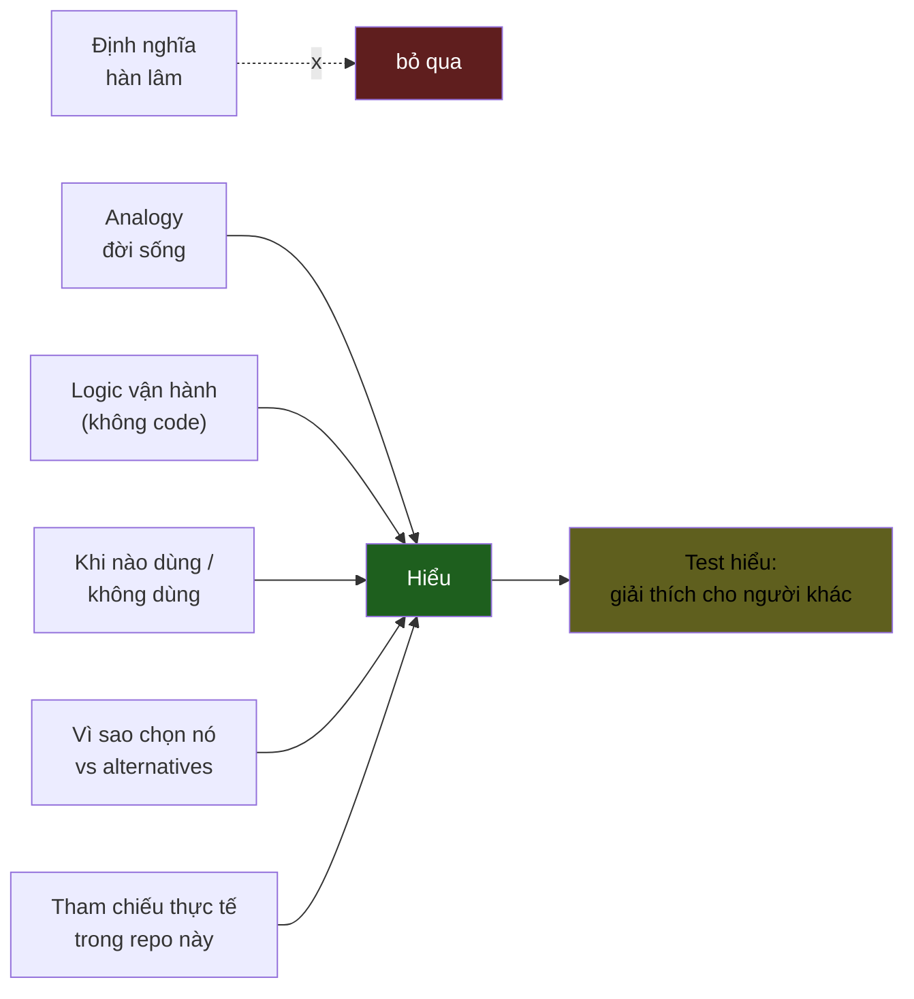

# Methodology — Cách hệ thống học này được thiết kế

> Tại sao 1 KU phải có cấu trúc như vậy. Tại sao không học định nghĩa hàn lâm. Tại sao analogy quan trọng.

---

## 1. Vấn đề của cách học truyền thống

Khi bạn search "Kafka là gì", Google trả về:

> Apache Kafka là một nền tảng truyền tải sự kiện phân tán có khả năng mở rộng, được thiết kế để xử lý luồng dữ liệu thời gian thực với độ trễ thấp và thông lượng cao...

Đọc xong, bạn:
- ✅ Có thể đọc to câu này
- ❌ Không biết khi nào nên dùng
- ❌ Không biết vì sao **không** dùng RabbitMQ
- ❌ Không hình dung được nó vận hành thế nào
- ❌ Không dạy lại được cho người khác

→ Đó **không phải** hiểu. Đó là **nhớ tạm**.

---

## 2. Triết lý của hệ thống này



> **Hiểu = giải thích được cho người không cùng ngành.**
>
> Nếu bạn không thể giải thích Kafka cho mẹ bạn trong 2 phút mà mẹ gật đầu, bạn chưa hiểu Kafka.

---

## 3. Khung 7 câu hỏi của mỗi KU

Mỗi KU LUÔN có 7 phần theo thứ tự cố định. Đây không phải gợi ý — là **bắt buộc**, để mỗi lần đọc bạn biết tìm cái gì ở đâu.

### 🎯 1. Nó là gì?
- **Mở đầu bằng analogy đời sống**, không phải định nghĩa.
- Định nghĩa hàn lâm (nếu có) đặt sau analogy, in nghiêng.
- Ví dụ: "Kafka như **bưu cục có nhiều ngăn thư**, ai gửi cứ gửi, ai nhận cứ nhận, thư không mất."

### 💡 2. Nó làm được gì?
- 3-5 gạch đầu dòng capability cụ thể.
- Không trừu tượng kiểu "scalable, fault-tolerant, high-throughput".
- Cụ thể kiểu "lưu được hàng triệu thư mỗi giây, đọc lại được thư từ 1 tuần trước".

### 🧩 3. Nó là mảnh ghép nào trong tổng thể?
- Đặt nó vào sơ đồ kiến trúc.
- Cái gì gọi nó? Nó gọi cái gì?
- Có thể chèn Mermaid để chỉ vị trí.

### 🚀 4. Nó giúp ích gì?
- Không phải "feature" mà là **bài toán nó giải**.
- "Trước khi có Kafka, mỗi service phải gọi trực tiếp service khác → khi 1 service chết, tất cả chờ. Có Kafka → service A đẩy thư vào, service B chết cũng không ảnh hưởng A."

### ⏰ 5. Khi nào dùng / KHÔNG dùng?
- Bảng 2 cột.
- **"Không dùng"** quan trọng không kém "dùng".
- Ví dụ: "KHÔNG dùng Kafka cho 100 user/ngày của blog cá nhân — Redis pub/sub đủ rồi."

### 🤔 6. Vì sao chọn nó (vs alternatives)?
- Liệt kê 2-4 lựa chọn thay thế.
- Mỗi cái: ưu / nhược / khi nào nó thắng.
- Đây là **dấu hiệu senior**: thấy được trade-off.

### 🔧 7. Nó vận hành ra sao?
- Logic, không code.
- Sequence diagram hoặc flowchart.
- Tập trung vào **dòng dữ liệu** và **trạng thái thay đổi**, không phải syntax.

### 🧠 8. Self-test
- 3-5 câu hỏi.
- Trả lời được = hiểu. Trả lời lúng túng = đọc lại.
- Tốt nhất là viết câu trả lời ra giấy, đối chiếu với KU.

---

## 4. Style guide

### Ngôn ngữ
- **Tiếng Việt là chính.** Tiếng Anh chỉ dùng cho thuật ngữ.
- Lần đầu xuất hiện thuật ngữ Anh: `... CDC (Change Data Capture, ghi nhận thay đổi dữ liệu)...`
- Sau đó dùng tiếng Anh gọn.
- KHÔNG dùng tiếng Anh để khoe.

### Văn phong
- Peer-to-peer. Không giảng dạy từ trên xuống.
- Câu ngắn. Câu dài bị cắt nhỏ.
- Không "we will see that..." kiểu textbook.

### Analogy
- Lấy từ **đời sống Việt Nam**: chợ, bún, xe máy, sổ hộ khẩu, bưu điện, ngân hàng, bệnh viện.
- Nếu phải dùng analogy nước ngoài (sushi conveyor belt cho Kafka), giải thích lại 1 câu.

### Hình vẽ
- Ít nhất 1 Mermaid mỗi KU.
- Tốt nhất 2-3.
- Palette màu nhất quán (xem `templates/colors.md`).

### Độ dài
- KU bình thường: 700-1200 từ.
- KU cốt lõi (CAP, Kafka, Iceberg, Flink): 1200-1800 từ.
- KU phụ trợ: 500-800 từ.

---

## 5. Tham chiếu chéo

Mỗi KU nên có ít nhất 1 link **về bên trong repo** ở cuối:

```markdown
## 🔗 Trong repo này
- Thấy `partition` được dùng thực tế ở [`docs/06-event-backbone.md`](../../docs/06-event-backbone.md)
- Schema mẫu dùng partition: [`schemas/payment/payment.authorized.v1.json`](../../schemas/payment/payment.authorized.v1.json)
- ADR liên quan: [ADR-0002](../../adr/0002-redpanda-over-kafka.md)
```

→ Học rồi xem code thật → khắc sâu.

---

## 6. Khi nào dùng link ngoài

**Hạn chế.** Mỗi KU tối đa 3 link ngoài. Chỉ khi:
- Nguồn chính thống (Apache, NVIDIA, RFC).
- Bổ sung SÂU mà KU không cover hết được (ví dụ: RFC 4271 cho BGP).
- KHÔNG link blog Medium ngẫu nhiên.

Đặt ở section `## 📖 Đọc thêm (chính thống)` cuối KU.

---

## 7. Self-test rubric

| Bạn trả lời được... | Mức |
|---|---|
| 0-1 câu | Chưa hiểu — đọc lại |
| 2-3 câu | Biết — nhưng chưa hiểu |
| 4-5 câu trôi chảy, kèm ví dụ riêng | Hiểu — có thể dạy lại |

---

## 8. Khi viết KU mới (cho bạn / cho tôi)

Trước khi viết, check 5 câu hỏi:

- [ ] Có analogy đời sống đủ "thấm" không?
- [ ] Có "khi nào KHÔNG dùng" rõ ràng không?
- [ ] Có bảng so sánh vs alternatives không?
- [ ] Có Mermaid diagram không?
- [ ] Có tham chiếu chéo vào repo platform không?

Nếu thiếu 1 trong 5, **chưa viết**. Đó là KU half-baked.

---

## 9. Cách dùng METHODOLOGY này

Bạn không phải đọc 1 lần rồi quên. Mỗi lần đọc 1 KU, nếu thấy KU đó **dở** (không thấm, không giải thích được cho người khác), quay lại đây — chắc chắn KU đó thiếu 1 trong 7 phần trên.

KU dở → fix KU đó, không phải đổ lỗi cho bản thân không hiểu.
