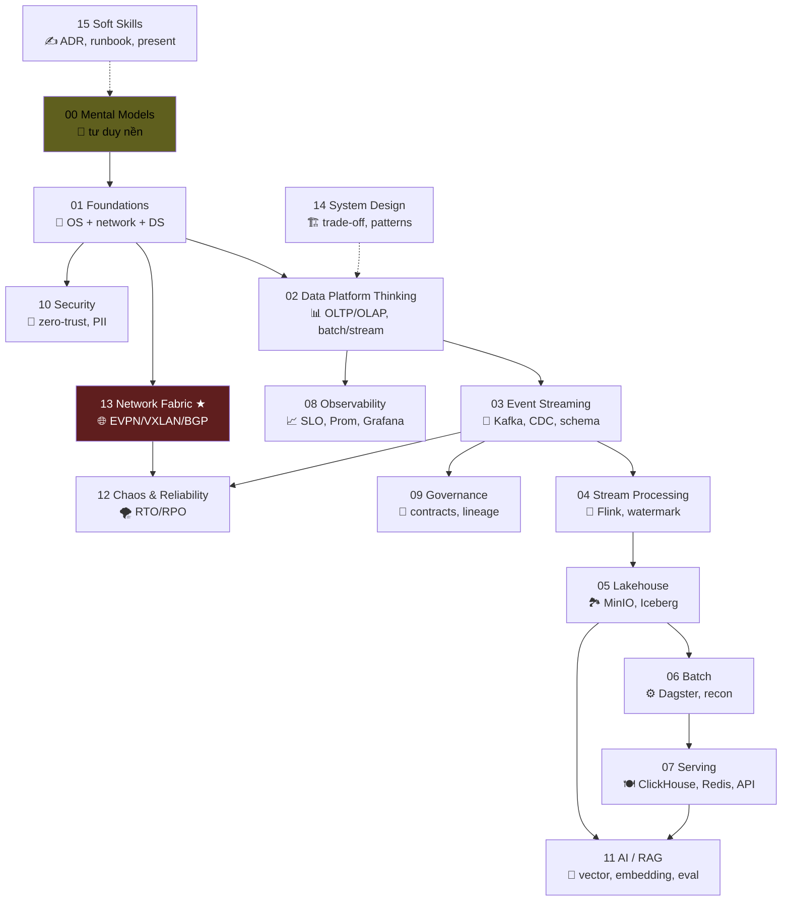
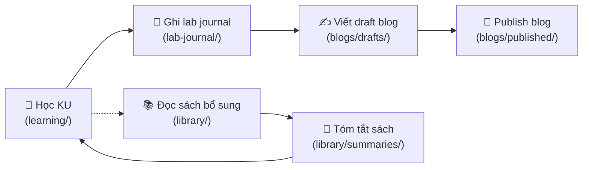

# Learning Lab

> Phòng học — phòng làm — phòng viết. Tất cả trong cùng 1 repo.
> Không phải tutorial setup. Là **hiểu logic vận hành** bằng tiếng Việt + analogy đời sống.

---

## 🎯 Mục tiêu

Sau khi đi hết hệ thống này, bạn KHÔNG chỉ biết "Kafka là gì" theo định nghĩa Wikipedia. Bạn sẽ **giải thích được Kafka cho cô bán bún** trong 3 phút, **biết khi nào nên / không nên dùng**, và **kể được vì sao chọn nó thay vì alternative**.

Đó là khoảng cách giữa *junior đọc tutorial* và *senior thực sự hiểu*.

---

## 🧭 Cách đi

Mỗi **Knowledge Unit (KU)** trả lời 7 câu hỏi cố định:

```mermaid
flowchart LR
    Q1["🎯 Là gì?<br/>analogy đời sống"] --> Q2["💡 Làm được gì?<br/>capability"]
    Q2 --> Q3["🧩 Mảnh ghép nào<br/>trong tổng thể?"]
    Q3 --> Q4["🚀 Giúp ích gì?<br/>value"]
    Q4 --> Q5["⏰ Khi nào dùng /<br/>KHÔNG dùng?"]
    Q5 --> Q6["🤔 Vì sao chọn nó<br/>vs alternatives?"]
    Q6 --> Q7["🔧 Vận hành ra sao?<br/>logic, không code"]
    Q7 --> ST["🧠 Self-test<br/>3-5 câu"]

    style Q1 fill:#1e3a5f,color:#fff
    style Q2 fill:#3a1e5f,color:#fff
    style Q3 fill:#5f1e5f,color:#fff
    style Q4 fill:#5f1e3a,color:#fff
    style Q5 fill:#3a5f1e,color:#fff
    style Q6 fill:#5f3a1e,color:#fff
    style Q7 fill:#5f5f1e,color:#000
    style ST fill:#1e5f5f,color:#fff
```



Đọc [METHODOLOGY.md](./METHODOLOGY.md) để hiểu sâu hơn về triết lý.

---

## 🗺 Bản đồ học (Learning Map)



Đi theo mũi tên đặc (→). Nét đứt (-->) là kiến thức xuyên suốt, đọc song song.

---

## 📚 Modules

| # | Module | KUs | Status |
|---:|---|---:|---|
| 00 | [Mental Models — tư duy nền](./00-mental-models/) | 8 | 🟡 Wave 1 |
| 01 | [Foundations — OS / Network / Distributed Systems](./01-foundations/) | 12 | 🟡 Wave 1 |
| 02 | [Data Platform Thinking](./02-data-platform-thinking/) | 10 | 🟡 Wave 1 |
| 03 | [Event Streaming — Kafka / Redpanda / CDC](./03-event-streaming/) | 12 | ⚪ Wave 2 |
| 04 | [Stream Processing — Flink](./04-stream-processing/) | 14 | ⚪ Wave 2 |
| 05 | [Lakehouse — MinIO + Iceberg + Trino](./05-lakehouse/) | 10 | ⚪ Wave 2 |
| 06 | [Batch Orchestration — Dagster](./06-batch-orchestration/) | 8 | ⚪ Wave 2 |
| 07 | [Serving — ClickHouse / Redis / FastAPI](./07-serving/) | 9 | ⚪ Wave 2 |
| 08 | [Observability + SLO](./08-observability/) | 11 | ⚪ Wave 3 |
| 09 | [Governance + Lineage](./09-governance/) | 8 | ⚪ Wave 3 |
| 10 | [Security + Zero-trust](./10-security/) | 8 | ⚪ Wave 3 |
| 11 | [AI / RAG](./11-ai-rag/) | 11 | ⚪ Wave 3 |
| 12 | [Chaos & Reliability](./12-chaos-reliability/) | 9 | ⚪ Wave 3 |
| 13 | [Network Fabric ★ — EVPN/VXLAN/BGP](./13-network-fabric/) | 12 | 🟡 Wave 1 |
| 14 | [System Design](./14-system-design/) | 9 | ⚪ Wave 3 |
| 15 | [Soft Skills — ADR / Runbook / Present](./15-soft-skills/) | 7 | ⚪ Wave 3 |

**Tổng:** ~168 KUs.

Status: 🟢 done · 🟡 in progress · ⚪ pending

---

## 🧱 Cách dùng repo này



1. **Đọc KU** trong `learning/<module>/`.
2. **Đánh dấu** đã đọc xong trong `learning/progress/checklist.md`.
3. **Ghi nhật ký** tuần đó vào `lab-journal/YYYY-Www.md`: học được gì? confused chỗ nào?
4. **Viết blog draft** khi đã hiểu đủ để giải thích cho người khác (= test hiểu thực).
5. **Đọc thêm sách** ở `library/books/<chủ-đề>/` khi muốn sâu hơn.
6. **Tóm tắt sách** thành `library/summaries/<book>.md` để chốt take-aways.

---

## 🤝 Tham chiếu chéo với phần platform

Mỗi KU sẽ trỏ về phần code/doc tương ứng trong repo:

```text
learning/03-event-streaming/02-partition.md
  ↓ (See in practice:)
docs/06-event-backbone.md → topic catalog với partition count
producers/clickstream_producer.py → producer thực tế
schemas/ecom/ecom.page_view.v1.json → schema gắn topic
```

→ Học xong concept → mở file thật → thấy concept ấy được dùng → khắc sâu hơn 10 lần.

---

## 📖 Đọc thêm

- [METHODOLOGY.md](./METHODOLOGY.md) — triết lý + cách viết KU
- [GLOSSARY.md](./GLOSSARY.md) — từ điển Việt-Anh thuật ngữ
- [`../library/`](../library/) — sách tham khảo
- [`../blogs/`](../blogs/) — writing lab
- [`../lab-journal/`](../lab-journal/) — nhật ký
