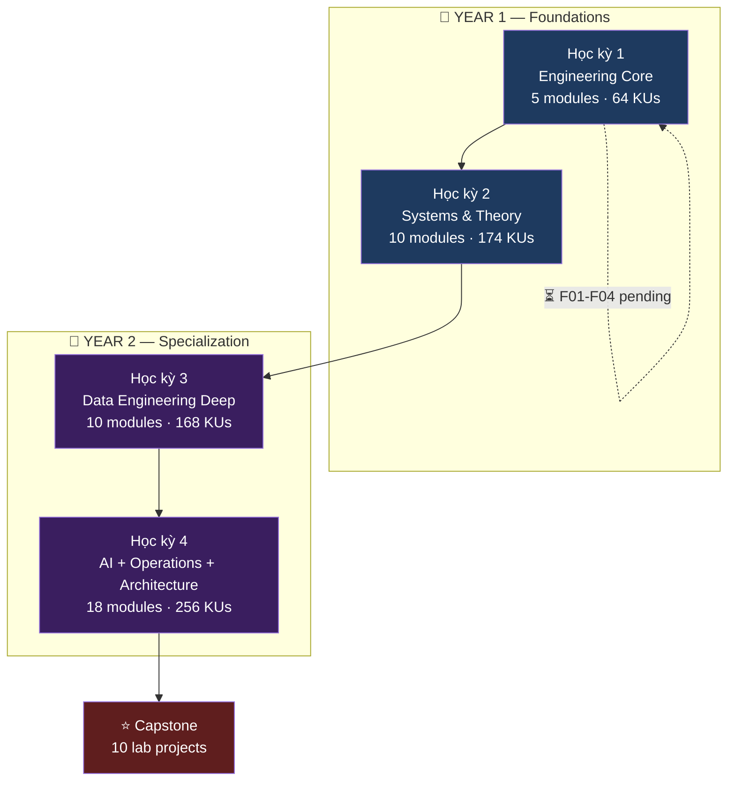

# Learning Lab — Chương trình 2 năm

> Phòng học — phòng làm — phòng viết. Cấu trúc đại học chuẩn.
> **43 modules · 662 KUs · ~1.85M từ.**

---

## 🎓 Cấu trúc đại học



---

## 📂 Cấu trúc thư mục

```
learning/
├── README.md                                ← bạn ở đây
├── CURRICULUM.md                            ← bản đồ 43 module chi tiết
├── METHODOLOGY.md                           ← rule viết KU + 16 section
├── GLOSSARY.md                              ← từ điển Việt-Anh
│
├── year-1-foundations/                      ← 📘 YEAR 1
│   ├── semester-1-engineering-core/         ← Wave 1 (5 modules)
│   │   ├── F00-mental-models/               ✅ DONE 12/12 KUs
│   │   ├── F01-cs-fundamentals/             ⏳ 18 KUs
│   │   ├── F02-programming-paradigms/       ⏳ 14 KUs
│   │   ├── F03-modern-python-for-data/      ⏳ 12 KUs
│   │   └── F04-type-systems-validation/     ⏳ 8 KUs
│   └── semester-2-systems-theory/           ← Wave 2 (10 modules)
│       ├── F05-operating-systems/           ⏳ 18 KUs
│       ├── F06-computer-networks/           ⏳ 20 KUs
│       ├── F07-linux-devops/                ⏳ 16 KUs
│       ├── F08-containers-k8s-basics/       ⏳ 14 KUs
│       ├── F09-databases-relational/        ⏳ 18 KUs
│       ├── F10-databases-beyond-sql/        ⏳ 16 KUs
│       ├── F11-distributed-systems-theory/  ⏳ 22 KUs
│       ├── F12-system-design-fundamentals/  ⏳ 20 KUs
│       ├── F13-security-privacy/            ⏳ 16 KUs
│       └── F14-math-for-data-ai/            ⏳ 14 KUs
│
├── year-2-specialization/                   ← 📕 YEAR 2
│   ├── semester-3-data-engineering-deep/    ← Wave 3 (10 modules)
│   │   ├── D15-data-modeling/               ⏳ 16 KUs
│   │   ├── D16-event-streaming-deep/        ⏳ 22 KUs
│   │   ├── D17-stream-processing-deep/      ⏳ 22 KUs
│   │   ├── D18-batch-processing-spark/      ⏳ 18 KUs
│   │   ├── D19-lakehouse-deep/              ⏳ 20 KUs
│   │   ├── D20-orchestration-deep/          ⏳ 16 KUs
│   │   ├── D21-serving-query-engines/       ⏳ 18 KUs
│   │   ├── D22-data-quality-contracts/      ⏳ 12 KUs
│   │   ├── D23-cdc-replication/             ⏳ 10 KUs
│   │   └── D24-modern-data-stack-2026/      ⏳ 14 KUs
│   └── semester-4-ai-ops-architecture/      ← Wave 4 (18 modules)
│       ├── D25-backend-engineering/         ⏳ 16 KUs
│       ├── D26-observability-sre/           ⏳ 20 KUs
│       ├── D27-governance-lineage/          ⏳ 12 KUs
│       ├── D28-ml-engineering-foundations/  ⏳ 18 KUs
│       ├── D29-deep-learning-basics/        ⏳ 14 KUs
│       ├── D30-llm-engineering/             ⏳ 18 KUs
│       ├── D31-vector-search-embeddings/    ⏳ 16 KUs
│       ├── D32-rag-engineering-deep/        ⏳ 14 KUs
│       ├── D33-ai-agents-tool-use/          ⏳ 12 KUs
│       ├── D34-mlops-model-serving/         ⏳ 16 KUs
│       ├── D35-gpu-compute-ai-infra/        ⏳ 14 KUs
│       ├── D36-network-fabric/              ⏳ 16 KUs ★ differentiator
│       ├── D37-chaos-reliability/           ⏳ 14 KUs
│       ├── D38-cloud-native-k8s-deep/       ⏳ 16 KUs
│       ├── D39-finops-cost-engineering/     ⏳ 8 KUs
│       ├── D40-solution-architecture/       ⏳ 10 KUs
│       ├── D41-experimentation-ab-testing/  ⏳ 10 KUs
│       └── D42-soft-skills-communication/   ⏳ 12 KUs
│
├── capstone/                                ← ⭐ Wave 5 (10 labs)
│   ├── lab-01-event-backbone-cdc/
│   ├── lab-02-stream-processing-lakehouse/
│   ├── lab-03-batch-reconciliation-dq/
│   ├── lab-04-realtime-serving-api/
│   ├── lab-05-network-chaos-suite/          ★ differentiator
│   ├── lab-06-observability-runbook/
│   ├── lab-07-lineage-contracts-pii/
│   ├── lab-08-rag-service-eval/
│   ├── lab-09-mlops-pipeline/
│   └── lab-10-benchmark-portfolio/
│
├── _legacy/                                 ← reference cũ (sẽ migrate vào F-modules)
│   └── M01-foundations-v1/                  12 KUs cũ v1 (sẽ rewrite vào F05/F06/F08/F11)
│
├── progress/
│   ├── checklist.md                         ← tick khi đọc xong KU
│   └── notes.md                             ← ghi lightbulb/confused
│
└── templates/
    ├── KU-template.md
    ├── module-quiz-template.md
    └── colors.md
```

---

## 🎯 Trạng thái hiện tại

| Wave | Học kỳ | Modules | KUs done | Status |
|---|---|---:|---|---|
| **Wave 1** | HK1 Engineering Core | F00 → F04 | 12/64 | 🟡 19% (F00 done, F01-F04 pending) |
| **Wave 2** | HK2 Systems & Theory | F05 → F14 | 0/174 | ⚪ pending |
| **Wave 3** | HK3 Data Engineering Deep | D15 → D24 | 0/168 | ⚪ pending |
| **Wave 4** | HK4 AI + Ops + Architecture | D25 → D42 | 0/256 | ⚪ pending |
| **Wave 5** | Capstone | 10 labs | 0/10 | ⚪ pending |

**Tổng:** 12/662 KUs (1.8%) · ~40,500 từ đã viết.

---

## 🚀 Start here

1. Đọc [METHODOLOGY.md](./METHODOLOGY.md) để hiểu cách viết/đọc KU (16 sections, analogy đời sống, logic-only, no setup).
2. Đọc [CURRICULUM.md](./CURRICULUM.md) để xem full 43-module map + KU titles.
3. Bắt đầu [Year 1 → Semester 1 → F00 Mental Models](./year-1-foundations/semester-1-engineering-core/F00-mental-models/) — đã hoàn thành 12/12 KU.
4. Sau F00 → tiếp F01 CS Fundamentals (đang viết).

## 📖 Đọc thêm

- [`../library/`](../library/) — 104 sách + 5 paper + 5 free courses (catalog: [`../library/SCAN_INDEX.md`](../library/SCAN_INDEX.md))
- [`../blogs/`](../blogs/) — writing lab (viết blog từ KU để Hiểu sâu)
- [`../lab-journal/`](../lab-journal/) — nhật ký học hàng tuần
