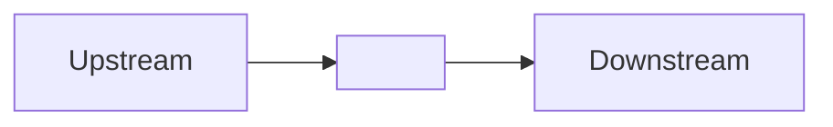
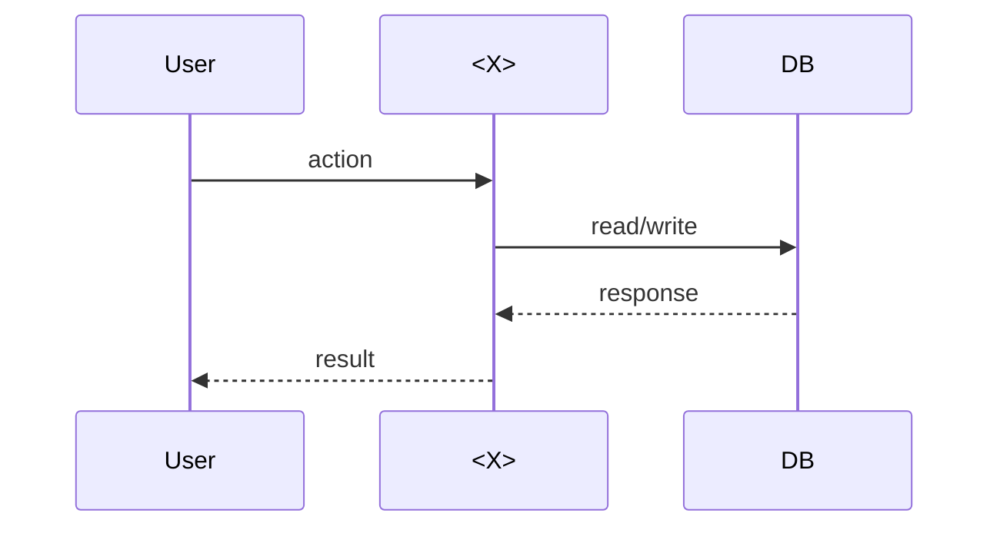

# KU XX/YY — <Tên KU>

> 1 câu hook mở đầu, gây tò mò. Không phải định nghĩa.

**Module:** [XX — <module name>](../README.md)
**Phụ thuộc:** KU AA/BB · KU CC/DD
**Đọc trong:** ~10 phút
**Trong repo này:** trỏ tới file thật dùng concept này

---

## 🎯 Nó là gì?

**Analogy đời sống** (BẮT BUỘC mở đầu bằng cái này, không phải định nghĩa):

> Tưởng tượng <tình huống đời sống>. Đó chính là cách <X> vận hành.

*Định nghĩa hàn lâm (chỉ để tham khảo):* <X> là...

---

## 💡 Nó làm được gì?

3-5 capability cụ thể, không trừu tượng:

- ...
- ...
- ...

---

## 🧩 Nó là mảnh ghép nào trong tổng thể?

Diễn giải: <X> đứng giữa A và B. A đẩy vào, B đọc ra.

---

## 🚀 Nó giúp ích gì?

**Bài toán mà nếu không có <X>, bạn sẽ phải:**
- ...

**Có <X> rồi:**
- ...

---

## ⏰ Khi nào dùng / KHÔNG dùng?

| ✅ Dùng khi | ❌ KHÔNG dùng khi |
|---|---|
| ... | ... |
| ... | ... |

---

## 🤔 Vì sao chọn nó (vs alternatives)?

| Lựa chọn | Khi nào nó thắng | Khi nào nó thua |
|---|---|---|
| <X> | ... | ... |
| Alt 1 | ... | ... |
| Alt 2 | ... | ... |

---

## 🔧 Nó vận hành ra sao?

Diễn giải step-by-step:
1. ...
2. ...
3. ...

---

## 🧠 Self-test

Trả lời được = hiểu. Không trả lời được = đọc lại.

1. <câu 1>
2. <câu 2>
3. <câu 3>
4. <câu 4>
5. <câu 5 — câu khó nhất>

---

## 🔗 Trong repo này

Concept này xuất hiện thực tế ở:

- [`docs/...md`](../../docs/...md) — ...
- [`<code>/.../...`](../../<code>/...) — ...
- ADR liên quan: [ADR-XXXX](../../adr/XXXX-...)

---

## 📖 Đọc thêm (chính thống)

- [Nguồn 1](https://...)
- [Nguồn 2](https://...)
