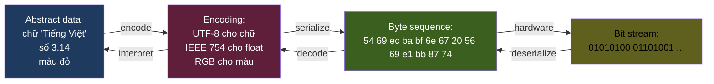

# KU F01 / 01 — Bits, bytes, encoding: unit cơ bản của máy tính

> Tất cả dữ liệu trong máy tính = chuỗi **bit 0/1**. Hiểu cách bit → byte → ký tự → file = hiểu vì sao có UTF-8 vs Latin-1, vì sao base64 to gấp 1.33x file gốc, vì sao Parquet nhỏ hơn JSON 10x. Đây là **đơn vị đầu tiên** mọi engineer phải có.

**Module:** [F01 — CS Fundamentals](./README.md)
**Prereqs:** [F00 Mental Models](../F00-mental-models/)
**Related KUs:** [F01/02 Big-O](./02-big-o-notation.md) · [F01/10 Compression](./10-compression-basics.md) · [F01/15 String encoding](./15-string-encoding-bugs.md) · [F01/16 Endianness](./16-endianness.md)
**Đọc trong:** ~12 phút
**Mức độ:** Foundational

---

## 🎯 Nó là gì? (Analogy đời sống)

Tưởng tượng bạn đang **gửi tin nhắn mã Morse** từ Sài Gòn ra Hà Nội qua dây điện báo cũ.

- Mỗi ký hiệu có **2 trạng thái**: "tít" (dài) hoặc "ta" (ngắn) — giống bit **0** hoặc **1**.
- Chữ "A" trong Morse = `.-` (2 ký hiệu).
- Chữ "B" = `-...` (4 ký hiệu).
- Để gửi "BACH" cần ~16 ký hiệu Morse.
- Người nhận phải có **bảng tra Morse** để dịch ngược.

Máy tính giống y hệt — nhưng nhanh hơn 1 tỷ lần:

- **Bit (binary digit)** = 1 trạng thái 0 hoặc 1, đơn vị cơ bản nhất.
- **Byte** = 8 bit = 256 trạng thái (2^8). Đủ encode 1 ký tự ASCII.
- **Encoding** = bảng tra dịch giữa **ý nghĩa con người** (chữ "A", màu đỏ, số 42) và **bit pattern** máy hiểu.

Không có encoding chuẩn = "BACH" gửi đi nhưng bên kia đọc ra "B0CH" hoặc "????" — đó là **Mojibake**, khi bạn mở file CSV tiếng Việt thấy `Tiá??ng Viá??t` thay vì `Tiếng Việt`. Đây là khoảng 99% lỗi data engineer mới vào nghề gặp.

---

## 🧩 The Crux of the Problem  *(v3 — OSTEP-style framing)*

> **Core question:** Máy tính chỉ hiểu 0 và 1. Làm sao **encode** mọi thứ (chữ tiếng Việt, emoji 🎉, hình ảnh, video, audio, IPv6 address) thành bit pattern + đảm bảo **bên gửi và bên nhận hiểu giống nhau**?
>
> **Why hard:** Có vô số cách encode "Tiếng Việt" thành bit. ASCII (1963) chỉ có 128 ký tự — không có chữ Việt. ISO-8859-1 (Latin-1) khác Windows-1252 khác UTF-8. Đọc sai encoding = Mojibake. Càng dùng nhiều ngôn ngữ + emoji, càng cần encoding universal.
>
> **What we need:** Một encoding chuẩn **universal** + **backward compatible** với ASCII + **variable-length** để efficient với English. Đó là **UTF-8** (1992, Ken Thompson + Rob Pike).

→ Today (2026): UTF-8 dominate 98% web. Mọi modern system (Python 3 string, JSON, HTML5, Linux filesystem) default UTF-8.

---

## 📜 Lịch sử ngắn  *(v3 — etymology + invention)*

- **Morse code (1830s)** — Samuel Morse — variable-length code đầu tiên. Frequent letters (E, T) shorter codes. Same principle như Huffman 100 năm sau.
- **Baudot code (1870s)** — 5-bit teletype encoding. Tên thành unit baud rate.
- **ASCII (1963)** — *American Standard Code for Information Interchange*. 7-bit, 128 ký tự. Bias về English.
- **EBCDIC (1964)** — IBM mainframe encoding, không tương thích ASCII. Vẫn dùng trong COBOL legacy.
- **ISO-8859-x (1980s)** — 8-bit extensions cho European languages. 15 variants. Lỗi nếu mix.
- **Unicode (1991)** — universal character set, 1.1M code points. **Joe Becker** (Xerox) propose. Today: 154 scripts, 149K characters.
- **UTF-8 (1992)** — **Ken Thompson & Rob Pike** invent trong 1 night để Plan 9 OS. Genius properties: ASCII-compatible (single-byte), self-synchronizing, no null bytes, variable-length (1-4 bytes).
- **UTF-16 / UTF-32** — alternatives. UTF-16 dùng nội bộ Java/Windows/JavaScript. UTF-32 đơn giản nhưng phí 4× memory cho ASCII.
- **Today (2026):** UTF-8 thắng cuộc chiến encoding. Mọi system mới default UTF-8.

---

## ❌ Bad example / anti-pattern  *(v3 — "Martin's algorithm" style)*

### Anti-pattern 1 — Open file không specify encoding

```python
# ❌ Python 2 default ASCII, Python 3 default platform-dependent
with open('user_data.csv') as f:
    data = f.read()
# Windows default cp1252, Linux default utf-8 → broken cross-platform
```

**Tại sao bad:** Default encoding khác nhau theo OS. Pick **explicit**:
```python
with open('user_data.csv', encoding='utf-8') as f: ...
```

### Anti-pattern 2 — Concat bytes + str

```python
# ❌ Mix bytes và string
header = b"Content-Type: text/html\n"
body = "Hello, Tiếng Việt"
response = header + body   # TypeError: can't concat str to bytes
```

**Tại sao bad:** Bytes (raw) khác str (Unicode code points). Phải explicit encode:
```python
response = header + body.encode('utf-8')
```

### Anti-pattern 3 — Substring UTF-8 by byte

```python
# ❌ Cắt UTF-8 string by byte → broken multi-byte char
data = "Tiếng Việt".encode('utf-8')   # 12 bytes
truncated = data[:5]                    # cắt giữa multi-byte char
print(truncated.decode('utf-8'))        # UnicodeDecodeError
```

**Tại sao bad:** UTF-8 char "ế" = 3 bytes (E1 BA BF). Cắt giữa → corrupted. **Always** work với decoded `str`, not raw bytes.

### Anti-pattern 4 — `len()` Unicode trả về visual character count

```python
# ❌ Length of emoji string
s = "Hello 👨‍👩‍👧‍👦"  # family emoji = ZWJ sequence
print(len(s))    # 13 (Python counts code points)
# Visual: 7 characters
# UTF-8 bytes: 25 bytes
# 3 different "lengths" — must specify which
```

**Tại sao bad:** "Length" ambiguous cho Unicode. Pick:
- **Byte length** for storage: `len(s.encode('utf-8'))`
- **Code point count** for processing: `len(s)`
- **Grapheme count** for display: `regex.findall(r'\X', s)` or `grapheme` library

---

## 📖 Định nghĩa chính thức

**Bit (binary digit)** — đơn vị thông tin nhỏ nhất, có 2 trạng thái: 0 hoặc 1.

**Byte** — gom 8 bit. Là **unit addressable** chính trong memory + file system. 1 byte có 2^8 = 256 giá trị (từ 0 đến 255, hoặc -128 đến 127 nếu signed).

**Encoding** — convention mapping **giữa giá trị abstract** (ký tự, số, hình ảnh) và **bit/byte pattern** cụ thể. Ví dụ:
- ASCII: 'A' = byte 65 (binary `01000001`)
- UTF-8: 'A' = byte 65 (1 byte), 'ă' = 2 bytes (`11000100 10000011`), '中' = 3 bytes
- Latin-1 (ISO-8859-1): 'A' = byte 65, 'á' = byte 225 (1 byte) — **KHÁC** UTF-8!
- Integer 8-bit unsigned: byte `00000010` = 2 (decimal)
- Integer 8-bit signed (two's complement): byte `11111110` = -2

**Encoding mismatch** = nguồn gốc 99% bug "ký tự lạ" trong data engineering.

**Nguồn:**
- Joel Spolsky, *"The Absolute Minimum Every Software Developer Absolutely, Positively Must Know About Unicode and Character Sets"* (2003) — bài kinh điển.
- RFC 3629 — UTF-8 chuẩn IETF.
- IEEE 754 — Floating point standard (cho float encoding).
- Reis-Housley *Fundamentals of Data Engineering* Appendix B — serialization & compression.

---

## 🔤 Terminology box

| Thuật ngữ | Tiếng Anh | Giải thích 1 câu |
|---|---|---|
| Bit | Bit | Đơn vị nhỏ nhất, 0 hoặc 1 |
| Byte | Byte | 8 bits = 1 unit addressable trong memory |
| Word | Word | Đơn vị tự nhiên CPU (32-bit = 4 byte, 64-bit = 8 byte) |
| Nibble | Nibble | 4 bits = nửa byte (hex digit) |
| Hexadecimal | Hex | Cơ số 16 (0-9, A-F), 1 hex = 4 bits, 2 hex = 1 byte |
| Binary | Binary | Cơ số 2, native của máy |
| Decimal | Decimal | Cơ số 10, native của người |
| ASCII | ASCII | American Standard Code for Information Interchange — 128 ký tự cơ bản, 7 bits |
| Extended ASCII | Extended ASCII | 256 ký tự, 8 bits (Latin-1, etc.) |
| Unicode | Unicode | Standard cover toàn bộ ngôn ngữ thế giới (1+ million code points) |
| UTF-8 | UTF-8 | Variable-length encoding của Unicode — 1-4 bytes/ký tự, ASCII-compatible |
| UTF-16 | UTF-16 | 2-4 bytes/ký tự, dùng trong Java/Windows |
| UTF-32 | UTF-32 | Luôn 4 bytes/ký tự, dễ index nhưng tốn |
| Code point | Code point | 1 ký tự trong Unicode, ví dụ U+0041 = 'A', U+00E1 = 'á' |
| Endianness | Endianness | Thứ tự byte (big-endian / little-endian) |
| Mojibake | Mojibake | Ký tự lạ do encoding mismatch (tiếng Nhật 文字化け) |
| Base64 | Base64 | Encoding chuyển binary thành ASCII printable (size × 1.33) |
| Magic number | Magic number | Bytes đầu file định danh file type (PDF = `25 50 44 46`) |
| BOM | Byte Order Mark | 2-3 bytes đầu file UTF-* để signal encoding |
| Two's complement | Two's complement | Cách encode integer âm (binary) |
| IEEE 754 | IEEE 754 | Standard cho floating point (single 32-bit, double 64-bit) |
| Big-endian | Big-endian | Byte cao trước (network protocol, mainframe) |
| Little-endian | Little-endian | Byte thấp trước (x86, ARM) |

---

## 💡 Nó làm được gì?

Hiểu bit/byte/encoding cho phép bạn:

- **Debug encoding bug** trong < 30 giây — đoán đúng UTF-8 vs Latin-1, không phải Google 1 tiếng.
- **Estimate size** của data trước khi build (1M user × 50 bytes/record = 50MB).
- **Hiểu file format internals** — Parquet column compression, Avro variable-length integers, JSON Schema validation.
- **Đọc magic bytes** identify file format khi extension mất (`hexdump -C file.bin | head` → 25 50 44 46 = PDF).
- **Pick compression đúng** dựa trên entropy của data (xem KU 10).
- **Avoid base64 trap** — biết base64 to 33% so với raw binary, dùng khi cần ASCII transport (JSON, email).

---

## 🧩 Nó là mảnh ghép nào trong tổng thể?



→ **Encoding là bridge** giữa người (abstract data) và máy (bit stream). Mỗi tầng kỹ thuật (Postgres, Kafka, Parquet, JSON) đều có encoding riêng.

---

## 🚀 Nó giúp ích gì? (Real impact trong DE)

### Bug 1 — Tiếng Việt thành ký tự lạ

```
CSV file `users.csv`:
  ID,Name
  1,Nguyễn Văn A
  2,Trần Thị B

Open trong Excel → hiển thị:
  1,Nguyá»…n Vu‰n A
  2,Trịn Thị B
```

**Root cause:** file encoded UTF-8, Excel decode bằng Latin-1 (Windows default).

**Senior fix:** Specify UTF-8 explicit khi đọc: `pd.read_csv('users.csv', encoding='utf-8')`. Hoặc add BOM: `EF BB BF` đầu file.

### Bug 2 — Parquet file 100MB → JSON 1.2GB

```
1M records × 50 columns × float64
Parquet: 100MB (encoded efficient, column-compressed)
JSON export: 1.2GB (text encoded, 3-4 bytes per digit, verbose schema)
```

**Junior:** "Sao JSON to vậy?"
**Senior:** Parquet dùng binary encoding (8 bytes/float) + column compression. JSON encode 3.14 thành 4 ký tự `"3.14"` = 4 bytes, plus quote + comma + key name. **JSON ~10x to hơn Parquet cho structured data.**

### Bug 3 — base64 transport overhead

```
Upload 10MB image qua JSON API → base64 encode → 13.3MB JSON payload
Same image qua multipart/form-data → 10MB binary
```

**Trade-off:** base64 = ASCII printable (JSON-safe) + 33% overhead. Binary = nhanh hơn + JSON không support.

### Trong project DSX Air

- **Producer events** dùng JSON (~ 200 bytes/event) — easy debug, schema flexible
- **Sink lakehouse** convert sang Parquet column-compressed (~20 bytes/event sau compression)
- **Network transit** wrap trong Kafka frame format (binary header + payload)
- **Backup** lưu trong MinIO với chunked encoding

→ 1 event đi qua **3-4 encoding layers** từ producer → ClickHouse. Senior biết mỗi layer làm gì + size impact.

---

## ⏰ Khi nào quan tâm encoding?

| Tình huống | Phải nghĩ về encoding |
|---|---|
| Đọc/ghi file CSV/JSON/text | ✅ Specify UTF-8 explicit |
| Network transit JSON API | ✅ Content-Type charset=utf-8 header |
| Database connection | ✅ Set `client_encoding = UTF8` |
| Binary file format (Parquet, Avro) | ✅ Built-in handling, ít lỗi |
| Email/SMTP | ✅ MIME encoding (base64 cho attachment) |
| URL parameters | ✅ Percent-encoding (`%20` = space) |
| Internal Python string | ❌ Python 3 native UTF-8, không cần lo |
| Internal compute (int math) | ❌ Direct binary |

→ **Default rule**: UTF-8 cho text everywhere. Pin explicit khi cross boundary.

---

## 🤔 Trade-off vs alternatives

Encoding choice trade-off:

| Encoding | Size | Compatibility | Use case |
|---|:---:|:---:|---|
| **ASCII (7-bit)** | Smallest | Legacy systems | Email headers, old protocols |
| **UTF-8** | Variable (1-4 bytes) | Universal | **Default 99% modern** |
| **UTF-16** | Variable (2-4 bytes) | Java/Windows internal | Java strings |
| **UTF-32** | Fixed 4 bytes | Easy indexing, wasteful | Internal processing |
| **Latin-1** | 1 byte | European only | Legacy DBs (avoid) |
| **GBK / Big5** | Variable | Chinese only | Legacy Chinese systems |
| **Base64** | 1.33x raw | ASCII transport | JSON payload binary |
| **Hex** | 2x raw | Human-readable | Debug, magic numbers |
| **Binary (Parquet/Avro)** | Compact | Schema-aware | Modern data files |

→ **Modern default: UTF-8 + Parquet/Avro for structured data**. Skip Latin-1, GBK trừ khi maintain legacy.

---

## 🔧 Nó vận hành ra sao? (Logic walkthrough)

### Từ chữ → bit (UTF-8 encoding)

Chữ Việt 'ế' (Unicode U+1EBF):

```
Step 1: code point = 0x1EBF (binary 0001111010111111)
Step 2: 0x1EBF < 0x10000 → UTF-8 3 bytes
Step 3: UTF-8 3-byte template = 1110xxxx 10xxxxxx 10xxxxxx
Step 4: Fill bits từ code point (16 bits → 4+6+6 = 16 bits):
        1110 0001 | 10 111010 | 10 111111
Step 5: 3 bytes = E1 BA BF (hex)
```

→ 'ế' = 3 bytes `E1 BA BF` trong UTF-8.

### Từ chữ → bit (Latin-1 — SAI cho tiếng Việt)

```
Latin-1 chỉ encode được 256 ký tự (1 byte).
'ế' không có trong Latin-1 → encoder fail hoặc map sai.
```

→ Vì sao Latin-1 KHÔNG dùng cho tiếng Việt được. Phải UTF-8.

### Hex dump — đọc file binary

```bash
$ echo -n "Tiếng Việt" | hexdump -C
00000000  54 69 e1 ba bf 6e 67 20  56 69 e1 bb 87 74        |Ti...ng Vi...t|
```

Phân tích:
- `54` = 'T'
- `69` = 'i'
- `E1 BA BF` = 'ế' (3 bytes UTF-8)
- `6E 67` = 'ng'
- `20` = space
- `56 69` = 'Vi'
- `E1 BB 87` = 'ệ' (3 bytes UTF-8)
- `74` = 't'

→ Total 14 bytes cho "Tiếng Việt" (10 ký tự nhưng 2 ký tự có dấu chiếm 3 bytes mỗi cái).

### Magic numbers — file type detection

Mọi file format có "chữ ký" ở đầu (magic number):

| File | Magic (hex) | ASCII |
|---|---|---|
| PDF | `25 50 44 46` | `%PDF` |
| PNG | `89 50 4E 47 0D 0A 1A 0A` | `‰PNG\r\n\x1A\n` |
| JPEG | `FF D8 FF` | (binary) |
| ZIP | `50 4B 03 04` | `PK\x03\x04` |
| Parquet | `50 41 52 31` | `PAR1` (đầu + cuối file) |
| Avro | `4F 62 6A 01` | `Obj\x01` |
| GZIP | `1F 8B` | (binary) |
| MS Office (OLE) | `D0 CF 11 E0 A1 B1 1A E1` | (binary) |

```bash
$ hexdump -C unknown_file.bin | head -1
00000000  50 41 52 31 ...
→ Parquet file (PAR1 magic)
```

→ File extension có thể fake, magic number thì không.

### Two's complement — số âm

Byte 1 (signed 8-bit):

```
00000001  =  1
00000010  =  2
00000000  =  0
11111111  = -1  ←  flip bits + add 1 từ +1
11111110  = -2
10000000  = -128 (min signed 8-bit)
01111111  =  127 (max signed 8-bit)
```

→ Two's complement = trick để CPU add subtract dễ. Cùng circuit cho cả positive + negative.

---

## 🧪 Worked example

**Tình huống:** project DSX Air có file CSV legacy 50MB từ team Sales: `customers_legacy.csv`. Khi import bằng `pd.read_csv()` default → tiếng Việt thành ký tự lạ.

### Bước 1 — Detect encoding

```bash
$ file customers_legacy.csv
customers_legacy.csv: ISO-8859 text, with CRLF line terminators

$ head -2 customers_legacy.csv | hexdump -C
00000000  49 44 2c 4e 61 6d 65 0d  0a 31 2c 4e 67 75 79 65  |ID,Name..1,Nguye|
00000010  e1 6e 20 56 e1 6e 20 41  0d 0a                    |.n V.n A..|
```

**Phân tích:**
- `0D 0A` = CRLF (Windows line ending)
- `E1` đứng riêng (1 byte) — đây là Latin-1 'á', không phải UTF-8 (UTF-8 'á' = `C3 A1`)
- `file` command confirm: ISO-8859 (= Latin-1 family)

### Bước 2 — Read với explicit encoding

```python
# ❌ Sai: assume UTF-8
df = pd.read_csv('customers_legacy.csv')  # → UnicodeDecodeError

# ✅ Đúng: specify Latin-1
df = pd.read_csv('customers_legacy.csv', encoding='latin-1')
print(df.head())
#    ID         Name
#  0  1  Nguyên Vân A    ← typo legacy (no dấu nặng)
#  1  2  Trân Thi B
```

### Bước 3 — Convert sang UTF-8 cho downstream

```python
# Save lại với UTF-8 + BOM cho Excel friendliness
df.to_csv('customers_utf8.csv', encoding='utf-8-sig', index=False)
```

`utf-8-sig` = UTF-8 + BOM (`EF BB BF` ở đầu) → Excel tự detect UTF-8.

### Bước 4 — Verify

```bash
$ hexdump -C customers_utf8.csv | head -1
00000000  ef bb bf 49 44 2c 4e 61  6d 65 0d 0a 31 2c 4e 67  |...ID,Name..1,Ng|
        ^^^^^^^^^^^
        BOM UTF-8
```

→ BOM `EF BB BF` xuất hiện. Excel mở giờ đọc đúng UTF-8.

### Bước 5 — Pipeline integration

Trong project DSX Air, mọi ingestion script phải:

```python
# Standard pattern
with open(file_path, 'rb') as f:
    raw = f.read(4)
    if raw[:3] == b'\xef\xbb\xbf':  # UTF-8 BOM
        encoding = 'utf-8'
    elif raw[:2] in (b'\xff\xfe', b'\xfe\xff'):  # UTF-16 BOM
        encoding = 'utf-16'
    else:
        encoding = chardet.detect(open(file_path, 'rb').read(10000))['encoding']

df = pd.read_csv(file_path, encoding=encoding)
```

→ Detect-then-decode pattern. Không assume UTF-8 cho legacy data.

---

## ⚠️ Common pitfalls

### Pitfall 1 — Assume UTF-8 cho mọi file

❌ **Sai:** `pd.read_csv('legacy.csv')` → UnicodeDecodeError với file Latin-1.

✅ **Đúng:** Detect encoding first (chardet, `file`, hex dump). Pin explicit `encoding=...`.

### Pitfall 2 — Mix UTF-8 và Latin-1 trong cùng pipeline

❌ **Sai:** Producer dùng UTF-8, downstream Java consumer assume Latin-1 → Mojibake xuất hiện tại bronze layer.

✅ **Đúng:** Standardize **UTF-8 everywhere** trong project. Documenting trong data contract.

### Pitfall 3 — base64 mọi binary

❌ **Sai:** Upload 100MB ảnh qua JSON API với base64 → 133MB payload + 30% CPU overhead.

✅ **Đúng:** Multipart/form-data cho binary > 1MB. base64 chỉ cho metadata + small payload.

### Pitfall 4 — Hex dump skip với "small file"

❌ **Sai:** File 5KB CSV không xem hex dump → khi có lỗi không biết encoding.

✅ **Đúng:** `head` + `file` + `hexdump -C` là 3 commands đầu tiên cho mọi file unknown.

### Pitfall 5 — len() trên string

❌ **Sai:** `len("Việt")` → kỳ vọng 4 (4 ký tự), thực tế:
- Python 3: 4 ✓ (count code points)
- Bytes in UTF-8: 6 (3+1+1+1 nếu encode)
- Java String.length(): 4 (UTF-16 code units, NHƯNG có thể sai cho ký tự > U+FFFF)

✅ **Đúng:** Phân biệt **code points** vs **bytes** vs **grapheme clusters**. Phụ thuộc ngôn ngữ.

### Pitfall 6 — Endianness ignore

❌ **Sai:** Đọc binary file int32 trên ARM (little-endian) nhưng file ghi trên mainframe (big-endian) → số sai 4 byte order.

✅ **Đúng:** Explicit specify khi đọc binary: `struct.unpack('<i', bytes)` (`<` = little, `>` = big).

---

## 🌱 Advanced topics

### A1. Unicode normalization (NFC vs NFD)

Tiếng Việt 'ế' có thể encode 2 cách:

```
NFC (composed):    1 code point: U+1EBF (1 code point, 3 bytes UTF-8)
NFD (decomposed):  3 code points: U+0065 ('e') + U+0302 (◌̂) + U+0301 (◌́)
                   = 5 bytes UTF-8
```

→ Same visual character, **different bytes**. Sorting, comparison có thể fail nếu mix NFC/NFD.

**Fix:** normalize trước khi compare:

```python
import unicodedata
unicodedata.normalize('NFC', 'ế')  # canonical form
```

### A2. Why UTF-8 dominated

UTF-8 thắng UTF-16/UTF-32 vì:

1. **ASCII-compatible** — 1 byte cho 0-127 → tương thích ngược với code cũ.
2. **Variable length** — economy of space (English/code mostly 1 byte, Asian languages 3 bytes).
3. **No endianness** — byte order luôn cố định (UTF-16 cần BOM).
4. **Self-synchronizing** — biết byte nào là start, byte nào continuation.
5. **Web standard** — HTTP, JSON, HTML5 all default UTF-8.

→ **2026: UTF-8 ~98% web content** (W3Techs stat).

### A3. Variable-length integers (varint)

Parquet, Protobuf, Avro dùng **varint** thay vì fixed-size int:

```
Number 1:    varint = 1 byte (0x01)
Number 127:  varint = 1 byte (0x7F)
Number 128:  varint = 2 bytes (0x80 0x01)
Number 16383: varint = 2 bytes
Number int32 max (2^31-1): varint = 5 bytes
```

→ Small numbers cost 1-2 bytes (most common case in data) thay vì 4 bytes fixed. Saving 50-70% size cho integer columns.

### A4. Endianness — network vs host

Internet protocols (TCP/IP) dùng **big-endian** ("network byte order").
x86, ARM CPUs dùng **little-endian** ("host byte order").

```c
// Send port number 80 over network
uint16_t port_host = 80;        // bytes in memory: 50 00 (little-endian)
uint16_t port_net = htons(80);  // → 00 50 (big-endian)
send(socket, &port_net, 2);
```

→ Mỗi protocol C library có `htons`, `htonl`, `ntohs`, `ntohl` để convert. Forget = bug "port 0x5000 = 20480" thay vì 80.

### A5. Floating point representation (IEEE 754)

Float 32-bit:
```
sign (1 bit) | exponent (8 bits) | mantissa (23 bits)
```

Float `3.14` không exact biểu diễn được — gần nhất `3.1400001049041748...`.

→ `0.1 + 0.2 = 0.30000000000000004` trong float. Đó là lý do **không dùng float cho money**. Dùng `decimal` hoặc integer cents.

Sẽ học sâu hơn ở [F01/14 Floating point](./14-floating-point.md).

### A6. Compression precondition — entropy

Compression algorithm leverage **patterns + repetition**:

- Text English: ~5 bits/character entropy (rút từ 8 bits/byte ASCII) → compress 3-4x
- Random bytes: ~8 bits/byte entropy → **không compress được** (entropy đã max)
- Repeated bytes (10000 × `'A'`): ~0 bits entropy → compress cực mạnh

→ Trước khi adopt compression, đo entropy. Sẽ học sâu hơn ở [F01/10 Compression](./10-compression-basics.md).

### A7. Encoding for AI 2026

LLM tokenization là encoding hiện đại:

```
Text: "Hello, world!"
Tokenizer (BPE): [9906, 11, 1917, 0]  (4 tokens)
Bytes (UTF-8):   13 bytes
```

→ BPE merge frequently-occurring byte pairs → variable token length. 1 token ~ 4 ký tự English, ~1-2 ký tự CJK.

Cost OpenAI/Anthropic = per token. Hiểu tokenization = hiểu cost. Sẽ học sâu hơn ở [D30/05 Tokenization](../../../year-2-specialization/semester-4-ai-ops-architecture/D30-llm-engineering/).

---

## 🔗 Liên kết KU khác

- **[F01/10 Compression basics](./10-compression-basics.md)** — bytes → compressed bytes
- **[F01/14 Floating point](./14-floating-point.md)** — IEEE 754 deep
- **[F01/15 String encoding bugs](./15-string-encoding-bugs.md)** — UTF-8 vs Latin-1 traps
- **[F01/16 Endianness](./16-endianness.md)** — big vs little endian
- **[F01/17 CRC, MD5, SHA](./17-hash-families.md)** — bytes → hash digest
- **[F06 Computer Networks](../../semester-2-systems-theory/F06-computer-networks/)** — network byte order
- **[F10 Databases II](../../semester-2-systems-theory/F10-databases-beyond-sql/)** — Parquet binary format
- **[D30 LLM Engineering](../../../year-2-specialization/semester-4-ai-ops-architecture/D30-llm-engineering/)** — tokenization

---

## 🧠 Self-test (3 mức)

### 🟢 Easy

1. 1 byte có bao nhiêu giá trị khác nhau? 2 byte? 4 byte?
2. Chữ 'A' trong ASCII = byte 65. Tìm 'a' (lowercase) bằng decimal + binary.
3. UTF-8 dùng bao nhiêu byte cho ký tự ASCII vs ký tự CJK (như '中')?

### 🟡 Medium

4. File CSV mở Excel thấy "Nguyá»…n" thay vì "Nguyễn". Root cause là gì? Fix bằng cách nào?
5. Vì sao base64 to 33% so với raw binary? Cho 1 use case base64 đáng dùng.
6. Magic number của Parquet là `PAR1`. Vì sao Parquet có magic ở cả **đầu và cuối** file (không phải chỉ đầu)?

### 🔴 Hard

7. Phân biệt **code points** vs **bytes** vs **grapheme clusters**. Trong tiếng Việt 'ế', mỗi cái = bao nhiêu? (Hint: NFC vs NFD).
8. Variable-length integer (varint) trong Parquet: tại sao Parquet dùng varint thay vì fixed int32? Cho 1 ví dụ saving cụ thể.
9. LLM tokenizer (BPE) encode "Hello, 世界!" thành mấy tokens (ước lượng)? So với UTF-8 bytes? Liên hệ cost API.

> **6+/9** = sẵn sàng đi KU 02. **4-5** = đọc lại advanced topics. **<4** = practice với hex dump real file.

---

## 📌 Trong repo này

Encoding thấm vào mọi layer DSX Air:

- **Producers** dùng UTF-8 JSON (~200 bytes/event): [`producers/common/base.py`](../../../../producers/common/base.py)
- **Schemas** JSON Schema UTF-8: [`schemas/`](../../../../schemas/)
- **Lakehouse** Parquet binary column-compressed: [`docs/09-lakehouse-design.md`](../../../../docs/09-lakehouse-design.md)
- **Kafka frame format** binary header + payload: [`docs/06-event-backbone.md`](../../../../docs/06-event-backbone.md)

---

## 🌐 Đọc thêm — refs cụ thể vào library  *(v3 — pointers chính xác)*

📚 **Trong [library/books/cs-fundamentals/](../../../../library/books/cs-fundamentals/):**

- **CSAPP samples (CMU)** → `CSAPP3e_preface_CMU.pdf`, `CSAPP3e_intro_CMU.pdf` — bits, bytes, integer representation (chapter 2 sample).
- **Beej C Programming** → `Beej_C_Programming.pdf` — practical bit-level operations + types.

📖 **Sách commercial:**
- **Reis-Housley, "Fundamentals of Data Engineering" — Appendix B "Serialization and Compression Technical Details"** — DE context. [Library link](../../../../library/books/data-engineering/Reis-Housley_2022_Fundamentals-of-Data-Engineering.pdf).

📄 **Paper + spec:**
- **Joel Spolsky (2003)**, *["The Absolute Minimum Every Software Developer Absolutely, Positively Must Know About Unicode and Character Sets"](https://www.joelonsoftware.com/2003/10/08/the-absolute-minimum-every-software-developer-absolutely-positively-must-know-about-unicode-and-character-sets-no-excuses/)* — bài kinh điển.
- **RFC 3629 — UTF-8** — [datatracker.ietf.org/doc/html/rfc3629](https://datatracker.ietf.org/doc/html/rfc3629).
- **Unicode Standard** — [unicode.org/versions/latest/](https://www.unicode.org/versions/latest/).
- **Pike & Thompson** — UTF-8 history, [doc.cat-v.org/bell_labs/utf-8_history](http://doc.cat-v.org/bell_labs/utf-8_history).

---

**Đã đọc xong?**
✅ Tick vào [`../../../progress/checklist.md`](../../../progress/checklist.md) → đi tiếp [F01/02 Big-O notation đời thường](./02-big-o-notation.md).
