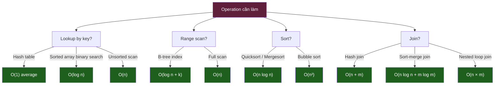
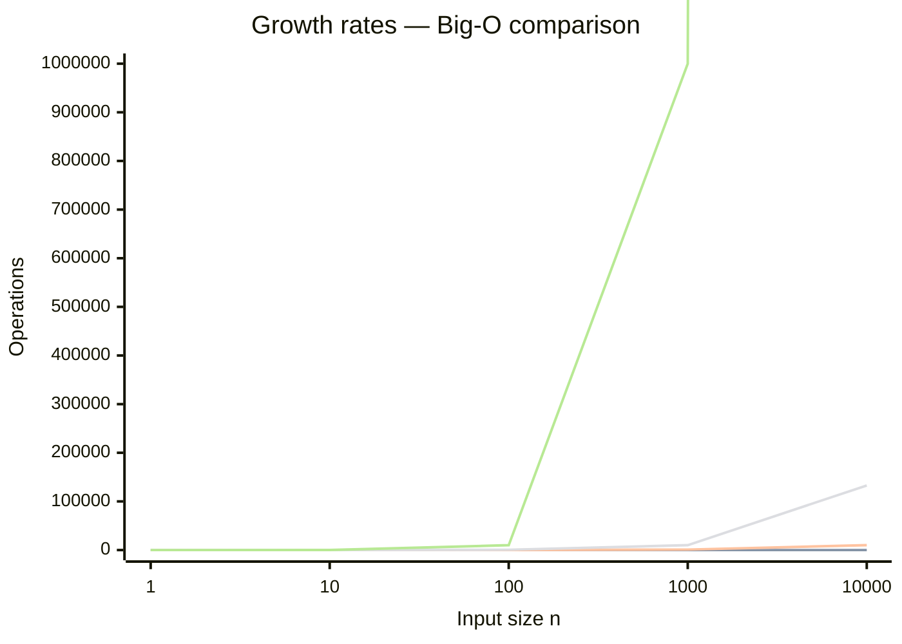
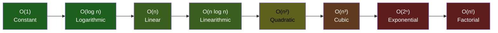

# KU F01 / 02 — Big-O notation: ngôn ngữ nói về "chậm khi data lớn"

> Khi data tăng 10x, code của bạn chậm 10x hay 100x hay 1000x lần? **Big-O** là ngôn ngữ trả lời câu hỏi này. Hiểu Big-O = biết tool nào scale được, tool nào không. Không có Big-O = chọn tool sai → 6 tháng sau prod sập.

**Module:** [F01 — CS Fundamentals](./README.md)
**Prereqs:** [F01/01 Bits, bytes, encoding](./01-bits-bytes-encoding.md)
**Related KUs:** [F01/03 Array vs Linked list](./03-array-vs-linked-list.md) · [F01/04 Hash table](./04-hash-table.md) · [F01/05 Tree](./05-tree-bst-btree.md) · [F01/09 Time vs space complexity](./09-time-vs-space-complexity.md) · [F00/10 Premature optimization](../F00-mental-models/10-premature-optimization.md)
**Đọc trong:** ~12 phút
**Mức độ:** Foundational

---

## 🎯 Nó là gì? (Analogy đời sống)

Bạn mở **tiệm bún bò** ở quận 1. 4 cô bồi bàn (Nga, Hoa, Lan, Phong) có 4 cách phục vụ khác nhau khi tiệm đông khách:

### Cô Nga — phong cách O(1)
- Mỗi bàn có **chuông gọi riêng**. Khách bấm chuông → cô đi ngay tới bàn đó.
- Dù tiệm có 10 bàn hay 100 bàn → **luôn 1 bước**: nhìn chuông nào sáng, đi tới đó.

### Cô Hoa — phong cách O(log n)
- Cô **chia tiệm thành 2 nửa** (trái/phải), rồi **chia tiếp 2 nửa nữa** (góc), rồi nửa cuối.
- 10 bàn → cần 3-4 lần chia (log₂ 10 ≈ 3.3).
- 100 bàn → cần ~7 lần chia (log₂ 100 ≈ 6.6).
- 1000 bàn → cần ~10 lần.
- **Tăng 10x bàn chỉ cần thêm 3-4 lần chia.** Cực kỳ scale.

### Cô Lan — phong cách O(n)
- Cô **đi qua từng bàn**, hỏi "anh chị cần gì?".
- 10 bàn → 10 lần hỏi.
- 100 bàn → 100 lần hỏi.
- 1000 bàn → 1000 lần hỏi. **Tăng 10x bàn = 10x thời gian.**

### Cô Phong — phong cách O(n²)
- Cô **so sánh từng cặp bàn** xem ai gọi trước (kiểu sort).
- 10 bàn → 100 lần so sánh.
- 100 bàn → 10,000 lần so sánh.
- 1000 bàn → 1,000,000 lần so sánh. **Tăng 10x bàn = 100x thời gian.**

**Sau 1 năm:** tiệm đông lên 1000 bàn:

| Cô | Thời gian phục vụ 1 khách | Đánh giá |
|---|---:|---|
| Nga (O(1)) | 1 bước | ✅ Excellent |
| Hoa (O(log n)) | 10 bước | ✅ Excellent |
| Lan (O(n)) | 1,000 bước | ⚠️ Slow but OK |
| Phong (O(n²)) | 1,000,000 bước | ❌ Tiệm sập |

→ Big-O = **cách mô tả tốc độ chậm dần khi data lớn lên**.

---

## 🧩 The Crux of the Problem  *(v3 — OSTEP-style framing)*

> **Core question:** Cho hai algorithm cùng giải 1 vấn đề, làm sao **so sánh tốc độ** chúng **độc lập với hardware, ngôn ngữ, compiler** và input cụ thể?
>
> **Why hard:** Đo thời gian thực (giây/ms) đổi theo CPU, RAM, lúc đo, OS load. Đếm số instruction đổi theo compiler optimization. Đếm số "ops cao cấp" (compare, swap) thì cũng đổi theo implementation.
>
> **What we need:** Một thước đo **invariant** dưới các biến đổi hardware-level — chỉ giữ lại **order of growth** khi n → ∞. Đó chính là Big-O: bỏ qua constant, low-order term, focus duy nhất vào **tốc độ tăng** khi n lớn.

→ Tất cả phần dưới là **mechanism** + **policy** để áp dụng tư duy này vào quyết định kỹ thuật hàng ngày.

---

## 📜 Lịch sử ngắn  *(v3 — etymology + invention)*

- **Big-O notation** được formalized bởi nhà toán học người Đức **Paul Bachmann** (1894) trong sách *Analytische Zahlentheorie* — ban đầu dùng cho number theory, không phải computer.
- **Edmund Landau** mở rộng năm 1909 (vì vậy còn gọi là **"Landau notation"**).
- **Donald Knuth** popularize cho computer science năm 1976 trong bài *"Big Omicron and Big Omega and Big Theta"* (*ACM SIGACT News*) — chính thức hoá O / Ω / Θ semantics dùng đến ngày nay.
- Từ "**algorithm**" gốc từ **al-Khwārizmī** (Persian scholar thế kỷ 9, Baghdad House of Wisdom) — viết các thuật toán cho phép tính số học base-10 ngược lại với base-60 Sumerian. Erickson Algorithms §0.1 dành 3 trang về etymology này.
- **Today:** Big-O = ngôn ngữ duy nhất universal trong job interview, paper, doc tool (Postgres EXPLAIN, Redis, ClickHouse).

→ Khi bạn nói "O(n log n)" — bạn đang nói **ngôn ngữ Bachmann–Landau–Knuth**, có hơn 130 năm tuổi.

---

## 🧮 Pseudocode chuẩn — minh hoạ Big-O qua 3 thuật toán  *(v3 — Erickson UIUC style)*

### O(n) — Linear search

```
LINEARSEARCH(A[1..n], target):
    for i ← 1 to n
        if A[i] = target then
            return i
    return NOT_FOUND
```

→ Worst case `n` so sánh → **T(n) = Θ(n)**.

### O(log n) — Binary search (sorted array)

```
BINARYSEARCH(A[1..n], target):
    lo ← 1
    hi ← n
    while lo ≤ hi
        mid ← ⌊(lo + hi) / 2⌋
        if A[mid] = target then return mid
        else if A[mid] < target then lo ← mid + 1
        else hi ← mid − 1
    return NOT_FOUND
```

→ Mỗi vòng lặp **halve** search space → **T(n) = Θ(log n)**.

### O(n log n) — Mergesort

```
MERGESORT(A[1..n]):
    if n ≤ 1 then return A
    mid ← ⌊n / 2⌋
    L ← MERGESORT(A[1..mid])
    R ← MERGESORT(A[mid+1..n])
    return MERGE(L, R)         《MERGE chạy Θ(n)》
```

→ Recurrence: `T(n) = 2·T(n/2) + Θ(n)` → Master Theorem → **T(n) = Θ(n log n)**.

---

## 📐 Recurrence equations — bridge giữa code và Big-O  *(v3 — formal proof skeleton)*

Recursion → recurrence relation. Master Theorem 3 case:

> `T(n) = a · T(n/b) + f(n)` với `a ≥ 1, b > 1`. Đặt `c = log_b a`.
>
> 1. Nếu `f(n) = O(n^(c-ε))` → **T(n) = Θ(n^c)**.
> 2. Nếu `f(n) = Θ(n^c · log^k n)` → **T(n) = Θ(n^c · log^(k+1) n)**.
> 3. Nếu `f(n) = Ω(n^(c+ε))` và regularity → **T(n) = Θ(f(n))**.

**Apply 4 algorithm classic:**

| Algorithm | Recurrence | Case | Solution |
|---|---|:---:|---|
| Linear search | `T(n) = T(n−1) + Θ(1)` | (linear, not Master) | Θ(n) |
| Binary search | `T(n) = T(n/2) + Θ(1)` | a=1, b=2, c=0, f=Θ(1) → case 2 | Θ(log n) |
| Mergesort | `T(n) = 2·T(n/2) + Θ(n)` | a=2, b=2, c=1, f=Θ(n) → case 2 | Θ(n log n) |
| Naive matrix multiply | `T(n) = 8·T(n/2) + Θ(n²)` | a=8, b=2, c=3, f=Θ(n²) → case 1 | Θ(n³) |
| Strassen matrix multiply | `T(n) = 7·T(n/2) + Θ(n²)` | a=7, b=2, c=log₂7 ≈ 2.807 → case 1 | Θ(n^2.807) |

→ **Senior nhìn code recursion → viết recurrence → đọc Big-O trong 30 giây.** Reference: Erickson Algorithms §1, CLRS Chapter 4.

---

## 📊 Cost annotation table — Big-O cho operations phổ biến  *(v3 — Sedgewick Princeton style)*

| Operation | Best case | Average | Worst | Amortized | Space |
|---|---|---|---|---|---|
| Array access by index | Θ(1) | Θ(1) | Θ(1) | — | Θ(1) |
| Array search (unsorted) | Θ(1) | Θ(n) | Θ(n) | — | Θ(1) |
| Sorted array binary search | Θ(1) | Θ(log n) | Θ(log n) | — | Θ(1) |
| Linked list append (tail ptr) | Θ(1) | Θ(1) | Θ(1) | — | Θ(1) |
| Linked list search | Θ(1) | Θ(n) | Θ(n) | — | Θ(1) |
| Hash table insert/lookup | Θ(1) | Θ(1) | Θ(n) | Θ(1)* | Θ(n) |
| BST insert/lookup | Θ(log n) | Θ(log n) | Θ(n) | — | Θ(n) |
| Red-Black / B-tree insert | Θ(log n) | Θ(log n) | Θ(log n) | — | Θ(n) |
| Heap insert | Θ(1) | Θ(log n) | Θ(log n) | — | Θ(n) |
| Heap extract-min | Θ(log n) | Θ(log n) | Θ(log n) | — | — |
| Quicksort | Θ(n log n) | Θ(n log n) | Θ(n²) | — | Θ(log n) stack |
| Mergesort | Θ(n log n) | Θ(n log n) | Θ(n log n) | — | Θ(n) |
| Hash join | Θ(n + m) | Θ(n + m) | Θ(n · m) | — | Θ(min(n,m)) |
| Nested-loop join (no index) | Θ(n · m) | Θ(n · m) | Θ(n · m) | — | Θ(1) |

\* = under uniform hashing assumption (xem KU 04 chi tiết).

→ **Senior pick data structure không cần đoán — nhìn bảng này pick đúng cái.** Junior copy-paste, prod sập.

---

## ❌ Bad example / anti-pattern  *(v3 — "Martin's algorithm" style)*

### Anti-pattern 1 — Đo Big-O bằng wall-clock

```python
# ❌ NHẦM: dùng time.time() để "kết luận" complexity
import time
start = time.time()
result = my_func(data)
elapsed = time.time() - start
# "Code chạy 50ms với n=1000 → ‘nhanh’ → O(n)?"   ← KHÔNG
```

**Tại sao bad:**
- Wall-clock chứa noise (CPU contention, GC pause, disk cache).
- 50ms với n=1000 không nói gì về scaling.
- Cần đo với **nhiều n** (10, 100, 1k, 10k, 100k) → vẽ log-log plot → mới ước lượng được order.

### Anti-pattern 2 — Tự lừa với Big-O constants

```python
# ❌ NHẦM: "O(n) tốt hơn O(n log n) → mergesort thua linear search?"
# Cho n=10: linear search ~10 ops, mergesort ~30 ops → linear nhanh hơn ✓
# Cho n=10^9: linear ~10^9, mergesort ~3×10^10 → mergesort thua?

# SAI! Vì:
# 1. Bài toán khác nhau — linear SEARCH 1 element, mergesort SORT all elements.
# 2. Cùng bài toán (sort) → bubble sort O(n²) thua mergesort O(n log n) cho n > ~20.
```

**Tại sao bad:** So sánh Big-O của hai algorithm giải **bài toán khác nhau** = vô nghĩa. Big-O so sánh chỉ valid cho **cùng I/O contract**.

### Anti-pattern 3 — "Hash table O(1) — luôn nhanh nhất"

```python
# ❌ NHẦM
d = {}
for x in big_list:
    d[x] = True
# "O(1) lookup → faster than sorted array binary search O(log n)"?

# SAI vì:
# - Hash table có **memory overhead** lớn (load factor + bucket array).
# - Hash function cost không free (hash 1KB key ~ vài μs).
# - Cache locality kém hơn array (random memory access).
# - Worst case Θ(n) khi hash collision (bị attacker exploit qua HashDoS).
```

→ Erickson §0.4 cảnh báo: thuật toán "có vẻ đúng" nhưng vi phạm **assumption ngầm** → không phải thuật toán hợp lệ.

---

Hiểu Big-O thì:
- Postgres index B-tree = O(log n) → query 1M rows mất ~20 bước. ✓
- Postgres no index scan = O(n) → query 1M rows mất 1M bước. ❌ chậm
- Hash table lookup = O(1) → Redis vì sao nhanh.
- Sort entire table không index = O(n log n).
- Nested loop join = O(n × m) → 2 table 1M rows = 10^12 ops. **Tiệm sập.**

---

## 📖 Định nghĩa chính thức

**Big-O notation** = ký pháp toán mô tả **upper bound** (chặn trên) của thời gian/bộ nhớ một algorithm cần khi input n tăng lên.

Formal: `f(n) = O(g(n))` nếu tồn tại constants c > 0 và n₀ sao cho `f(n) ≤ c × g(n)` với mọi n ≥ n₀.

**Tiếng người:** "f tăng nhanh nhất là cỡ g khi n lớn lên."

Ví dụ:
- `f(n) = 3n + 50` = **O(n)** — phần `+50` và hệ số `3` bỏ qua khi n lớn.
- `f(n) = 2n² + 100n + 5` = **O(n²)** — phần n² dominate.
- `f(n) = 5` = **O(1)** — constant.

**Tại sao bỏ qua constants?** Vì n nhỏ thì irrelevant, n lớn thì n² hoặc n dominate. CPU + hardware + ngôn ngữ làm constants không stable. **Order of growth** là thứ stable.

3 ký pháp asymptotic:
- **O(g)** — upper bound (≤): "không tệ hơn g"
- **Ω(g)** — lower bound (≥): "không tốt hơn g"
- **Θ(g)** — tight bound (=): "đúng cỡ g"

Trong DE, **chỉ Big-O** dùng phổ biến. Senior dùng Θ khi cần precise.

**Nguồn:**
- Donald Knuth, *"The Art of Computer Programming"* Vol 1 — bài gốc của asymptotic notation phổ biến hoá.
- CLRS Chapter 3 — formal definition + properties.
- Bhargava, *Grokking Algorithms* — illustrated, dễ tiếp cận.

---

## 🔤 Terminology box

| Thuật ngữ | Tiếng Anh | Giải thích 1 câu |
|---|---|---|
| Big-O | Big-O notation | Upper bound asymptotic — "không tệ hơn..." |
| Asymptotic | Asymptotic | Behavior khi n → ∞ |
| Order of growth | Order of growth | Tốc độ tăng của function |
| Constant time | O(1) constant | Time không phụ thuộc n |
| Logarithmic | O(log n) | Time tăng chậm, double n → +1 bước |
| Linear | O(n) | Time tăng tuyến tính theo n |
| Linearithmic | O(n log n) | Linear × log, "đẹp" cho sort |
| Quadratic | O(n²) | Time × 100 khi n × 10 |
| Cubic | O(n³) | Time × 1000 khi n × 10 |
| Exponential | O(2ⁿ) | Time × 1024 khi n + 10 |
| Factorial | O(n!) | Cực kỳ tệ — đếm permutation |
| Polynomial | O(n^k) | Bất kỳ power constant của n |
| Sub-linear | Sub-linear | Tốt hơn O(n) — như O(log n), O(√n) |
| Amortized | Amortized | Average cost qua nhiều operations |
| Worst case | Worst case | Trường hợp tệ nhất (Big-O thường nói trường hợp này) |
| Best case | Best case | Trường hợp tốt nhất |
| Average case | Average case | Trường hợp trung bình |
| Tight bound | Tight bound (Θ) | Big-O = Big-Ω |
| Recurrence relation | Recurrence relation | Công thức đệ quy cho complexity |
| Master theorem | Master theorem | Method giải recurrence relation |

---

## 💡 Nó làm được gì?

Hiểu Big-O cho phép bạn:

- **Estimate query latency** trước khi build (1M rows × O(n²) = no-go).
- **Pick data structure đúng** (cần O(1) lookup → hash, cần O(log n) ordered → tree).
- **Đoán scaling behavior** — khi user tăng 10x, system slow 10x hay 100x?
- **Đọc EXPLAIN ANALYZE** — Seq Scan = O(n), Index Scan = O(log n), Nested Loop = O(n×m).
- **Reject bad design** với data — "join 2 bảng 10M rows không có index → no". Reason in math.
- **Communicate trade-off** — "Algorithm B chậm hơn 3x cho n=10 nhưng O(n) tốt hơn O(n²) khi prod scale" — câu trả lời senior.

---

## 🧩 Nó là mảnh ghép nào trong tổng thể?

Big-O là **ngôn ngữ chung** mọi data structure + algorithm xài:



→ Senior reading EXPLAIN trong Postgres / Trino → instinct ngay complexity của plan. Junior không có Big-O → đoán mò.

---

## 🚀 Nó giúp ích gì?

### Real case 1: Tại sao Postgres index = magic?

```sql
SELECT * FROM users WHERE email = 'user@example.com';

-- No index: Seq Scan → O(n)
-- 10M rows × 1 us/row = 10 seconds  ❌

-- B-tree index: Index Scan → O(log n)
-- log₂(10M) ≈ 23 levels × 1 us = 23 us  ✓
```

→ **Tăng tốc 400,000x** cho 10M rows. Đây là magic của index. Hiểu Big-O = hiểu vì sao.

### Real case 2: Why ClickHouse beat Postgres for analytics

Postgres row-store + index = O(log n) **per row** + read entire row.
ClickHouse columnar + sparse index = O(log n) **per column**, skip irrelevant columns.

Aggregate `SUM(amount) WHERE date > X` trên 1B rows:
- Postgres: scan 1B rows × 100 bytes = 100GB I/O
- ClickHouse: scan 1B × 8 bytes (only `amount` column) = 8GB I/O, **+ vectorized SIMD = 10x faster**

→ Different complexity profile cho different workload. Pick tool theo Big-O fit.

### Real case 3: Join trap

```
SELECT * FROM orders o JOIN customers c
WHERE o.customer_id = c.id

-- Nested loop join (no index on c.id): O(orders × customers)
-- 10M × 1M = 10^13 operations  ❌ days
-- Hash join (build hash on c.id): O(orders + customers)
-- 10M + 1M = 11M operations  ✓ seconds
```

→ Khi Postgres pick "Hash Join" trong EXPLAIN → fast. "Nested Loop" → red flag, force index.

### Trong project DSX Air

| Operation | Complexity | Tool |
|---|---|---|
| Kafka producer.send() | O(1) amortized | Append-only log |
| Kafka consumer poll | O(1) per message | Sequential read |
| Iceberg metadata fetch | O(log n) | B-tree-like manifest |
| Iceberg time-travel query | O(log n) snapshots + O(k) data files | Snapshot tree |
| Flink dedup state | O(1) hash lookup | RocksDB |
| Flink window aggregate | O(n) per window | State backend |
| ClickHouse mat view refresh | O(n) once, O(1) read | MergeTree |
| Trino join | O(n + m) with broadcast | Hash join |
| RAG vector search | O(log n) HNSW | Approximate NN |

→ Senior data engineer luôn có **complexity map** trong đầu cho mọi op.

---

## ⏰ Khi nào quan tâm Big-O?

| Tình huống | Care Big-O? |
|---|---|
| Build pipeline 10k records/day | ❌ Mọi thứ "đủ nhanh" |
| Build pipeline 10M records/hour | ✅ Critical |
| Production system 1B+ rows | ✅✅ Bắt buộc |
| Analytics query ad-hoc | ✅ Reading EXPLAIN |
| ML feature engineering | ✅ Sort, groupby costly |
| Real-time API < 100ms p99 | ✅ Every operation matters |
| Cron job 1 lần/ngày | ❌ Throughput > complexity |
| Hot loop in Flink | ✅ Per-record cost matters |

**Quy tắc:** Khi data ≥ 100k rows hoặc latency < 1s, Big-O matter. Dưới ngưỡng đó, constants thắng.

---

## 🤔 Trade-off vs alternatives

| Notation | Khi dùng | Ưu/Nhược |
|---|---|---|
| **Big-O (O)** | Daily DE, communicate scaling | Worst-case, dễ pessimistic |
| **Big-Omega (Ω)** | Theory, prove lower bound | Ít dùng practical |
| **Big-Theta (Θ)** | Khi muốn precise tight bound | Strict — viết khó hơn |
| **Big-Litto (o)** | Khi muốn strict less-than | Rất hiếm trong DE |
| **Amortized analysis** | Khi op có spike (hash resize, GC) | Smoothing average |
| **Practical benchmark** | Khi Big-O không đủ (cache effect) | Reality > theory |

→ **DE daily:** Big-O + occasional benchmark. Đủ 95% case.

---

## 🔧 Nó vận hành ra sao? (Logic walkthrough)

### So sánh growth rates



→ Nhìn chart: O(log n) gần như flat. O(n) tăng đều. O(n²) bùng nổ.

### Common complexity ladder



### Tính Big-O từ code (đọc thuần loop)

```python
# Example 1: O(1) — independent of n
def get_first(arr):
    return arr[0]

# Example 2: O(n) — single loop
def sum_array(arr):
    total = 0
    for x in arr:           # n iterations
        total += x          # O(1) per iter
    return total
    # Total: O(n)

# Example 3: O(n²) — nested loop
def has_duplicate(arr):
    for i in arr:           # n iterations
        for j in arr:       # n iterations
            if i == j: ...  # O(1) per
    return False
    # Total: O(n × n) = O(n²)

# Example 4: O(log n) — divide-and-conquer
def binary_search(arr, target):
    lo, hi = 0, len(arr) - 1
    while lo <= hi:         # halve each iter → log n iters
        mid = (lo + hi) // 2
        if arr[mid] == target: return mid
        elif arr[mid] < target: lo = mid + 1
        else: hi = mid - 1
    return -1
    # Total: O(log n)

# Example 5: O(n log n) — recursive divide + linear merge
def merge_sort(arr):
    if len(arr) <= 1: return arr
    mid = len(arr) // 2
    left = merge_sort(arr[:mid])    # T(n/2)
    right = merge_sort(arr[mid:])   # T(n/2)
    return merge(left, right)       # O(n)
    # T(n) = 2T(n/2) + O(n)
    # Master theorem → O(n log n)
```

### Rules of thumb

| Pattern | Complexity |
|---|---|
| Single loop `for i in range(n)` | O(n) |
| Nested loop `for i: for j` | O(n²) |
| Halve each step `while n > 0: n //= 2` | O(log n) |
| Double each step `for i in range(n²)` | O(n²) |
| Recursive divide T(n) = 2T(n/2) + n | O(n log n) |
| Pick 2 từ n items | O(n²) |
| Pick k từ n items (sort) | O(n log n) |
| All permutations | O(n!) |
| All subsets | O(2ⁿ) |

### Real-world numbers (per second on modern CPU)

| Complexity | n=1000 | n=1M | n=1B |
|---|---:|---:|---:|
| O(1) | <1us | <1us | <1us |
| O(log n) | <1us | <1us | <1us |
| O(n) | 10us | 10ms | 10s |
| O(n log n) | 100us | 200ms | 5 min |
| O(n²) | 10ms | 3 hours | 30 years |
| O(2ⁿ) | universe heat death | … | … |

→ **O(n²) ≥ 1M = unfeasible.** Pick algorithm khác.

---

## 🧪 Worked example

**Tình huống:** DSX Air project, team báo `gold.daily_revenue` query mất 30s. PM yêu cầu fix về <2s.

### Bước 1 — Lấy EXPLAIN ANALYZE

```sql
EXPLAIN ANALYZE
SELECT day, SUM(amount) FROM gold.daily_revenue
WHERE day >= '2026-01-01' AND day < '2026-02-01'
GROUP BY day;

-- Plan:
-- Seq Scan on gold.daily_revenue (cost=0..150000 rows=10M)
--   Filter: (day >= '2026-01-01' AND day < '2026-02-01')
-- GroupAggregate
-- Execution time: 30,000 ms
```

### Bước 2 — Identify complexity

- `Seq Scan` = O(n) where n = 10M rows
- Filter applied **after** scan → reads all 10M rows
- Each row read ~3us → 10M × 3us = 30 seconds ✓ match observation

### Bước 3 — Identify bottleneck via Big-O

Real impact:
- Want: ~30 days of data
- Reading: 10M rows (all history)
- **Wasted I/O: 99% reading rows not needed**

Senior insight: Big-O *itself* fine cho Seq Scan, nhưng **constant** (n) quá to vì không filter early.

### Bước 4 — Fix với partition + index

Option A: Partition by `day`:
```sql
ALTER TABLE gold.daily_revenue PARTITION BY day;
-- Now query scans only partition for Jan 2026
-- n shrinks from 10M to ~300k → 0.9 seconds ✓
```

Option B: Index on `day`:
```sql
CREATE INDEX ON gold.daily_revenue(day);
-- Index range scan: O(log n + k) where k = matching rows
-- log₂(10M) + 300k = 23 + 300k ≈ 1 second ✓
```

Option C: Materialized view per month:
```sql
CREATE MATERIALIZED VIEW monthly_revenue AS
SELECT month_trunc(day) AS month, SUM(amount) FROM gold.daily_revenue
GROUP BY month_trunc(day);
-- Refresh nightly. Query mat view: O(months in range) = 1 row, <10ms
```

### Bước 5 — Verify

```sql
EXPLAIN ANALYZE SELECT day, SUM(amount) ...;
-- Plan:
-- Bitmap Index Scan on idx_day  (cost=0..150 rows=300000)
-- Execution time: 1,200 ms  ✓ Within SLA
```

**Big-O đã giúp:**
1. Identify Seq Scan = O(n) là bottleneck
2. Calculate expected time (10M × 3us = 30s) match reality
3. Suggest 3 fix options với complexity profile mới
4. Verify match prediction sau fix

→ **Math first, code after**. Senior DE workflow.

---

## ⚠️ Common pitfalls

### Pitfall 1 — Ignore constants for small n

❌ **Sai:** "O(n²) bad, must avoid forever."

✅ **Đúng:** Khi n ≤ 100, O(n²) (= 10,000 ops) thường nhanh hơn O(n log n) với high constant. Bubble sort fastest cho n=10!

→ Big-O matters when n is large. Small n → benchmark thật.

### Pitfall 2 — Average case = worst case

❌ **Sai:** "Quicksort O(n log n), dùng luôn."

✅ **Đúng:** Quicksort **average** O(n log n), **worst** O(n²) (sorted input → bad pivot). Production phải dùng randomized pivot hoặc Introsort.

### Pitfall 3 — Hash table = O(1) always

❌ **Sai:** "Hash lookup O(1), không lo."

✅ **Đúng:** Hash O(1) **average**, **worst O(n)** khi collision cao. Bad hash function → linear scan bucket. Senior check hash distribution.

### Pitfall 4 — Bỏ qua I/O complexity

❌ **Sai:** "Code O(log n), should be fast."

✅ **Đúng:** B-tree O(log n) **trong RAM**, **trong disk** mỗi level = 1 disk seek = 10ms. log₂(1B) = 30 → 300ms total (very slow).

→ Cần count **disk seeks** separately. ClickHouse + columnar reduce I/O 10x.

### Pitfall 5 — Recursion mất hidden O(n) memory

❌ **Sai:** `fibonacci_recursive(n)` O(2ⁿ) time + O(n) stack space.

✅ **Đúng:** Tail recursion / iteration nếu language không optimize tail call. Stack overflow with deep recursion.

### Pitfall 6 — Premature Big-O over simplicity

❌ **Sai:** Pre-optimize cho O(log n) khi n luôn < 100.

✅ **Đúng:** Code O(n²) cho n < 100 = đơn giản + đủ nhanh. Knuth: "premature optimization is the root of all evil" (xem [F00/10](../F00-mental-models/10-premature-optimization.md)).

---

## 🌱 Advanced topics

### A1. Master theorem (giải recurrence relation)

Cho T(n) = aT(n/b) + f(n):

- Nếu f(n) = O(n^(log_b a - ε)) → T(n) = Θ(n^log_b a)
- Nếu f(n) = Θ(n^log_b a) → T(n) = Θ(n^log_b a × log n)
- Nếu f(n) = Ω(n^(log_b a + ε)) → T(n) = Θ(f(n))

Ví dụ Merge sort: T(n) = 2T(n/2) + n → a=2, b=2, f=n. log_b a = 1, f matches → T(n) = Θ(n log n).

→ Tool để analyze divide-and-conquer algorithms.

### A2. Amortized analysis

Dynamic array (Python list) append:
- Worst case: O(n) (when resize)
- Average over many: O(1) amortized

3 methods analyze:
- **Aggregate:** total ops / number of ops
- **Accounting:** charge "credit" per op
- **Potential:** function maps state to credit

→ Hash table resize, vector grow đều amortized O(1).

### A3. Cache complexity (CPU caching)

Modern CPU có L1/L2/L3 cache. Algorithm sequential access (cache-friendly) **10-100x faster** than random access **same Big-O**.

Example:
- Linked list traversal O(n) — random memory access — slow
- Array traversal O(n) — sequential — fast (prefetch)

→ Big-O is asymptotic. Real-world performance includes cache.

### A4. External memory model (disk-aware)

Traditional Big-O assume infinite RAM. External model count **I/O ops** to disk:

- B-tree height log_B(n) (B = block size)
- LSM-tree write O(1) amortized, read O(log n) levels

→ Why Postgres uses B-tree (read-optimized) và RocksDB/Cassandra use LSM (write-optimized). Both O(log n) different constant.

### A5. NP-completeness (sneak peek for KU 18)

Some problems no known polynomial algorithm:
- Traveling salesman (TSP) — O(n!) brute force
- 3-SAT — boolean satisfiability
- Vertex cover

Reductions: if A reduces to B in polynomial time, A ≤_p B.

→ NP-complete = hardest in NP. If P=NP → revolution.

Sẽ học sâu hơn ở [F01/18 Complexity classes](./18-complexity-classes.md).

### A6. Apply cho LLM 2026

LLM inference complexity:
- **Prefill** (read prompt): O(n²) — attention is quadratic in context length
- **Decode** (generate next token): O(n) — per token, sum to O(n × k) total

→ Long context (1M tokens) = O(10^12) ops. Why long context expensive.

Optimizations:
- **KV cache** (cache prefill) → decode O(n) without redo prefill
- **Flash attention** O(n) memory (not O(n²)) via tiling
- **Sliding window attention** O(n × w) where w = window size

→ Big-O thinking applies to LLM design too. Sẽ học sâu hơn ở [D30 LLM Engineering](../../../year-2-specialization/semester-4-ai-ops-architecture/D30-llm-engineering/).

---

## 🔗 Liên kết KU khác

- **[F01/01 Bits, bytes](./01-bits-bytes-encoding.md)** — unit being counted in complexity
- **[F01/03 Array vs Linked list](./03-array-vs-linked-list.md)** — first DS with different complexities
- **[F01/04 Hash table](./04-hash-table.md)** — O(1) magic explained
- **[F01/05 Tree](./05-tree-bst-btree.md)** — O(log n) workhorse
- **[F01/07 Sorting](./07-sorting-algorithms.md)** — O(n log n) is the limit
- **[F01/09 Time vs space](./09-time-vs-space-complexity.md)** — trade-off formalized
- **[F01/18 Complexity classes](./18-complexity-classes.md)** — P vs NP
- **[F00/10 Premature optimization](../F00-mental-models/10-premature-optimization.md)** — when NOT to optimize Big-O
- **[F00/12 Trade-off triangle](../F00-mental-models/12-trade-off-triangle.md)** — time/space/cost trade-off

---

## 🧠 Self-test (3 mức)

### 🟢 Easy

1. Cô bán bún Hoa phục vụ kiểu O(log n). 100 bàn → bao nhiêu bước? 10,000 bàn → bao nhiêu bước?
2. Cho 4 complexity: O(1), O(n), O(n²), O(log n). Xếp từ nhanh → chậm khi n = 1,000,000.
3. Tại sao `for i in range(n): for j in range(n): ...` là O(n²) chứ không phải O(2n)?

### 🟡 Medium

4. Postgres không có index trên `email`. Query `WHERE email = ...` complexity? Với index B-tree?
5. Hash table average O(1) nhưng worst case O(n). Khi nào worst case xảy ra? Cách phòng tránh?
6. Quicksort average O(n log n) nhưng worst O(n²). Worst case input là gì? Cách fix?

### 🔴 Hard

7. Merge sort recurrence: T(n) = 2T(n/2) + O(n). Dùng Master theorem chứng minh T(n) = O(n log n).
8. LLM context length 1M tokens, attention O(n²). Tính số ops + memory. Cách scale lên 10M token (hint: Flash attention, sliding window)?
9. Trong project DSX Air, Iceberg metadata fetch là O(log n) snapshots. Khi expire_snapshots không chạy 6 tháng, n=10,000 snapshots. Tính impact lên query latency. Recommendation?

> **6+/9** = sẵn sàng đi KU 03. **4-5** = vẽ growth chart 5 complexity từ tay. **<4** = đọc lại Bhargava Ch 1-2.

---

## 📌 Trong repo này

Big-O thấm vào mọi tool decision:

- **Iceberg snapshot O(log n)** → cần expire_snapshots định kỳ: [`docs/09-lakehouse-design.md`](../../../../docs/09-lakehouse-design.md)
- **Flink dedup O(1) hash** → state backend RocksDB: [`docs/08-stream-processing.md`](../../../../docs/08-stream-processing.md)
- **ClickHouse aggregate O(n) → O(1) via mat view**: [`docs/11-serving-layer.md`](../../../../docs/11-serving-layer.md)
- **Network chaos O(racks) impact** → leaf-down affects 1 rack only: [`docs/17-network-failure-storyline.md`](../../../../docs/17-network-failure-storyline.md)

---

## 🌐 Đọc thêm — refs cụ thể vào library  *(v3 — pointers chính xác)*

📚 **Trong [library/books/cs-fundamentals/](../../../../library/books/cs-fundamentals/):**

- **Erickson Algorithms (UIUC, CC BY 4.0)** → `Erickson_2019_Algorithms_UIUC.pdf` — Chapter 0 (Introduction §0.1 etymology + §0.2 multiplication algorithms historical depth), Chapter 1 (Recursion + recurrences), Chapter 12 (NP-hardness).
- **Sedgewick Princeton slides** → `Sedgewick_Princeton_Analysis.pdf` — analysis of algorithms with empirical doubling-test methodology.
- **Open Data Structures (Morin, CC BY)** → `Morin_OpenDataStructures_python.pdf` Chapter 1 — formal definition + asymptotic analysis Python-grounded.
- **OSTEP (Wisconsin)** → context cho complexity in OS scheduling: `OSTEP_cpu-sched.pdf`, `OSTEP_cpu-sched-mlfq.pdf`.

📖 **Sách commercial (mua / library):**
- **CLRS, "Introduction to Algorithms" — Chapter 3** — formal definition + properties. Bible.
- **Aditya Bhargava, "Grokking Algorithms" — Chapter 1** — illustrated explanation.

📄 **Paper gốc:**
- Knuth (1976), *"Big Omicron and Big Omega and Big Theta"*, ACM SIGACT News 8(2). [DOI 10.1145/1008328.1008329](https://doi.org/10.1145/1008328.1008329).
- Bachmann (1894), *Analytische Zahlentheorie* — bản tiếng Đức gốc (lưu Archive.org).

---

**Đã đọc xong?**
✅ Tick vào [`../../../progress/checklist.md`](../../../progress/checklist.md) → đi tiếp [F01/03 Array vs Linked list](./03-array-vs-linked-list.md).
