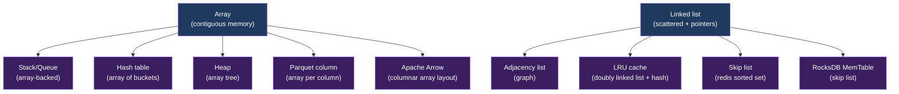
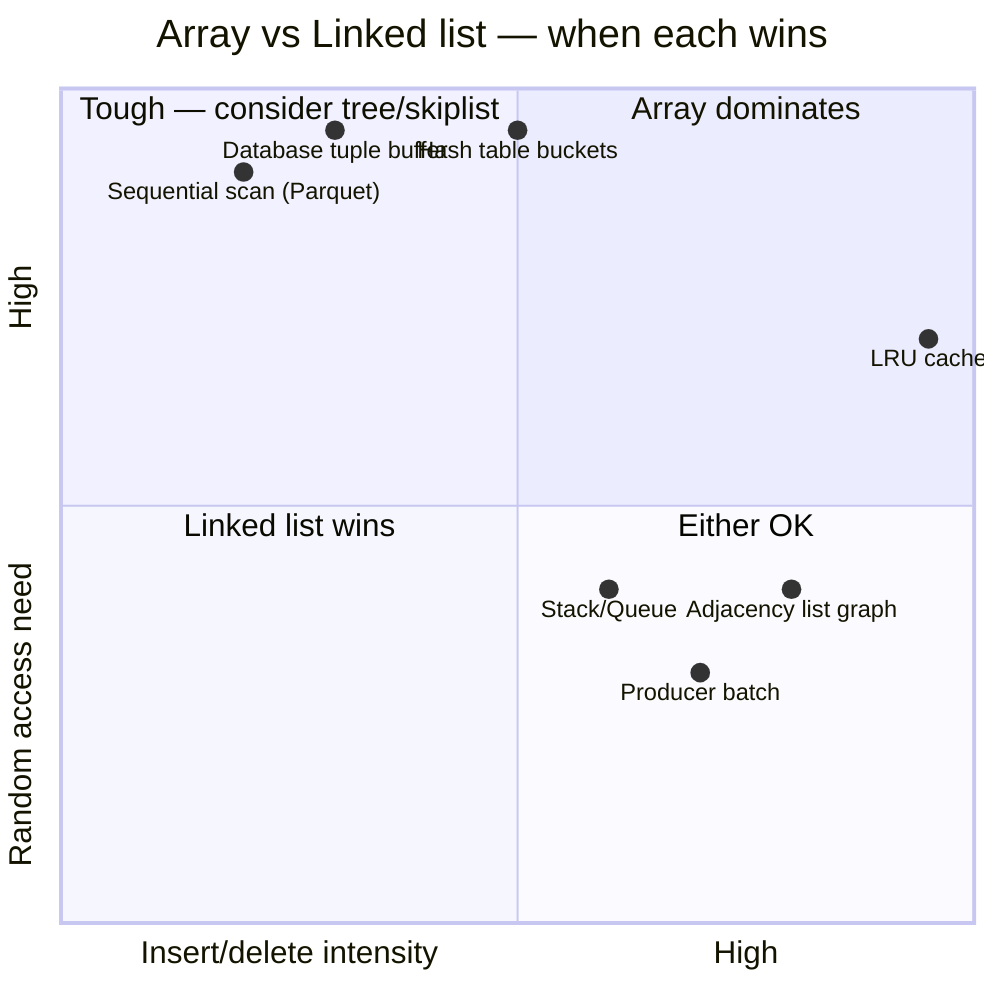
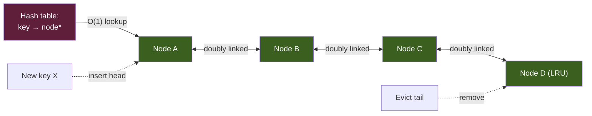

# KU F01 / 03 — Array vs Linked list: data structure đơn giản nhất, lựa chọn quan trọng nhất

> Đây là **lần đầu** bạn gặp data structure trade-off. Array vs Linked list = bài học **memory layout matters**. Hiểu cái này → hiểu vì sao columnar storage thắng row storage, vì sao Postgres TupleBuffer dùng array, vì sao Linked list "đẹp về lý thuyết, dở trong thực tế hiện đại".

**Module:** [F01 — CS Fundamentals](./README.md)
**Prereqs:** [F01/02 Big-O notation](./02-big-o-notation.md)
**Related KUs:** [F01/04 Hash table](./04-hash-table.md) · [F01/05 Tree](./05-tree-bst-btree.md) · [F10 Databases II](../../semester-2-systems-theory/F10-databases-beyond-sql/) · [F05 Operating Systems](../../semester-2-systems-theory/F05-operating-systems/)
**Đọc trong:** ~12 phút
**Mức độ:** Foundational

---

## 🎯 Nó là gì? (Analogy đời sống)

Bạn đang **xếp đồ vào hộc tủ** trong nhà. 2 cách:

### Cách 1 — Array: dãy hộc liền kề
- 10 hộc xếp **thành dãy thẳng** từ trái sang phải.
- Mỗi hộc đánh **số 1-10**.
- Lấy đồ ở hộc 7? → đi thẳng đến vị trí 7 = **1 bước** (random access O(1)).
- Thêm đồ mới? → để vào hộc tiếp theo (hộc 11) = **dễ ở cuối**.
- Chèn đồ vào giữa (hộc 3)? → phải **đẩy lùi** hộc 3, 4, 5, ..., 10 = **chậm O(n)**.

### Cách 2 — Linked list: hộc rải rác có "phiếu chỉ đường"
- 10 hộc đặt **rải rác** khắp nhà (phòng khách, bếp, sân thượng).
- Mỗi hộc có **phiếu giấy chỉ đường tới hộc kế tiếp**.
- Bắt đầu từ "hộc đầu tiên" (head), đọc phiếu → đến hộc 2 → đọc phiếu → đến hộc 3 → ...
- Lấy hộc 7? → phải đi qua 1, 2, 3, 4, 5, 6 → **7 bước** = O(n).
- Chèn hộc mới giữa hộc 3 và 4? → **sửa 2 phiếu**, không phải dịch chuyển: hộc 3 trỏ tới hộc mới, hộc mới trỏ tới hộc 4 = **O(1) thao tác** (nhưng phải tìm hộc 3 trước = O(n)).

**Bảng so sánh:**

| Operation | Array (dãy liền kề) | Linked list (rải rác) |
|---|---|---|
| Lấy phần tử thứ k (random access) | O(1) ⚡ | O(n) ❌ |
| Thêm vào cuối | O(1) amortized ⚡ | O(n) (phải duyệt) hoặc O(1) (có tail pointer) |
| Thêm vào đầu | O(n) ❌ | O(1) ⚡ |
| Chèn giữa (sau khi biết vị trí) | O(n) (dịch tất cả) | O(1) (sửa 2 pointer) ⚡ |
| Tìm phần tử (linear search) | O(n) | O(n) |
| Memory overhead | Thấp (chỉ data) | Cao (data + pointer) |
| Cache-friendly | ✅ Sequential | ❌ Random access |
| Memory contiguous | ✅ | ❌ |

→ Array thắng cho **random access + cache locality**.
→ Linked list thắng cho **chèn/xoá ở vị trí đã biết**.

**Thực tế modern (2026):** Array (+ variants) thắng 95% trường hợp vì **cache hierarchy**. Linked list chỉ thắng khi insert/delete cực nhiều ở giữa **và** không cần random access.

---

## 📖 Định nghĩa chính thức

**Array** = sequence of elements stored at **contiguous memory addresses**, indexed by integer. Truy cập `arr[i]` → tính địa chỉ `base + i × element_size` → O(1).

**Linked list** = chain of nodes, mỗi node chứa **data + pointer** đến next node (singly linked) hoặc + prev (doubly linked). Memory **không cần contiguous**.

3 variants quan trọng:

| Variant | Đặc tính |
|---|---|
| **Fixed array** | Size cố định, contiguous (`int arr[100]` C, NumPy array) |
| **Dynamic array** | Resize tự động (Python list, Java ArrayList, C++ vector) |
| **Singly linked list** | 1-way pointer |
| **Doubly linked list** | 2-way pointer (prev + next) |
| **Circular linked list** | Last node → first |

**Cache line** = unit CPU đọc memory, thường **64 bytes**. Khi array load 1 phần tử, CPU **prefetch** 64 bytes liền kề. Linked list → mỗi node ở nơi khác → mỗi access = 1 cache miss → 100x chậm hơn.

**Nguồn:**
- CLRS Chapter 10 — Elementary Data Structures.
- Bjarne Stroustrup's famous talk *"C++: vector vs list"* — empirical đo array beat linked list cho insert/delete 99% trường hợp do cache.
- Reis-Housley *Fundamentals of DE* — file format (Parquet/Arrow) dùng array layout cho column storage.

---

## 🔤 Terminology box

| Thuật ngữ | Tiếng Anh | Giải thích 1 câu |
|---|---|---|
| Mảng | Array | Dãy phần tử liền kề trong memory, index bằng số nguyên |
| Danh sách liên kết | Linked list | Chain nodes với pointer |
| Random access | Random access | Lấy phần tử thứ k trong O(1) |
| Sequential access | Sequential access | Duyệt từ đầu đến cuối |
| Contiguous memory | Contiguous memory | Memory addresses liền kề |
| Pointer | Pointer | Variable lưu memory address |
| Reference | Reference | Pointer wrapped (Java, Python) |
| Cache line | Cache line | CPU cache unit, thường 64 bytes |
| Cache miss | Cache miss | CPU không tìm thấy data trong cache, phải đọc RAM |
| Cache hit | Cache hit | CPU tìm thấy data trong cache |
| Prefetch | Prefetch | CPU đoán memory cần dùng tới, đọc trước |
| Spatial locality | Spatial locality | Data gần nhau trong memory được access gần nhau trong time |
| Temporal locality | Temporal locality | Data access gần đây sẽ access lại |
| Dynamic array | Dynamic array | Array resize tự động (Python list, vector) |
| Amortized | Amortized | Average cost qua nhiều ops |
| Head/Tail | Head/Tail | First/Last node của linked list |
| Singly linked | Singly linked | 1 pointer (next only) |
| Doubly linked | Doubly linked | 2 pointers (next + prev) |
| Sentinel node | Sentinel node | Dummy node simplify edge case |
| ArrayList | ArrayList | Java dynamic array |
| std::vector | std::vector | C++ dynamic array |

---

## 💡 Nó làm được gì?

Hiểu Array vs Linked list cho phép bạn:

- **Pick right DS** cho workload (read-heavy → array, insert-heavy middle → maybe linked list).
- **Hiểu Parquet/Arrow internals** — column = array of values, cache-friendly scan.
- **Hiểu vì sao Postgres TupleBuffer = array** không phải linked list.
- **Predict performance** — array iterate 100x faster than linked list cùng size (cache effect).
- **Avoid linked list trap** — junior thường over-use linked list từ academic background.

---

## 🧩 Nó là mảnh ghép nào trong tổng thể?

Array là **foundation** cho mọi DS phức tạp hơn:



→ 95% data structures bạn dùng built on array. 5% (LRU, skip list) dùng linked list strategically.

---

## 🚀 Nó giúp ích gì? (Real impact)

### Stroustrup's famous benchmark

Bjarne Stroustrup (creator C++) demo 2010: **vector vs list**, sort 100k random integers, then for each one, find + insert in sorted position.

- Vector O(n²) operations: insert vào giữa = shift n elements
- Linked list O(n²) operations: tìm vị trí = O(n), insert = O(1) → total O(n²)

**Theoretical:** linked list nhanh hơn (insert O(1) vs O(n)).
**Empirical:** vector nhanh hơn **10-100x** vì cache.

→ **Constant factor (cache effect)** thắng theoretical Big-O. Đặc biệt với n ≤ 1M.

### Vì sao Parquet/Arrow dùng column = array

Parquet column = array of values cùng type:

```
table.parquet:
  name (string array):  [Alice, Bob, Carol, Dave, ...]
  age (int32 array):    [25, 30, 22, 35, ...]
  amount (decimal):     [100.5, 200.0, 50.0, ...]
```

Query `AVG(amount)` only reads `amount` column array:
- Sequential scan → CPU prefetch friendly
- Vectorized SIMD ops on contiguous data
- 10-100x faster than row-store

→ Column-oriented = embracing array advantage.

### Vì sao Postgres dùng array (TupleBuffer)

Postgres reads page (8KB) at a time = array of tuples. Sequential access trong page → cache friendly. Tuple format = array of fields with offset table.

→ Postgres avoids linked list trong hot path. Sequential I/O = king.

### Trong project DSX Air

| Component | Data structure | Why |
|---|---|---|
| Kafka log segment | Sequential array on disk | Append-only, scan-friendly |
| Iceberg manifest entries | Array per file | Read column-wise during query plan |
| Parquet data files | Column = array | Vectorized read |
| Flink RocksDB MemTable | Skip list (semi-linked) | Sorted insert ordering |
| ClickHouse MergeTree parts | Sorted array per partition | Range scan + index lookup |
| Producer batch | Dynamic array | Accumulate then flush |

→ Modern data systems = array-first, linked list only when ordering+insert pattern requires.

---

## ⏰ Khi nào dùng cái nào?

| Pattern | Choose |
|---|---|
| Random access by index | **Array** |
| Iterate sequentially (sum, filter, scan) | **Array** (cache wins) |
| Append at end | **Array** (dynamic) hoặc **Linked list** |
| Frequent insert/delete at HEAD | **Linked list** |
| Frequent insert/delete at MIDDLE (vị trí đã có pointer) | **Linked list** |
| Frequent insert/delete at MIDDLE (cần tìm trước) | **Array** (search dominates) |
| Memory tight | **Array** (no pointer overhead) |
| Need stable pointer to element | **Linked list** (array resize moves) |
| Implement LRU cache | **Doubly linked list + hash** |
| Producer/consumer queue | **Ring buffer (circular array)** |

**Modern default:** Dynamic array (Python list, Java ArrayList, C++ vector). Linked list explicit when need above patterns.

---

## 🤔 Trade-off vs alternatives



→ Most workloads in upper-half (need random access) → array wins. Lower-right (high insert + low random) → linked list.

---

## 🔧 Nó vận hành ra sao? (Logic walkthrough)

### Array trong memory

```
int arr[5] = {10, 20, 30, 40, 50}

Memory:
  Address: 0x1000  0x1004  0x1008  0x100C  0x1010
  Value:   10      20      30      40      50
            ↑
          arr base

Access arr[3]:
  address = base + 3 × sizeof(int)
          = 0x1000 + 3 × 4 = 0x100C
  value at 0x100C = 40
  → O(1)
```

CPU instruction: 1 ADD + 1 MOV = nanoseconds.

### Linked list trong memory

```
list: 10 → 20 → 30 → 40 → 50 → null

Memory:
  Address: 0x1000          0x2080          0x3500
  Node 1: {data=10, next=0x2080}
  Node 2: {data=20, next=0x3500}
  Node 3: {data=30, next=0x4720}
  ...

Access node 3:
  ptr = head           // 0x1000
  ptr = ptr->next      // 0x2080 (cache miss?)
  ptr = ptr->next      // 0x3500 (cache miss?)
  return ptr->data     // 30
  → O(n), with cache misses each hop
```

Mỗi `ptr->next` jump = possible cache miss = 100+ cycles each.

### Dynamic array (Python list) growth

Python list internal:

```
Initial: capacity = 8, size = 0
append(1): size=1, capacity=8
append(2): size=2, capacity=8
...
append(8): size=8, capacity=8 (full)
append(9): RESIZE → capacity=16, copy 8 → 16, size=9, then write
append(10): size=10, capacity=16
...
append(16): size=16, capacity=16 (full)
append(17): RESIZE → capacity=24...
```

Most appends O(1). Resize O(n). Amortized: O(1) per append.

→ "Amortized" means **average over many ops** — see [F00 mental models](../F00-mental-models/).

### Cache lines + spatial locality

```
Array sequential scan:
  CPU loads cache line 64 bytes = 16 ints
  arr[0], arr[1], ..., arr[15] all in cache  ← 1 cache miss
  Read all 16 elements from cache  ← 16 cache hits

  Total: 1 miss per 16 elements (6.25%)

Linked list traversal:
  Each node random memory → likely cache miss each
  Total: ~100% cache miss
```

→ Real-world: array scan 100x faster than linked list traversal for same n.

### LRU cache: best-of-both-worlds

LRU cache combines hash table + doubly linked list:



- Hash table → O(1) lookup
- Doubly linked list → O(1) insert head + O(1) delete tail
- → LRU operations all O(1)

Redis, Memcached, browser cache, OS page cache implement LRU like this.

---

## 🧪 Worked example

**Tình huống:** Junior trong team DSX Air implement message queue cho producer:

```python
# Junior implementation
class JuniorQueue:
    def __init__(self):
        self.items = []  # Python list

    def enqueue(self, msg):
        self.items.append(msg)        # O(1) amortized ✓

    def dequeue(self):
        return self.items.pop(0)      # O(n) ❌ shift all elements
```

Producer push 100k msg/sec → 30 phút sau queue lag.

### Bước 1 — Identify problem via Big-O

```
Enqueue: O(1) ✓
Dequeue: O(n) ← bottleneck!
  pop(0) phải shift n-1 elements

Total time for n enqueue + n dequeue:
  Enqueue: n × O(1) = O(n)
  Dequeue: n × O(n) = O(n²)
  ← Quadratic time, 100k = 10^10 ops = unfeasible
```

### Bước 2 — Fix với deque (doubly linked list)

```python
from collections import deque

class SeniorQueue:
    def __init__(self):
        self.items = deque()      # doubly linked list

    def enqueue(self, msg):
        self.items.append(msg)   # O(1)

    def dequeue(self):
        return self.items.popleft()  # O(1) ✓ (LL head removal)
```

Python `collections.deque` = doubly linked list of blocks. Both ends O(1).

### Bước 3 — Test

```python
import timeit

# Junior:
timeit.timeit(lambda: junior.dequeue(), number=10000)
# 30+ seconds for 100k queue size

# Senior:
timeit.timeit(lambda: senior.dequeue(), number=10000)
# 0.001 seconds (30,000x faster)
```

### Bước 4 — Alternative: ring buffer (array-based)

```python
class RingBufferQueue:
    def __init__(self, capacity):
        self.buf = [None] * capacity   # fixed-size array
        self.head = self.tail = self.size = 0
        self.cap = capacity

    def enqueue(self, msg):
        if self.size == self.cap:
            raise OverflowError
        self.buf[self.tail] = msg
        self.tail = (self.tail + 1) % self.cap
        self.size += 1                # O(1)

    def dequeue(self):
        if self.size == 0: return None
        msg = self.buf[self.head]
        self.head = (self.head + 1) % self.cap
        self.size -= 1
        return msg                    # O(1)
```

**Trade-off:**

| | deque (LL-based) | Ring buffer (array-based) |
|---|---|---|
| Enqueue/dequeue | O(1) | O(1) |
| Memory overhead | Pointer per node (~24 bytes) | None (fixed array) |
| Cache friendliness | Worse | Better |
| Capacity | Unlimited | Fixed |

→ Ring buffer faster + less memory **nếu max capacity biết trước**. Kafka log segment, Disruptor library dùng ring buffer.

### Bài học từ worked example

- **Wrong DS choice** → O(n²) bug ẩn không detect bằng unit test (chỉ thấy khi load test).
- **Python list ≠ queue** — pop(0) là O(n).
- **Use right DS:** `deque` cho generic queue, ring buffer cho fixed-size.
- **Test với realistic data size** (load test, not unit test).

---

## ⚠️ Common pitfalls

### Pitfall 1 — Use linked list for "fast insert"

❌ **Sai:** "Insert vào middle linked list O(1), nhanh hơn array."

✅ **Đúng:** Insert là O(1) **CHỈ SAU KHI** có pointer to position. Find position vẫn O(n) → total O(n). Array shift = O(n) cũng. **Cache effect** thường làm array thắng.

→ Stroustrup's lesson: empirical > theoretical Big-O cho small-medium n.

### Pitfall 2 — Python `list.pop(0)` cho FIFO

❌ **Sai:** Use `list` as queue: `q.append(x)` + `q.pop(0)` → O(n) per dequeue.

✅ **Đúng:** `collections.deque` cho FIFO O(1) both ends.

### Pitfall 3 — Forget cache line in benchmarks

❌ **Sai:** Microbenchmark 10 element array vs linked list → "same speed".

✅ **Đúng:** Benchmark realistic size (10k, 1M). Cache effect emerges. Array dominate.

### Pitfall 4 — Linked list ignored memory overhead

❌ **Sai:** Build linked list of 1M small integers. Each node = 24 bytes (8 data + 16 pointers) → 24MB.

✅ **Đúng:** Array of int32 = 4MB. **6x less memory.**

### Pitfall 5 — Array trong shared/concurrent context

❌ **Sai:** Resize dynamic array trong multi-thread → race condition.

✅ **Đúng:** Use thread-safe queue (`queue.Queue` in Python, `BlockingQueue` in Java), hoặc lock-free ring buffer (Disruptor pattern).

### Pitfall 6 — Compare Java ArrayList vs LinkedList wrong

❌ **Sai:** "LinkedList faster cho insert."

✅ **Đúng:** Java LinkedList **almost always slower** than ArrayList in real apps. Use ArrayList default. LinkedList only for very specific patterns (HEAD insert + iterate).

---

## 🌱 Advanced topics

### A1. Cache hierarchy + access cost

Modern CPU:

```
L1 cache (per core):   32 KB,  4 cycles  (~1 ns)
L2 cache (per core):  256 KB, 12 cycles  (~3 ns)
L3 cache (shared):   24 MB,  40 cycles  (~10 ns)
RAM:                  ∞,    300 cycles  (~100 ns)
Disk (SSD):                  100,000 cycles (~25 us)
Disk (HDD):                ~10,000,000 cycles (~10 ms)
```

→ Cache miss = 75x slower than hit. Array sequential = mostly cache hit. Linked list random = mostly cache miss.

### A2. Apache Arrow columnar layout

Arrow standardize in-memory columnar format:

```
ColumnA (int32):    [10, 20, 30, 40, ..., 1M elements]
ColumnB (string):   offsets array + values array
ColumnC (double):   [3.14, 2.71, ..., 1M elements]
```

Each column = array → vectorized SIMD ops → 10-100x faster than row layout.

→ Modern data tools (Spark, Polars, DuckDB, ClickHouse) all use Arrow/columnar internals.

### A3. Skip list

Skip list = probabilistic linked list with multi-level pointers:

```
Level 3: head → ... → 10 → ... → 50 → null
Level 2: head → 3 → 10 → 30 → 50 → null
Level 1: head → 1 → 3 → 7 → 10 → 20 → 30 → 40 → 50 → null
```

- Insert/delete: O(log n) expected
- Search: O(log n) expected
- Simpler implementation than balanced tree
- Used in Redis sorted sets, RocksDB MemTable, ConcurrentSkipListMap (Java)

→ Alternative to balanced tree (BST/Red-Black tree).

### A4. Implementation: Python list internals

Python `list` is dynamic array (CPython source `Objects/listobject.c`):

```c
typedef struct {
    PyObject_VAR_HEAD
    PyObject **ob_item;     // pointer to array of object pointers
    Py_ssize_t allocated;   // capacity
} PyListObject;
```

- Growth pattern: `new_allocated = (size + (size >> 3) + 6) & ~3` (≈ 1.125x)
- Less aggressive than C++ vector (2x) — saves memory

→ Why Python list slower than NumPy array: each element is pointer to PyObject (32 bytes overhead) vs NumPy contiguous int (4 bytes).

### A5. Disruptor pattern — lock-free ring buffer

LMAX Disruptor (2011): high-frequency trading 6M messages/sec.

Key insights:
- Ring buffer (array-backed) instead of queue
- Producer + Consumer use atomic counters (sequence numbers)
- Pre-allocate slots → no GC pressure
- Mechanical sympathy: cache-friendly, no lock contention

→ Used in Apache Storm, Disruptor library, high-perf JVM apps.

### A6. Apply cho LLM 2026

LLM model weights = giant arrays (matrices):
- GPT-3: 175B parameters × 4 bytes (FP32) = 700GB
- Quantized to INT8 → 175GB

KV cache during inference = arrays of key/value tensors per layer per token. Critical to cache locality.

vLLM PagedAttention treats KV cache like virtual memory pages → memory efficient.

→ Array layout fundamental to GPU compute. Sẽ học sâu hơn ở [D35 GPU Compute](../../../year-2-specialization/semester-4-ai-ops-architecture/D35-gpu-compute-ai-infra/).

---

## 🔗 Liên kết KU khác

- **[F01/02 Big-O](./02-big-o-notation.md)** — complexity language used here
- **[F01/04 Hash table](./04-hash-table.md)** — built on array of buckets
- **[F01/05 Tree](./05-tree-bst-btree.md)** — alternative to array+linked list
- **[F05 Operating Systems](../../semester-2-systems-theory/F05-operating-systems/)** — memory + cache details
- **[F10 Databases II](../../semester-2-systems-theory/F10-databases-beyond-sql/)** — columnar storage (Parquet, Arrow)
- **[D18 Spark](../../../year-2-specialization/semester-3-data-engineering-deep/D18-batch-processing-spark/)** — DataFrame backed by Arrow array
- **[D35 GPU Compute](../../../year-2-specialization/semester-4-ai-ops-architecture/D35-gpu-compute-ai-infra/)** — tensor = multi-dim array

---

## 🧠 Self-test (3 mức)

### 🟢 Easy

1. Array random access là O bao nhiêu? Linked list?
2. Vì sao Python `list.pop(0)` slow? Cách thay thế?
3. Cache line là gì? Tại sao array benefit từ cache?

### 🟡 Medium

4. Stroustrup's lesson: vì sao C++ vector thắng list trong insert-sorted benchmark dù lý thuyết list nhanh hơn?
5. Implement LRU cache O(1) all operations: cần kết hợp DS nào? Vẽ sơ đồ.
6. Trong Apache Arrow, mỗi column = array. Tại sao layout này thắng row-store cho analytical query?

### 🔴 Hard

7. Ring buffer (LMAX Disruptor) vs deque (Python): khi nào ring buffer thắng? Memory + cache + concurrency trade-off?
8. Skip list O(log n) probabilistic. Vì sao Redis chọn skip list cho sorted set thay vì balanced BST? Trade-off.
9. Python list grow factor 1.125x vs C++ vector 2x. Trade-off memory vs time? Tính amortized cost cho cả 2.

> **6+/9** = sẵn sàng đi KU 04. **4-5** = đọc Bjarne talk + Bhargava Ch 2. **<4** = code Python list vs deque benchmark.

---

## 📌 Trong repo này

Array-first design choices:

- **Kafka log segment** = sequential array on disk: [`docs/06-event-backbone.md`](../../../../docs/06-event-backbone.md)
- **Iceberg manifest** = array of file entries: [`docs/09-lakehouse-design.md`](../../../../docs/09-lakehouse-design.md)
- **Parquet column** = array layout: production data files
- **Flink state RocksDB** = skip list (LL-variant) for ordering

---

## 🌐 Đọc thêm (chính thống, hạn chế — 3 nguồn)

- **CLRS Chapter 10** — Elementary Data Structures (arrays, lists, stacks, queues).
- **Bjarne Stroustrup, "Why you should avoid Linked Lists"** (CppCon talk 2014) — empirical lesson on cache.
- **Aleksey Shipilëv, "Move List to Array"** (JVM expert blog) — JVM-specific deep dive.

---

**Đã đọc xong?**
✅ Tick vào [`../../../progress/checklist.md`](../../../progress/checklist.md) → đi tiếp [F01/04 Hash table](./04-hash-table.md).
