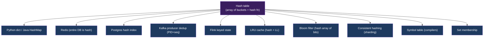
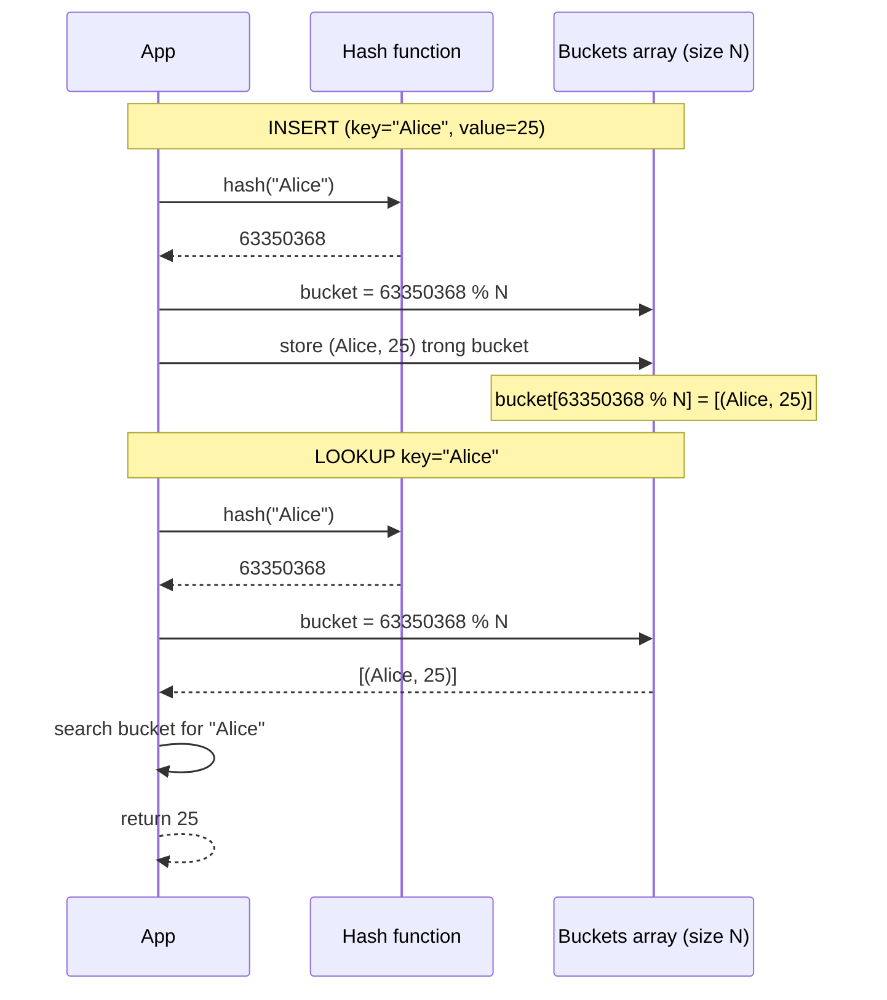

# KU F01 / 04 — Hash table: O(1) lookup magic

> **Hash table** = lookup O(1) "phép màu" của data structures. Nền tảng cho Redis, Python dict, Postgres hash index, Kafka producer dedup, Flink keyed state. Hiểu hash + collision = hiểu vì sao có **O(n) worst case** và làm sao tránh.

**Module:** [F01 — CS Fundamentals](./README.md)
**Prereqs:** [F01/03 Array vs Linked list](./03-array-vs-linked-list.md)
**Related KUs:** [F01/05 Tree](./05-tree-bst-btree.md) · [F01/11 Checksums](./11-checksums-integrity.md) · [F09 Databases I](../../semester-2-systems-theory/F09-databases-relational/) · [F10 Databases II](../../semester-2-systems-theory/F10-databases-beyond-sql/)
**Đọc trong:** ~12 phút
**Mức độ:** Foundational

---

## 🎯 Nó là gì? (Analogy đời sống)

Thư viện trường đại học có **10,000 cuốn sách**. Cách tìm cuốn bạn cần:

### Cách 1 — Linear scan (không có index)
- Đi từng kệ, đọc từng tựa sách.
- Tìm cuốn "Designing Data-Intensive Applications" → có thể đi hết 10,000 kệ. **O(n).**

### Cách 2 — Hash table (mỗi sách có "số ngăn" tính bằng công thức)
- Mỗi sách có **mã ISBN**. Thư viện có **công thức**: `ngăn = ISBN % 100` (chia lấy dư cho 100 ngăn).
- Có 100 ngăn (ngăn 0-99). Đi tới ngăn theo công thức → tìm trong ngăn đó (~100 sách).
- Lấy "Designing Data-Intensive Applications" với ISBN ending in `73` → đi thẳng **ngăn 73**, scan 100 sách. **O(1) lookup ngăn + O(100) scan = effectively O(1).**

**Khi nào có vấn đề?** Khi **công thức bị xung đột** (collision):
- 2 cuốn sách có ISBN khác nhau nhưng `% 100` ra cùng số (vd: 1573 và 2473 cùng ngăn 73).
- Nếu hash function tệ → **tất cả sách rơi vào 1 ngăn** → linear scan → O(n). **Tệ như không có index.**

→ **Hash table = công thức ánh xạ key → ngăn**, lookup O(1) **average**, O(n) **worst case** khi hash function tệ.

---

## 🧩 The Crux of the Problem  *(v3 — OSTEP-style framing)*

> **Core question:** Cho 10 triệu entries, làm sao **lookup 1 entry trong vài microseconds** mà không cần (a) sắp xếp toàn bộ, (b) so sánh tuần tự từng entry?
>
> **Why hard:** Sorted array binary search Θ(log n) = ~23 bước cho 10M → đã nhanh, nhưng chèn 1 entry mới = Θ(n) shift. Linked list insert Θ(1) nhưng lookup Θ(n). Cây cân bằng (BST) đảo trade-off nhưng vẫn Θ(log n).
>
> **What we need:** Một mechanism **biến key thành địa chỉ** (không phải so sánh) — `address = h(key)`. Nếu `h` đủ "đều" (uniform), mọi entry rơi vào bucket riêng → lookup = 1 phép tính + 1 array access ≈ **Θ(1)** *expected*. Trade-off: chấp nhận **worst-case Θ(n)** khi collision dồn về 1 bucket.

→ Đây chính là **hash table contract**: đổi *worst-case guarantee* lấy *average-case speed*.

---

## 📜 Lịch sử ngắn  *(v3 — etymology + invention)*

- **Khái niệm "scatter storage" / "hash"** ra đời cùng máy tính đầu tiên (1953-1956) tại IBM. **Hans Peter Luhn** (IBM) viết internal memo tháng 1/1953 đề xuất **scatter storage technique** — thuật ngữ "hashing" chưa có.
- Từ "**hash**" (chặt nhỏ, băm) lấy từ tiếng Anh ẩm thực: "hash browns" = khoai băm nhỏ. Bằng cách **băm key** thành mảnh nhỏ rồi mix lại, ta được số ngẫu nhiên-ish.
- **Donald Knuth** trong *TAOCP Vol 3* (1973, *Sorting and Searching*) là người đầu tiên phân tích formal về collision distribution + load factor — đặt nền cho mọi hash table sau này.
- **Robin Hood Hashing** (Pedro Celis, 1986, PhD thesis Waterloo) — biến thể giảm variance lookup time. Today dùng trong Rust HashMap, .NET Core Dictionary.
- **Cuckoo Hashing** (Pagh & Rodler, 2001) — guarantee Θ(1) worst-case lookup.
- **Consistent Hashing** (Karger et al., 1997, MIT) — sinh ra cho web caching (Akamai), today là backbone của DynamoDB, Cassandra, MinIO sharding.

→ Mỗi data engineering tool bạn dùng (Redis, Postgres hash index, Kafka producer state, Flink keyed state, Memcached) đều thừa hưởng 70 năm research này.

---

## 🧮 Pseudocode chuẩn — Hash table với separate chaining  *(v3 — Erickson UIUC style)*

```
INSERT(T, key, value):
    h ← HASH(key) mod size(T.buckets)
    《Tìm key trong bucket — nếu đã có thì update》
    for each entry in T.buckets[h]
        if entry.key = key then
            entry.value ← value
            return
    《Không có — chèn vào đầu list》
    APPEND(T.buckets[h], (key, value))
    T.count ← T.count + 1
    if T.count / size(T.buckets) > 0.75 then
        RESIZE(T, 2 × size(T.buckets))

LOOKUP(T, key):
    h ← HASH(key) mod size(T.buckets)
    for each entry in T.buckets[h]
        if entry.key = key then
            return entry.value
    return NOT_FOUND

RESIZE(T, new_size):
    old_buckets ← T.buckets
    T.buckets ← NEWARRAY(new_size)
    for each bucket in old_buckets
        for each (k, v) in bucket
            INSERT(T, k, v)        《rehash với new_size》
```

### Pseudocode Robin Hood (open addressing, fairness)

```
INSERT_RH(T, key, value):
    h ← HASH(key) mod size(T.buckets)
    dist ← 0
    while T.buckets[h] is not empty
        existing ← T.buckets[h]
        existing_dist ← (h − existing.original_h) mod size(T.buckets)
        if existing_dist < dist then
            《Robin Hood: poor entry steals from rich one》
            swap (key, value, dist) ↔ existing
        h ← (h + 1) mod size(T.buckets)
        dist ← dist + 1
    T.buckets[h] ← (key, value, dist)
```

→ Robin Hood giảm **variance** của probe length → 99th percentile latency tốt hơn separate chaining.

---

## 📊 Cost annotation table — 5 collision strategies  *(v3 — Sedgewick Princeton style)*

| Strategy | Insert (avg) | Lookup (avg) | Delete (avg) | Insert (worst) | Lookup (worst) | Space overhead |
|---|---|---|---|---|---|---|
| **Separate chaining** (linked list) | Θ(1) | Θ(1 + α) | Θ(1 + α) | Θ(n) | Θ(n) | High (pointer per entry) |
| **Linear probing** (open addr) | Θ(1)* | Θ(1)* | Θ(1)* hard | Θ(n) | Θ(n) | Low (just array) |
| **Quadratic probing** | Θ(1)* | Θ(1)* | hard | Θ(n) | Θ(n) | Low |
| **Double hashing** | Θ(1)* | Θ(1)* | hard | Θ(n) | Θ(n) | Low + 2 hash fns |
| **Robin Hood hashing** | Θ(1)* | Θ(1)* low variance | hard | Θ(n) | Θ(n) | Low |
| **Cuckoo hashing** | Θ(1) amortized | **Θ(1) guaranteed** | Θ(1) | Θ(n) rehash | **Θ(1)** | Low + 2 tables |

\* α = load factor (entries/buckets). Under uniform hashing assumption.

**Picking guide:**
| Cần | Pick |
|---|---|
| Default Python/JVM ecosystem | Separate chaining (Python dict, Java HashMap) |
| Cache-friendly, low memory | Linear probing (Rust HashMap, Google SwissTable) |
| Low variance latency (P99 quan trọng) | Robin Hood (Rust std, .NET Core Dictionary) |
| Hard real-time / worst-case guarantee | Cuckoo hashing (some embedded systems) |
| Distributed keys (sharding) | **Consistent hashing** (DynamoDB, Cassandra, MinIO) |

→ Sedgewick Princeton có bảng tương tự ở slide `Sedgewick_Princeton_HashTables.pdf`.

---

## ❌ Bad example / anti-pattern  *(v3 — "Martin's algorithm" style)*

### Anti-pattern 1 — Bad hash function

```python
# ❌ Always-42 hash → mọi key vào cùng 1 bucket → degenerate to linked list
class BadHashMap:
    def __init__(self):
        self.buckets = [[] for _ in range(100)]

    def _hash(self, key):
        return 42    # constant!

    def insert(self, key, value):
        self.buckets[self._hash(key)].append((key, value))
```

**Tại sao bad:** Vi phạm **uniformity property**. Insert 1M entries → bucket 42 có 1M entries, 99 bucket còn lại empty. Lookup = Θ(n) linear scan. "Hash table" mà chậm hơn linked list — vô nghĩa.

### Anti-pattern 2 — Hash key có high bit entropy nhưng dùng modulo nhỏ

```python
# ❌ SHA-256(key) là 256-bit → modulo 100 mất 248 bit entropy
import hashlib
def weak_hash(key, n_buckets=100):
    digest = hashlib.sha256(key.encode()).hexdigest()
    return int(digest, 16) % n_buckets   # mất hầu hết entropy
```

**Tại sao bad:** Nếu `n_buckets` không phải prime → modulo gây bias. Pick prime (97, 101, 1009...) hoặc power-of-2 + bitmask + extra mixing (Fibonacci hashing).

### Anti-pattern 3 — Hash table cho ordered iteration

```python
# ❌ Iterate hash table assuming insertion order
data = {"banana": 1, "apple": 2, "cherry": 3}
for k in data:
    print(k)
# Python 3.7+ guarantee insertion order (impl detail)
# BUT: Java 8 HashMap, C++ unordered_map → KHÔNG guarantee
```

**Tại sao bad:** Hash table = **unordered** by definition. Cần ordered → dùng `OrderedDict`, `TreeMap`, hoặc sorted by key sau khi extract.

### Anti-pattern 4 — User-controllable hash → HashDoS

```python
# ❌ Web framework receive query params → put vào dict
@app.route("/api")
def api(request):
    params = {k: v for k, v in request.args.items()}
    # attacker gửi 10,000 keys colliding hash → Θ(n²) insert → DoS
```

**Tại sao bad:** Classic HashDoS attack (CVE-2011-4815, Python). Mitigation: **randomized hash seed** (Python 3.3+ default, Java 8+ `String.hashCode` is randomized via siphash). Library mới như Rust HashMap dùng SipHash để chống.

---

**Hash table** = data structure dùng **hash function** map key → integer index → vị trí trong **array of buckets**. Mỗi bucket chứa 1 hoặc nhiều entries (collision handling).

3 components:

1. **Hash function** `h(key) → integer` — convert bất kỳ key (string, int, struct) sang số.
2. **Array of buckets** — `bucket[h(key) % N]` là entry storage.
3. **Collision resolution** — khi 2 keys hash về cùng bucket.

**Properties chuẩn:**
- Insert: O(1) average, O(n) worst
- Lookup: O(1) average, O(n) worst
- Delete: O(1) average, O(n) worst
- Memory: O(n) where n = number of entries

**Load factor** = `entries / buckets`. Khi > 0.75 thường, resize (double buckets) → rehash all entries.

**Nguồn:**
- CLRS Chapter 11 — Hash Tables (formal treatment).
- Knuth TAOCP Vol 3 — Sorting and Searching (original hash analysis).
- Robin Hood hashing paper (Celis 1986).

---

## 🔤 Terminology box

| Thuật ngữ | Tiếng Anh | Giải thích 1 câu |
|---|---|---|
| Bảng băm | Hash table | Array of buckets indexed by hash(key) |
| Hàm băm | Hash function | Function map key → integer |
| Băm | Hashing | Process apply hash function |
| Bucket | Bucket | Slot trong array, chứa entries |
| Slot | Slot | = Bucket |
| Va chạm | Collision | 2 keys hash về cùng bucket |
| Chuỗi va chạm | Chaining | Resolve collision bằng linked list trong bucket |
| Open addressing | Open addressing | Probe slot kế tiếp khi collision |
| Linear probing | Linear probing | Probe slot kế tiếp tuần tự |
| Quadratic probing | Quadratic probing | Probe với khoảng cách bình phương |
| Double hashing | Double hashing | Dùng 2 hash function |
| Robin Hood hashing | Robin Hood hashing | Open addressing với fairness (poor swap rich) |
| Hệ số tải | Load factor | entries / buckets, thường < 0.75 |
| Resize | Resize / rehash | Tăng số bucket, rehash all entries |
| Universal hashing | Universal hashing | Family of hash functions chọn random tránh worst case |
| Cryptographic hash | Cryptographic hash | Hash 1-way (SHA, MD5) — không reverse được |
| Non-cryptographic | Non-cryptographic | Fast hash cho hash table (xxHash, MurmurHash) |
| Perfect hashing | Perfect hashing | Hash function không collision (static set) |
| Bloom filter | Bloom filter | Probabilistic membership test (no false negative) |
| Consistent hashing | Consistent hashing | Distribute keys giữa nodes với minimal rehash khi resize |
| Hash collision attack | Hash collision attack | Attacker craft keys force same bucket → DoS |

---

## 💡 Nó làm được gì?

Hash tables cho phép:

- **O(1) lookup by key** — Redis, Memcached built on this.
- **Dedup** — set of seen items: `if x in seen: skip`.
- **Cache layer** — `cache[url] → response`, O(1) hit/miss.
- **Database hash index** — Postgres hash index, MySQL.
- **Stream processing keyed state** — Flink dedup operator, GROUP BY.
- **Producer idempotency** — Kafka producer track (PID, seqno) → bucket.
- **Distributed sharding** — consistent hashing distributes keys.

---

## 🧩 Nó là mảnh ghép nào trong tổng thể?



→ Hash table là **most-used data structure** trong industry. 70%+ data systems built on it.

---

## 🚀 Nó giúp ích gì?

### Real case 1 — Redis = giant hash table

Redis core = 1 hash table mapping key → value. Plus secondary data structures.

```
> SET user:1234 "Alice"
> GET user:1234
"Alice"            ← O(1) lookup
```

→ Redis serve **1M ops/sec** từ 1 thread → vì mỗi op O(1) hash lookup.

### Real case 2 — Python dict performance

```python
big_set = set(range(1_000_000))

# O(1) lookup
'500000' in big_set        # ~50 nanoseconds

# vs list O(n) lookup
big_list = list(range(1_000_000))
500000 in big_list         # ~5 milliseconds (100,000x slower)
```

→ Always pick `set` / `dict` over `list` cho membership test.

### Real case 3 — Postgres hash index vs B-tree

```sql
-- Hash index: equality only, O(1)
CREATE INDEX idx_email_hash ON users USING HASH (email);
SELECT * FROM users WHERE email = 'x@example.com';   -- O(1)

-- B-tree index: range + equality, O(log n)
CREATE INDEX idx_email ON users (email);
SELECT * FROM users WHERE email = 'x@example.com';      -- O(log n)
SELECT * FROM users WHERE email > 'a@example.com';      -- O(log n + range)
```

→ Hash index thắng cho exact match. B-tree thắng cho range. Postgres default B-tree because more flexible.

### Trong project DSX Air

| Tool | Hash table use |
|---|---|
| Kafka producer | (PID, sequence_number) → ack status |
| Kafka broker | partition assignment per (topic, key hash) |
| Flink dedup operator | RocksDB state hash-indexed by event_id |
| Iceberg manifest | partition spec hash → data file |
| ClickHouse Aggregator | groupBy keys hash → aggregate state |
| Redis cache | risk score per customer_id (KU example) |

→ Mọi keyed operation trong pipeline = hash table somewhere.

---

## ⏰ Khi nào dùng hash table vs alternatives?

| Need | Pick |
|---|---|
| O(1) exact lookup by key | **Hash table** |
| Ordered iteration | **Sorted tree** (BST, B-tree) |
| Range queries | **B-tree / sorted array** |
| Membership only (no values) | **Set** (hash-based) hoặc **Bloom filter** (memory-tight) |
| Memory-tight | **Open addressing** > chaining |
| Concurrent access | **ConcurrentHashMap** (Java) / Redis (single-thread atomic) |
| Persistent storage | **B-tree** (Postgres) > Hash index for flexibility |
| Distributed | **Consistent hashing** (Cassandra ring, DynamoDB) |

---

## 🤔 Trade-off vs alternatives

| Hash table | Tree (BST/B-tree) | Sorted array |
|---|---|---|
| O(1) lookup average | O(log n) | O(log n) binary search |
| O(n) worst lookup | O(log n) worst | O(log n) |
| No ordering | Sorted | Sorted |
| Resize expensive | Smooth growth | Insert O(n) |
| Memory: pointers + slots | Memory: pointers | Memory: compact |
| Cache: random | Cache: tree traversal mixed | Cache: sequential |

→ **Hash for exact, tree for range, array for compact ordered.**

---

## 🔧 Nó vận hành ra sao? (Logic walkthrough)

### Hash function basics

Goal: distribute keys **uniformly** across buckets.

```python
def hash_string(s):
    h = 0
    for c in s:
        h = (h * 31 + ord(c)) & 0xFFFFFFFF  # Java-style
    return h

print(hash_string("Alice"))  # → 63350368
print(hash_string("Bob"))    # → 66555
# Different keys → different hashes (usually)
```

### Insert + Lookup flow



→ O(1) hash + O(1) bucket access + O(k) scan bucket (k thường tiny).

### Collision resolution — 2 methods

**Method 1: Chaining** — bucket = linked list

```
bucket[5]: ("Alice", 25) → ("Bob", 30) → ("Carol", 40) → null
```

Insert "Dave" hash to 5 → append → linked list grows.

**Method 2: Open addressing** — probe next slot

```
bucket[5]: ("Alice", 25)
bucket[6]: ("Bob", 30)    ← Bob's hash = 5, but 5 taken, probe to 6
bucket[7]: ("Carol", 40)
```

Linear probing: try slot+1, slot+2, ... Quadratic: slot+1, slot+4, slot+9.

| | Chaining | Open addressing |
|---|---|---|
| Memory overhead | Higher (pointers) | Lower (no pointer) |
| Cache | Worse (random nodes) | Better (sequential) |
| Load factor max | 1+ OK | Must keep < 0.75 |
| Delete | Easy (remove from LL) | Tricky (need tombstone) |
| Modern preference | Java HashMap | Python dict, Go map |

### Resize (load factor management)

Load factor > 0.75 → double buckets → rehash all entries.

```
Before: N=8, entries=6 (load=0.75)
Insert 7th entry → trigger resize
After: N=16, rehash 7 entries to new array
```

→ Amortized O(1) insert. Spike O(n) on resize (rare).

### Robin Hood hashing (modern, used in Rust, Python 3.6+)

Open addressing với "fairness": entries probed lâu sẽ "đẩy" entries probed ngắn ra → minimize variance probe length.

```
Insert (key, hash) probe count:
  - (Alice, 5): probe 0 at slot 5
  - (Bob, 5):   probe 1 at slot 6 (collision moved to 6)
  - (Carol, 6): probe 0 at slot 6? No, taken by Bob (probe 1)
                Robin Hood: Carol probe 0, Bob probe 1
                → Carol "richer" (0 < 1), so Bob "robs" Carol's slot
                → Carol moves to slot 7

Result: variance probe length giảm → average lookup faster.
```

→ Python 3.6+ dict uses compact + Robin-Hood-like → 20-25% smaller memory.

### Bloom filter — probabilistic alternative

Bloom filter = array of bits + multiple hash functions. Test "có thể trong set?" với **0 false negative** + **small false positive rate**.

```
3 hash functions h1, h2, h3 → 3 bits per key

Insert "Alice":
  Set bit[h1(Alice)] = 1
  Set bit[h2(Alice)] = 1
  Set bit[h3(Alice)] = 1

Test "Bob":
  bit[h1(Bob)] == 0? → DEFINITELY not in set (no false neg)
  All bits 1? → MIGHT be in set (false positive possible)
```

Use case: Cassandra/RocksDB bloom filter per SSTable → skip files that don't contain key.

---

## 🧪 Worked example

**Tình huống:** Project DSX Air, Flink dedup operator phải maintain set của 1M event_ids để dedup. Junior dùng Python set, mem grow 200MB. Senior optimize.

### Bước 1 — Estimate memory

Python set of 1M UUID strings (36 chars each):
- Each string: 36 bytes data + ~50 bytes Python object overhead = 86 bytes
- Each set entry: pointer (8 bytes) + hash slot overhead
- Total: ~200 MB ✗

Java HashMap of same: 1M × ~64 bytes = 64 MB (better but still big).

### Bước 2 — Estimate Bloom filter

For 1% false positive, 1M entries:
- Bits needed ≈ n × ln(p) / -(ln(2))² ≈ 1M × 9.6 ≈ 9.6M bits = **1.2 MB**
- 7 hash functions

→ **Bloom filter 1.2 MB vs Python set 200 MB = 170x less memory.**

### Bước 3 — Trade-off

Bloom filter says "might be in set" → false positive 1% time. Có chấp nhận được không?

- For dedup: false positive = treat new event as duplicate → **drop** new event → **data loss** ❌
- For cache pre-check (avoid expensive disk query): false positive = false cache hit → small extra work ✓
- For Cassandra SSTable skip: false positive = wasted read ✓

→ Bloom filter **không** fit cho dedup (need 100% accurate). Fit cho **cache existence check**.

### Bước 4 — Alternative for dedup

Real option: RocksDB hash-indexed state with TTL.

```
Flink keyed state với event_id as key, TTL 24h.
RocksDB stores hash + value on disk + LRU cache in RAM.
Memory: bounded by cache size (e.g., 100MB).
Lookup: hot path RAM (~1us), cold path disk (~100us).
```

→ RocksDB gives O(1)-ish + bounded memory + persistent.

### Bước 5 — Configuration

```python
# Flink TTL state
ttl_config = StateTtlConfig.newBuilder(Time.hours(24)) \
    .setUpdateType(UpdateType.OnCreateAndWrite) \
    .build()

dedup_state = ValueStateDescriptor("event_id_seen", Boolean.class)
dedup_state.enableTimeToLive(ttl_config)
```

### Bài học từ worked example

- **Don't always use in-memory set** for large state — explosion.
- **Bloom filter** great for "might exist" but **not** for "must dedup".
- **Persistent state with TTL** (RocksDB) is right tool cho dedup at scale.
- **Pick hash structure by tradeoff** (accuracy vs memory vs persistence).

---

## ⚠️ Common pitfalls

### Pitfall 1 — Bad hash function → all collisions

❌ **Sai:** `def hash(s): return len(s)` → mọi string cùng length → cùng bucket → O(n).

✅ **Đúng:** Hash function distribute uniform. Use built-in `hash()` (Python) or `String.hashCode()` (Java).

### Pitfall 2 — Hash collision DoS attack

❌ **Sai:** Public-facing app dùng Java HashMap. Attacker gửi 1M keys forcefully hash về 1 bucket → server hang.

✅ **Đúng:** Use randomized hash (Python 3.3+ default, Java 7+ has SecureHash for security). Or use TreeMap when keys come from untrusted source.

### Pitfall 3 — Mutate key after insert

❌ **Sai:** Insert mutable object as dict key, then mutate object → hash changes → can't find.

✅ **Đúng:** Use immutable keys (str, int, tuple, frozenset). Python dict raises if you use mutable list as key.

### Pitfall 4 — Forget worst case O(n)

❌ **Sai:** "Hash O(1), guarantee."

✅ **Đúng:** O(1) **average**. Worst case O(n) when collision spike. Pathological inputs exist. Real-time SLA needs awareness.

### Pitfall 5 — Use Python list `in` operator on large list

❌ **Sai:** `if user_id in users_list:` where list = 1M items → O(n) → 5ms per check.

✅ **Đúng:** Build `users_set = set(users_list)` first. Then `in users_set` is O(1) → 50ns.

### Pitfall 6 — Resize spike during peak

❌ **Sai:** Hash table reaches 0.75 load during peak traffic → resize triggered → 100ms pause → cascading timeout.

✅ **Đúng:** Pre-allocate with expected size (`HashMap(initialCapacity, 0.75f)`). Or use incremental rehashing (Redis does this).

---

## 🌱 Advanced topics

### A1. Consistent hashing — distributed sharding

Distribute keys across N nodes. When N changes (add/remove node), minimize rehash.

```
Naive: hash(key) % N
  → N changes from 3 to 4 → ~75% keys rehash → cache thundering

Consistent hashing:
  Map both keys and nodes to a "ring" [0, 2^32)
  Each key assigned to next clockwise node
  Add node → only keys in 1 segment rehash (1/N of total)
```

→ Used in Cassandra, DynamoDB, MemCached client (Ketama), nginx upstream hash.

### A2. Cuckoo hashing

2 hash functions h1, h2. Each key in 1 of 2 possible slots.

```
Insert "Alice":
  slot_a = h1(Alice) = 5
  slot_b = h2(Alice) = 12
  Try slot 5: empty? → place. Otherwise try slot 12.
  If both full → evict existing → recursively re-place evicted.
```

→ O(1) **worst case** lookup. Used in some DB indexes, modern hash sets.

### A3. Hopscotch hashing

Hybrid open addressing + chaining. Cache-friendly.

### A4. Perfect hashing (static set)

For static set known at build time (e.g., compiler keywords), construct hash function with **0 collision**. Gperf tool generates this.

→ Compiler symbol tables, RegEx state machines.

### A5. Locality-Sensitive Hashing (LSH) — similar keys → similar buckets

Opposite of standard hash (uniform distribution). For similarity search:
- MinHash → estimate Jaccard similarity of sets
- SimHash → near-duplicate detection
- LSH for vectors → approximate nearest neighbor

→ Pre-dates vector DB (Qdrant uses HNSW now, but LSH foundational).

### A6. Apply cho LLM 2026

- **Token embedding cache** — hash(token_id) → embedding vector
- **Prompt cache key** — hash(prompt prefix) → cached KV cache
- **Anthropic prompt caching** — content-addressable storage via hash
- **Vector DB shard** — consistent hash assigns vectors to shards

→ LLM serving heavy on hash for caching. Sẽ học sâu hơn ở [D31 Vector Search](../../../year-2-specialization/semester-4-ai-ops-architecture/D31-vector-search-embeddings/).

---

## 🔗 Liên kết KU khác

- **[F01/03 Array vs Linked list](./03-array-vs-linked-list.md)** — buckets = array of LL
- **[F01/05 Tree](./05-tree-bst-btree.md)** — alternative for ordering
- **[F01/11 Checksums](./11-checksums-integrity.md)** — hash for integrity (different goal)
- **[F01/17 CRC, MD5, SHA](./17-hash-families.md)** — cryptographic hash families
- **[F09 Databases I](../../semester-2-systems-theory/F09-databases-relational/)** — hash index Postgres
- **[F10 Databases II](../../semester-2-systems-theory/F10-databases-beyond-sql/)** — Redis hash, Cassandra ring
- **[D31 Vector Search](../../../year-2-specialization/semester-4-ai-ops-architecture/D31-vector-search-embeddings/)** — LSH

---

## 🧠 Self-test (3 mức)

### 🟢 Easy

1. Hash table average lookup là O bao nhiêu? Worst case?
2. Tại sao Python `set` lookup nhanh hơn `list` cho membership test?
3. Load factor là gì? Khi vượt threshold, hash table làm gì?

### 🟡 Medium

4. Chaining vs Open addressing: khác nhau ra sao? Khi nào dùng cái nào?
5. Bloom filter cho 1M entries với 1% false positive cần ~1.2 MB. Vì sao tiết kiệm memory hơn set? Trade-off?
6. Hash collision attack: kẻ tấn công craft inputs làm hash table O(n). Cách phòng?

### 🔴 Hard

7. Consistent hashing: khi add 1 node vào cluster 10 nodes, bao nhiêu % keys rehash? So với naive modulo.
8. Cuckoo hashing 2-table O(1) worst lookup. Trade-off insert? Khi rebuild required?
9. Robin Hood hashing: giải thích "đẩy" mechanism. Tại sao improve variance probe length?

> **6+/9** = sẵn sàng KU 05. **4-5** = đọc CLRS Ch 11 + Robin Hood paper. **<4** = implement hash table from scratch in Python.

---

## 📌 Trong repo này

Hash everywhere trong DSX Air:

- **Kafka producer idempotency** — (PID, seqno) hash dedup: [`docs/06-event-backbone.md`](../../../../docs/06-event-backbone.md)
- **Flink keyed state** — RocksDB hash-indexed: [`docs/08-stream-processing.md`](../../../../docs/08-stream-processing.md)
- **ClickHouse GROUP BY** — hash aggregation
- **Redis cache** — risk score per customer_id: [`docs/11-serving-layer.md`](../../../../docs/11-serving-layer.md)

---

## 🌐 Đọc thêm — refs cụ thể vào library  *(v3 — pointers chính xác)*

📚 **Trong [library/books/cs-fundamentals/](../../../../library/books/cs-fundamentals/):**

- **Sedgewick Princeton slides** → `Sedgewick_Princeton_HashTables.pdf` — visual step-through separate chaining + linear probing + load factor analysis.
- **Open Data Structures (Morin)** → `Morin_OpenDataStructures_python.pdf` Chapter 5 (Hash Tables) — implementation + probing strategies + tabulation hashing analysis. Java/C++ versions cũng có.
- **Erickson Algorithms (UIUC)** → `Erickson_2019_Algorithms_UIUC.pdf` Chapter 5 (Hash Tables, Universal Hashing).

📖 **Sách commercial (mua / library):**
- **CLRS Chapter 11** — Hash Tables formal treatment (Universal Hashing, Perfect Hashing).
- **Mechanical Sympathy blog by Martin Thompson** — hash table cache locality.

📄 **Paper gốc:**
- Celis (1986), *"Robin Hood Hashing"* PhD thesis, University of Waterloo. [archive.org](https://archive.org).
- Pagh & Rodler (2001), *"Cuckoo Hashing"*, ESA. [DOI 10.1007/3-540-44676-1_10](https://doi.org/10.1007/3-540-44676-1_10).
- Karger et al. (1997), *"Consistent Hashing and Random Trees"*, STOC. [DOI 10.1145/258533.258660](https://doi.org/10.1145/258533.258660).
- Luhn (1953), IBM internal memo "Scatter Storage" — original hashing concept.

---

**Đã đọc xong?**
✅ Tick → [F01/05 Tree: BST, B-tree, B+tree, LSM](./05-tree-bst-btree.md).
