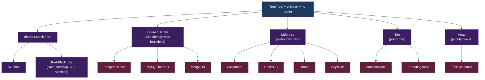
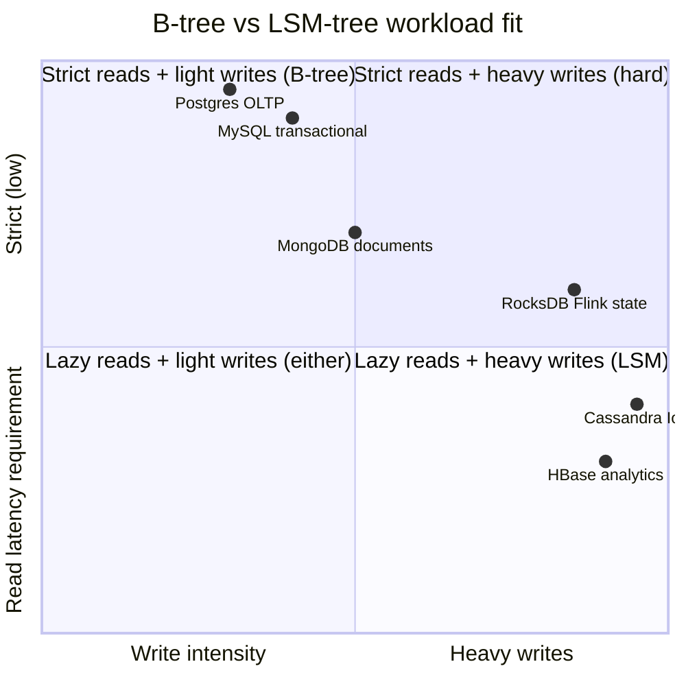
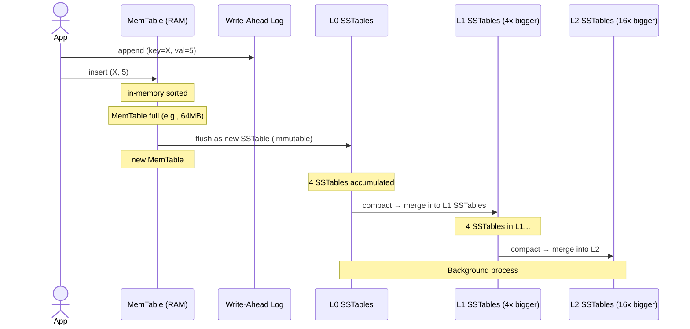
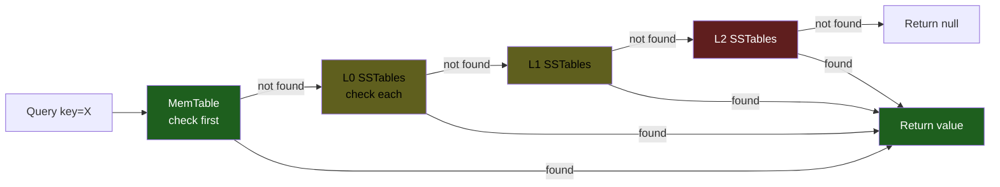

# KU F01 / 05 — Tree: BST, B-tree, B+tree, LSM-tree

> **Tree** = O(log n) workhorse cho ordered data. **B-tree** (Postgres index) + **LSM-tree** (Cassandra, RocksDB) là 2 tree pattern thống trị data world 2026. Hiểu 2 cái này = hiểu vì sao Postgres tốt cho OLTP và Cassandra tốt cho write-heavy.

**Module:** [F01 — CS Fundamentals](./README.md)
**Prereqs:** [F01/04 Hash table](./04-hash-table.md)
**Related KUs:** [F01/06 Graph](./06-graph-bfs-dfs.md) · [F01/07 Sorting](./07-sorting-algorithms.md) · [F09 Databases I](../../semester-2-systems-theory/F09-databases-relational/) · [F10 Databases II](../../semester-2-systems-theory/F10-databases-beyond-sql/)
**Đọc trong:** ~14 phút
**Mức độ:** Foundational

---

## 🎯 Nó là gì? (Analogy đời sống)

**Thư viện trường có 3 cách sắp sách.**

### Cách 1 — BST (Binary Search Tree) — kệ chia đôi liên tiếp

- 1 kệ chính → chia 2 kệ con (trái = sách ISBN nhỏ, phải = lớn).
- Mỗi kệ con lại chia 2 → 4 kệ → 8 kệ → ...
- 1M sách → log₂ 1M ≈ 20 kệ depth. **20 bước tìm bất kỳ sách**.

### Cách 2 — B-tree — kệ rộng có nhiều ngăn

- 1 kệ chính có **100 ngăn**, mỗi ngăn trỏ tới 1 kệ con.
- Kệ con lại có **100 ngăn** nữa.
- 1M sách → log₁₀₀ 1M = 3 levels. **3 bước tìm bất kỳ sách** ⚡.
- Lý do: mỗi "bước đọc" load 1 trang đĩa = 1 I/O. Càng ít level → càng ít I/O.

### Cách 3 — LSM-tree (Log-Structured Merge) — sổ ghi chú + dọn dẹp định kỳ

- Nhân viên ghi sách mới vào **sổ ghi chú nhanh** (memory).
- Mỗi tối, **dọn sổ ghi chú** vào kệ chính theo thứ tự (background merge).
- Lúc tìm: check sổ ghi chú **trước** (mới nhất), rồi check kệ chính (cũ).
- **Insert cực nhanh** (ghi vào sổ memory), **read thấp hơn B-tree** (phải check nhiều nơi).

3 patterns trade-off:

| | BST | B-tree | LSM-tree |
|---|---|---|---|
| Lookup | O(log₂ n) | O(log_B n) | O(log n × levels) |
| Insert | O(log n) | O(log n) | O(1) amortized ✨ |
| Disk I/O | Many | Few (wide nodes) | Many (multi-level) |
| Read-optimized | Yes | Yes ⚡ | No |
| Write-optimized | No | No | Yes ⚡ |
| Best for | In-memory ordered | Disk index (Postgres) | Write-heavy (Cassandra, RocksDB) |

→ **Modern data world = B-tree (Postgres, MySQL) + LSM-tree (Cassandra, RocksDB, ScyllaDB, Iceberg compaction).**

---

## 📖 Định nghĩa chính thức

**Tree** = recursive data structure với **root**, mỗi node có 0+ **children**. Mỗi node có 1 **parent** (except root). No cycle.

3 tree families trong DE:

1. **Binary Search Tree (BST)** — mỗi node có ≤ 2 children. Left subtree < node < right subtree. Balanced variants: AVL, Red-Black.

2. **B-tree / B+tree** — mỗi node có **B children** (B = 100-1000 typical). Designed cho disk I/O. Postgres index, MySQL InnoDB, MongoDB use **B+tree**.

3. **LSM-tree (Log-Structured Merge tree)** — write to memory (MemTable), flush to disk as immutable sorted files (SSTable), background merge. Cassandra, RocksDB, LevelDB, HBase, ScyllaDB.

**Trade-off cốt yếu:** B-tree read-optimized, LSM write-optimized. Modern data engineering picks based on workload.

**Nguồn:**
- CLRS Chapter 12 (BST), 18 (B-tree).
- Bayer & McCreight 1970 — original B-tree paper.
- O'Neil et al. 1996 — original LSM-tree paper.
- Kleppmann DDIA Chapter 3 "Storage and Retrieval" — best modern explanation.

---

## 🔤 Terminology box

| Thuật ngữ | Tiếng Anh | Giải thích 1 câu |
|---|---|---|
| Cây | Tree | Hierarchical DS với root + branches |
| Nút | Node | Element trong tree |
| Gốc | Root | Top node |
| Lá | Leaf | Node không có children |
| Con | Children | Direct descendants |
| Cha | Parent | Direct ancestor |
| Độ sâu | Depth | Distance từ root tới node |
| Chiều cao | Height | Max depth của tree |
| Cây nhị phân | Binary tree | Mỗi node ≤ 2 children |
| BST | Binary Search Tree | Binary tree với ordering property |
| Cây cân bằng | Balanced tree | Height O(log n) |
| AVL tree | AVL tree | Self-balancing BST (1962) |
| Red-Black tree | Red-Black tree | Self-balancing BST với coloring rule |
| B-tree | B-tree | Wide branching factor tree, disk-friendly |
| B+tree | B+tree | B-tree variant: data only trong leaves, leaves linked |
| Branching factor | Branching factor / fan-out | Số children per node |
| LSM-tree | Log-Structured Merge tree | Multi-level write-optimized tree |
| MemTable | MemTable | In-memory buffer cho LSM writes |
| SSTable | Sorted String Table | Immutable on-disk sorted file (LSM) |
| Compaction | Compaction | Merge SSTables → fewer larger SSTables |
| Write amplification | Write amplification | Total bytes written / user bytes (LSM trade-off) |
| Read amplification | Read amplification | Total bytes read / user bytes |
| Space amplification | Space amplification | Storage used / live data |
| Tombstone | Tombstone | Marker for deleted entry trong LSM |
| Bloom filter | Bloom filter | Skip SSTable when key not present |
| Trie | Trie | Tree mỗi node = 1 character (prefix lookup) |
| Skip list | Skip list | Probabilistic alternative to balanced BST |

---

## 💡 Nó làm được gì?

Tree cho phép:

- **Ordered lookup** O(log n) — find key + neighbors
- **Range scan** — efficient "give me all keys between X and Y"
- **Sorted iteration** — built-in
- **Database index** — Postgres B-tree, MySQL B+tree
- **Filesystem** — directory tree (ext4, btrfs, ZFS)
- **Decision tree ML** — classification/regression
- **Parse tree** — compilers, JSON/XML
- **DOM** — HTML hierarchical document

---

## 🧩 Nó là mảnh ghép nào trong tổng thể?



→ 80% indexed storage in industry uses B-tree variant or LSM-tree.

---

## 🚀 Nó giúp ích gì? (Real impact)

### Postgres B-tree index — vì sao log_B vs log_2 matter

```
1B rows, BST height: log₂(1B) = 30 levels
1B rows, B-tree (B=100) height: log₁₀₀(1B) = 5 levels

Disk seek time: 10ms (HDD), 0.1ms (SSD)
BST: 30 × 10ms = 300ms ❌
B-tree: 5 × 10ms = 50ms ⚡ (6x faster)
```

→ **B-tree designed cho disk**. Wide branching factor = fewer I/O.

### LSM-tree write throughput

```
B-tree insert:
  1. Find leaf (log_B n) — random I/O
  2. Write to leaf — random write
  Insert rate ~10k/sec on HDD

LSM-tree insert:
  1. Append to MemTable (RAM) — O(1)
  2. Periodically flush to disk — sequential write
  Insert rate ~1M/sec on SSD ⚡ (100x faster)
```

→ Cassandra ingests 1M events/sec on commodity hardware. Postgres maxes ~50k/sec. **LSM wins write-heavy.**

### Real-world examples

| System | Tree | Rationale |
|---|---|---|
| Postgres | B-tree index | OLTP read-heavy |
| MySQL InnoDB | B+tree | OLTP, large rows |
| MongoDB | B-tree | Document store, range query |
| Cassandra | LSM-tree | Write-heavy, IoT, time-series |
| RocksDB | LSM-tree | Embedded KV (Flink state, etc.) |
| HBase | LSM-tree (HFile) | Hadoop big data |
| Iceberg | (not tree, but uses compaction concept from LSM) | Parquet files + manifests |
| Java TreeMap | Red-Black BST | In-memory ordered map |
| Linux dentry cache | Trie variant | Filesystem path lookup |

### Trong project DSX Air

| Component | Tree-based |
|---|---|
| Postgres OLTP `orders` | B-tree primary key index |
| ClickHouse MergeTree | Skip list (primary index) + LSM-like merging |
| Iceberg manifest tree | Tree of manifests pointing to data files |
| Flink RocksDB state | LSM-tree |
| Kafka offset index | B-tree-like sparse index per segment |

→ Tree variant **everywhere** trong data infrastructure.

---

## ⏰ Khi nào dùng cây nào?

| Workload | Choice |
|---|---|
| In-memory ordered map | **Red-Black BST** (Java TreeMap) |
| OLTP database index | **B+tree** (Postgres, MySQL) |
| Write-heavy IoT / log | **LSM-tree** (Cassandra) |
| Embedded KV store | **LSM** (RocksDB) trong Flink/Kafka |
| Prefix search (autocomplete) | **Trie** |
| Priority queue (top-k) | **Heap** (binary) |
| Range scan + frequent insert | **B+tree** (leaves linked = scan efficient) |
| Static dataset, ordered | **Sorted array** (binary search) |
| Memory-constrained | **Skip list** (probabilistic balance) |

---

## 🤔 Trade-off: B-tree vs LSM-tree (the big one)



| Aspect | B-tree | LSM-tree |
|---|---|---|
| Insert rate | Medium | High ⚡ |
| Lookup latency | Low ⚡ | Medium (multi-level check) |
| Range scan | Excellent ⚡ (leaves linked) | Good |
| Write amplification | High (random writes) | Low → high (depending compaction) |
| Read amplification | Low | High (multi-level + Bloom miss) |
| Space amplification | Low | Medium-High (multiple versions) |
| Compaction overhead | None | Background CPU + I/O |
| Best for | OLTP, read-heavy | Write-heavy, log/IoT |

→ **Heuristic:** writes > reads → LSM. reads > writes → B-tree.

---

## 🔧 Nó vận hành ra sao? (Logic walkthrough)

### Binary Search Tree

```
      [50]
      /  \
   [30]   [70]
   / \    / \
 [20][40][60][80]

Lookup(40):
  start at root 50, 40 < 50 → go left
  at 30, 40 > 30 → go right
  at 40, found ✓
  Depth: 3
```

→ O(log n) **if balanced**. Worst case (sorted insert) → linear chain O(n).

→ Self-balancing variants (AVL, Red-Black) keep height = log n.

### B-tree (B=4 example)

```
      [25 | 50 | 75]                    ← root with 3 keys, 4 children
     /     |     |     \
 [10|20] [30|40] [60|70] [80|90]        ← 4 leaves with 2 keys each

Lookup(40):
  At root, 40 is between 25 and 50 → child index 1
  At leaf [30|40], scan → found ✓
  Depth: 2

Insert(45):
  Lookup → leaf [30|40]
  Insert → [30|40|45] (still ≤ B=4 max)
  
Insert(55):  
  Lookup → leaf [60|70]
  Insert → [55|60|70] (still ok)

If leaf full → split → propagate to parent.
```

→ **Wide branching factor + leaves close** = great for disk.

### B+tree (data only in leaves, leaves linked)

```
      [25 | 50 | 75]                    ← internal nodes have only keys
     /     |     |     \
 [10|20]→[30|40]→[60|70]→[80|90]        ← leaves linked horizontally for range scan
   |       |       |       |
  data    data    data    data
```

→ **B+tree better than B-tree** cho range scan (leaves are linked list).

**Postgres uses B+tree-like.**

### LSM-tree write path



Insert path: **only MemTable** → O(1). Persistence via WAL.

### LSM-tree read path



Read = check MemTable → L0 → L1 → L2 → ... Up to N levels.

**Optimization:**
- **Bloom filter** per SSTable → skip SSTables that don't contain key
- **Block cache** in RAM
- **Compaction** reduces # SSTables

### Compaction strategies

| Strategy | Description | Pro | Con |
|---|---|---|---|
| **Size-tiered** | Merge SSTables of similar size | Low write amp | High space amp |
| **Leveled** | Each level k-times bigger | Bounded read amp | High write amp |
| **Time-window** | Time-series workload | Efficient TTL | Specific use case |

Cassandra default = size-tiered. RocksDB default = leveled.

---

## 🧪 Worked example

**Tình huống:** Project DSX Air, team đang chọn DB cho `orders` (OLTP) và `event_logs` (1M events/sec IoT).

### Bước 1 — Analyze workload

| Dataset | Workload pattern |
|---|---|
| `orders` | 10k inserts/sec, 50k reads/sec, p99 < 10ms |
| `event_logs` | 1M inserts/sec, 1k reads/sec (analytics later), p99 insert < 5ms |

### Bước 2 — Map to tree

**`orders`:**
- Reads > writes by 5x → **B-tree** wins
- Need fast lookup by order_id → B+tree primary key
- Need range scan by created_at → B+tree secondary index
- → **Postgres B+tree**

**`event_logs`:**
- Writes >> reads (1000x) → **LSM-tree** wins
- Insert throughput critical → MemTable batching
- Acceptable read latency (analytics, not OLTP)
- → **Cassandra** or **ScyllaDB**

### Bước 3 — Verify with numbers

Postgres on commodity:
- Insert rate: ~50k/sec → handle orders 10k/sec ✓
- p99 read: 5-10ms ✓
- Fail for event_logs (1M/sec) ❌

Cassandra on commodity:
- Insert rate: 1M/sec ✓
- p99 read: 20-50ms (acceptable for analytics)
- Fail for orders (p99 too high) ❌

→ **Different tools for different tree types.** Don't force 1 DB.

### Bước 4 — In project DSX Air

Project simplifies for lab scale:
- `orders` Postgres (B-tree) — small scale, OLTP
- `events.*` Redpanda topics (append log, conceptually LSM-tree of events)
- Flink state RocksDB (LSM-tree) for dedup/aggregation
- Iceberg tables (Parquet + manifest tree, with LSM-style compaction)

### Bài học

- **Match tree to workload.** Don't force 1 DB.
- **B-tree** = OLTP, read-heavy, range scan.
- **LSM** = write-heavy, log, IoT, time-series.
- Modern systems often combine (Postgres + Cassandra + Redis cache).

---

## ⚠️ Common pitfalls

### Pitfall 1 — Use BST without balancing

❌ **Sai:** Implement BST, insert keys 1, 2, 3, ..., n → linear chain → O(n) ops.

✅ **Đúng:** Use Red-Black tree (Java TreeMap) or AVL. Auto-balance.

### Pitfall 2 — B-tree cho write-heavy workload

❌ **Sai:** Use Postgres for 1M events/sec ingestion → random I/O → 500k/sec at best, hot spots.

✅ **Đúng:** LSM-tree (Cassandra) or append-only log (Kafka) → 10-100x higher ingestion.

### Pitfall 3 — LSM-tree without compaction tuning

❌ **Sai:** Default Cassandra config, ingest TB/day → compaction lag → read amp explode.

✅ **Đúng:** Tune compaction strategy (time-window for time-series). Monitor read amp.

### Pitfall 4 — Bloom filter forgotten

❌ **Sai:** Disable Bloom filter on RocksDB → every key lookup checks ALL SSTables.

✅ **Đúng:** Always enable Bloom filter for LSM. ~1% false positive trade-off for 10x faster reads.

### Pitfall 5 — Index trên random data

❌ **Sai:** Postgres B-tree index trên UUID column → all inserts hit different leaves → random I/O kills.

✅ **Đúng:** Use UUID v7 (time-sortable) or hash partitioning.

### Pitfall 6 — Tombstone leak in LSM

❌ **Sai:** Cassandra delete many entries → tombstones không expire → read scan tombstones → slow.

✅ **Đúng:** Set GC grace period correctly. Monitor tombstone count.

---

## 🌱 Advanced topics

### A1. Red-Black tree (Java TreeMap, C++ std::map)

Self-balancing BST với 5 invariants. Insert/delete maintain balance via rotations + recoloring.

- Height bounded: ≤ 2 log(n+1)
- All ops O(log n) **guaranteed worst case**

→ Used in Linux kernel scheduler (CFS), Java TreeMap, C++ std::map.

### A2. B+tree leaf linked list

B+tree variant: only leaves contain data; internal nodes index only. Leaves chained as **doubly linked list** → range scan = walk leaves.

```
Postgres SELECT * WHERE id BETWEEN 100 AND 200:
  1. B+tree descend to leaf containing id=100: O(log n)
  2. Walk linked list of leaves until id > 200: O(k) where k = matching
```

→ **Efficient range scan.** Why B+tree dominant over B-tree.

### A3. Fractal tree / TokuMX

**Fractal tree**: buffer writes at each internal node. Amortized faster than B-tree for writes.

Used in TokuDB (acquired by Percona, then MongoDB).

→ Hybrid approach: B-tree structure + LSM-like batching.

### A4. Trie (prefix tree)

Each node = 1 character. Path from root = prefix.

```
              (root)
             /     \
           h        c
          / \       |
         e   i      a
         |   |      |
         l   m      t
         |
         l
         |
         o
        (hello)
```

Lookup "hello" = walk h→e→l→l→o. O(L) where L = string length, independent of dictionary size.

Used: autocomplete (Google search), IP routing (Patricia trie), DNS lookups.

### A5. Skip list

Probabilistic alternative to balanced BST. Multiple "express lanes":

```
Level 3: head → ... → 50 → null
Level 2: head → 10 → 30 → 50 → null
Level 1: head → 1 → 5 → 10 → 20 → 30 → 40 → 50 → null
```

- O(log n) **expected** (not worst)
- Simpler implementation than BST
- Used: Redis sorted set, RocksDB MemTable

### A6. LSM-tree write amplification

Compaction merges SSTables → reads + rewrites data multiple times.

```
1MB user write
→ Memtable (1MB)
→ flush L0 (1MB)
→ compact to L1 (merge with neighbors, e.g., 10MB)
→ compact to L2 (merge with 100MB)
...

Total bytes written to disk: 10x user data
Write amplification = 10
```

→ Trade-off vs B-tree. Tunable via compaction strategy.

### A7. Apply cho LLM 2026

- **Vector DB (Qdrant, Milvus)** sử dụng tree-like structures (HNSW = layered graph, similar concept)
- **LLM cache** in disk-backed store (RocksDB LSM under the hood)
- **Token tree** in beam search decoding

→ Tree concepts apply in surprising places.

---

## 🔗 Liên kết KU khác

- **[F01/04 Hash table](./04-hash-table.md)** — alternative for O(1) (vs O(log n))
- **[F01/06 Graph](./06-graph-bfs-dfs.md)** — graph traversal extends tree
- **[F01/07 Sorting](./07-sorting-algorithms.md)** — tree built via sort
- **[F09 Databases I](../../semester-2-systems-theory/F09-databases-relational/)** — Postgres B-tree index deep
- **[F10 Databases II](../../semester-2-systems-theory/F10-databases-beyond-sql/)** — Cassandra LSM deep
- **[D19 Lakehouse](../../../year-2-specialization/semester-3-data-engineering-deep/D19-lakehouse-deep/)** — Iceberg manifest tree
- **[D17 Stream Processing](../../../year-2-specialization/semester-3-data-engineering-deep/D17-stream-processing-deep/)** — Flink RocksDB state

---

## 🧠 Self-test (3 mức)

### 🟢 Easy

1. BST lookup là O bao nhiêu **nếu balanced**? **Nếu skewed**?
2. B-tree vs BST: vì sao B-tree wide branching factor (B=100) tốt hơn cho disk?
3. LSM-tree insert O bao nhiêu? Lookup O bao nhiêu?

### 🟡 Medium

4. Postgres index = B+tree, leaves linked. Vì sao range scan `WHERE id BETWEEN X AND Y` cực nhanh?
5. Cassandra LSM-tree write 1M/sec dễ, Postgres B-tree ~50k/sec. Vì sao? (Hint: random vs sequential I/O).
6. Tombstone trong LSM-tree là gì? Tại sao có thể gây vấn đề?

### 🔴 Hard

7. Compaction strategy: size-tiered vs leveled. Trade-off write amp / read amp / space amp khác nhau ra sao?
8. Bloom filter integration với LSM-tree: giảm read amplification thế nào? Trade-off?
9. Skip list vs Red-Black BST: tại sao Redis chọn skip list cho sorted set? (3 lý do).

> **6+/9** = đi KU 06. **<6** = đọc DDIA Ch 3.

---

## 📌 Trong repo này

Tree structures pervasive:

- **Postgres OLTP** B-tree primary key index
- **Iceberg manifest tree** — file metadata hierarchy: [`docs/09-lakehouse-design.md`](../../../../docs/09-lakehouse-design.md)
- **Flink RocksDB state** = LSM-tree: [`docs/08-stream-processing.md`](../../../../docs/08-stream-processing.md)
- **ClickHouse MergeTree** = LSM-style: [`docs/11-serving-layer.md`](../../../../docs/11-serving-layer.md)
- **Kafka offset index** = sparse B-tree-like

---

## 🌐 Đọc thêm (chính thống, hạn chế — 3 nguồn)

- **Kleppmann DDIA Chapter 3** — best modern explanation of B-tree vs LSM. [Library](../../../../library/books/distributed-systems/Kleppmann_2017_Designing-Data-Intensive-Applications.pdf)
- **CLRS Chapter 18** — B-tree formal treatment.
- **RocksDB Wiki — LSM-tree implementation** — practical optimizations.

---

**Đã đọc xong?**
✅ Tick → [F01/06 Graph + BFS/DFS](./06-graph-bfs-dfs.md).
