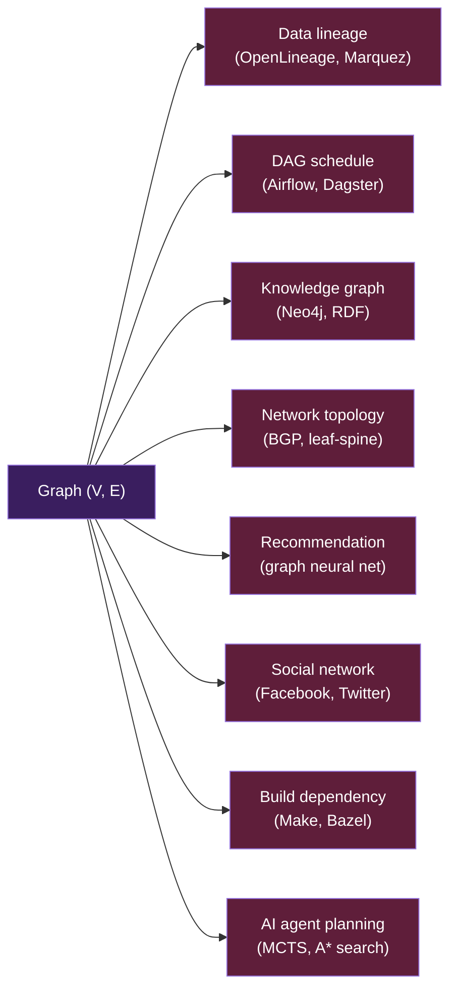
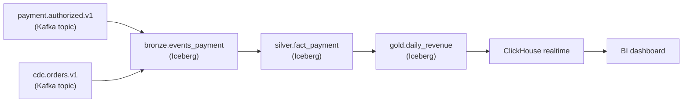
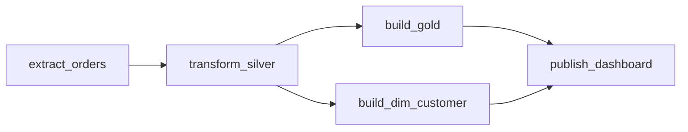

# KU F01 / 06 — Graph + BFS/DFS

> **Graph** = nodes + edges. Mô hình **mọi quan hệ** — social network, lineage, dependency, route, knowledge graph. **BFS/DFS** = 2 cách duyệt graph. Trong DE: data lineage, dependency DAG (Airflow/Dagster), schema relationships đều là graph.

**Module:** [F01 — CS Fundamentals](./README.md)
**Prereqs:** [F01/05 Tree](./05-tree-bst-btree.md)
**Related KUs:** [F01/07 Sorting](./07-sorting-algorithms.md) · [F01/08 Recursion](./08-recursion-iteration.md) · [D20 Orchestration](../../../year-2-specialization/semester-3-data-engineering-deep/D20-orchestration-deep/) · [D27 Governance](../../../year-2-specialization/semester-4-ai-ops-architecture/D27-governance-lineage/)
**Đọc trong:** ~10 phút
**Mức độ:** Foundational

---

## 🎯 Nó là gì? (Analogy đời sống)

Mạng lưới **bạn bè trên Facebook**:
- Mỗi người = **node** (đỉnh)
- Mỗi mối quan hệ "kết bạn" = **edge** (cạnh)
- Bạn có thể có **nhiều bạn**, bạn cũng có nhiều bạn nữa → mạng phức tạp

Bạn muốn tìm **đường ngắn nhất** từ bạn đến 1 người lạ (Kevin Bacon problem, ~6 degrees of separation):

### BFS (Breadth-First Search) — "tìm theo vòng tròn lan toả"
- **Bước 1:** liệt kê tất cả bạn trực tiếp của bạn (Hà, Long, Mai...) — đây là "vòng 1"
- **Bước 2:** liệt kê tất cả bạn của Hà, Long, Mai... — đây là "vòng 2"
- **Bước 3:** vòng 3...
- Khi gặp Kevin Bacon → trả lời đường đi.

→ Giống ném đá xuống nước → sóng lan ra. **Tìm shortest path** trong unweighted graph.

### DFS (Depth-First Search) — "đi sâu một đường rồi quay lại"
- Đi theo 1 hướng (theo Hà → bạn của Hà → bạn của bạn của Hà → ...)
- Cuối ngõ (no bạn mới) → **backtrack** lại.
- Thử hướng khác.

→ Giống đi mê cung — theo 1 hướng đến chết rồi quay. **Tìm có path hay không**, detect cycle.

3 patterns DE dùng graph:

1. **Data lineage** — Marquez/OpenLineage map dataset → upstream/downstream
2. **DAG** — Airflow/Dagster pipeline = directed acyclic graph (no cycle)
3. **Knowledge graph** — Neo4j, RDF stores
4. **Network topology** — leaf-spine fabric, BGP routing

---

## 📖 Định nghĩa chính thức

**Graph** G = (V, E) where V = set of **vertices** (nodes), E = set of **edges** (pairs of vertices).

Types:
- **Undirected** — edges không có hướng (Facebook friendship)
- **Directed** — edges có hướng (Twitter follow, lineage)
- **Weighted** — edges có weight (distance, cost)
- **DAG (Directed Acyclic Graph)** — directed, no cycle (Airflow DAG, dependency)
- **Cyclic** — có cycle
- **Connected** — every vertex reachable from every other
- **Bipartite** — vertices in 2 groups, edges only between groups

**Representation:**
- **Adjacency matrix** — 2D array V×V, `M[i][j] = 1` nếu có edge
- **Adjacency list** — array of lists, `adj[i]` = neighbors of i

**Traversal:**
- **BFS** — queue-based, level-by-level. O(V+E).
- **DFS** — stack-based or recursive. O(V+E).

**Nguồn:**
- CLRS Chapters 22-26 (graphs).
- Tarjan's SCC algorithm (1972).
- Dijkstra's shortest path (1959).

---

## 🔤 Terminology box

| Thuật ngữ | Tiếng Anh | Giải thích 1 câu |
|---|---|---|
| Đồ thị | Graph | Set of nodes + edges |
| Đỉnh / Nút | Vertex / Node | Element in graph |
| Cạnh | Edge | Connection between 2 vertices |
| Có hướng | Directed | Edges have direction |
| Không hướng | Undirected | Edges no direction |
| Có trọng số | Weighted | Edges have weight/cost |
| Đường đi | Path | Sequence of edges từ A → B |
| Chu trình | Cycle | Path that returns to start |
| DAG | Directed Acyclic Graph | Directed, no cycle |
| Liên thông | Connected | All vertices reachable |
| Adjacency matrix | Adjacency matrix | 2D array representation |
| Adjacency list | Adjacency list | Per-node neighbor list |
| BFS | Breadth-First Search | Queue-based, level traversal |
| DFS | Depth-First Search | Stack/recursive, depth traversal |
| Topological sort | Topological sort | Order DAG nodes by dependency |
| Shortest path | Shortest path | Min-cost path A→B |
| Dijkstra | Dijkstra's algorithm | Shortest path with positive weights |
| MST | Minimum Spanning Tree | Tree connect all nodes, min total weight |
| SCC | Strongly Connected Component | Subgraph all mutually reachable |
| Bipartite | Bipartite graph | Vertices split into 2 sets |
| Knowledge graph | Knowledge graph | Triple store: (subject, predicate, object) |
| Property graph | Property graph | Neo4j-style: nodes + edges + properties |

---

## 💡 Nó làm được gì?

Graph + BFS/DFS cho phép:

- **Data lineage queries** — "upstream của gold.daily_revenue?" → DFS upstream
- **Topological sort** — Airflow DAG schedule order
- **Cycle detection** — Ensure DAG (Airflow won't allow cycles)
- **Shortest path** — Dijkstra in routing, network optimization
- **Connected components** — Find isolated subgraphs
- **Bipartite check** — User-item recommendation
- **Network flow** — Capacity planning, bandwidth allocation

---

## 🧩 Nó là mảnh ghép nào trong tổng thể?



---

## 🚀 Nó giúp ích gì? (Real impact)

### Real case 1 — Data lineage (Marquez/OpenLineage)

Dataset graph in DSX Air:



Query: "Nếu `payment.authorized.v1` schema change → impact những gì?"
→ DFS forward từ `payment.authorized.v1` → traverse downstream → C, D, E, F, G impacted.

Marquez UI cho phép query này visually.

### Real case 2 — Airflow DAG topological sort



Schedule order computed via **topological sort**:
- T1 first (no dependency)
- T2 second (depends T1)
- T3, T4 parallel (both depend T2)
- T5 last (depends T3 + T4)

→ Standard graph algorithm. Sẽ sâu hơn ở [D20 Orchestration](../../../year-2-specialization/semester-3-data-engineering-deep/D20-orchestration-deep/).

### Real case 3 — Cycle detection

User accidentally creates dep:
```
A → B → C → A  (cycle!)
```

Airflow refuses to deploy → use DFS cycle detection.

### Trong project DSX Air

| Component | Graph |
|---|---|
| OpenLineage events | Dataset DAG |
| Dagster asset graph | DAG of assets |
| Network fabric topology | Leaf-spine graph |
| Iceberg snapshot history | Linked list (degenerate tree/graph) |

---

## 🔧 Nó vận hành ra sao? (Logic walkthrough)

### BFS (Breadth-First Search)

```python
from collections import deque

def bfs(graph, start):
    visited = {start}
    queue = deque([start])
    while queue:
        node = queue.popleft()
        process(node)
        for neighbor in graph[node]:
            if neighbor not in visited:
                visited.add(neighbor)
                queue.append(neighbor)
```

→ O(V+E). Queue keeps "next vertices to visit". Visit level-by-level.

### DFS (Depth-First Search)

```python
def dfs(graph, start, visited=None):
    if visited is None:
        visited = set()
    visited.add(start)
    process(start)
    for neighbor in graph[start]:
        if neighbor not in visited:
            dfs(graph, neighbor, visited)

# Iterative version with stack:
def dfs_iter(graph, start):
    visited = {start}
    stack = [start]
    while stack:
        node = stack.pop()
        process(node)
        for neighbor in graph[node]:
            if neighbor not in visited:
                visited.add(neighbor)
                stack.append(neighbor)
```

→ O(V+E). Stack (or recursion call stack). Depth-first.

### Topological sort (DAG only)

```python
def topo_sort(graph):
    visited = set()
    stack = []

    def dfs(node):
        visited.add(node)
        for neighbor in graph[node]:
            if neighbor not in visited:
                dfs(neighbor)
        stack.append(node)   # post-order

    for node in graph:
        if node not in visited:
            dfs(node)

    return stack[::-1]   # reverse = topological order
```

→ Used by Airflow/Dagster scheduler.

### Cycle detection (directed)

```python
def has_cycle(graph):
    WHITE, GRAY, BLACK = 0, 1, 2
    color = {node: WHITE for node in graph}

    def dfs(node):
        color[node] = GRAY
        for neighbor in graph[node]:
            if color[neighbor] == GRAY:  # back edge → cycle!
                return True
            if color[neighbor] == WHITE and dfs(neighbor):
                return True
        color[node] = BLACK
        return False

    return any(dfs(node) for node in graph if color[node] == WHITE)
```

→ Used by build systems, Airflow.

### Dijkstra (shortest path with weights)

```python
import heapq

def dijkstra(graph, start):
    dist = {node: float('inf') for node in graph}
    dist[start] = 0
    pq = [(0, start)]

    while pq:
        d, node = heapq.heappop(pq)
        if d > dist[node]:
            continue
        for neighbor, weight in graph[node]:
            new_dist = d + weight
            if new_dist < dist[neighbor]:
                dist[neighbor] = new_dist
                heapq.heappush(pq, (new_dist, neighbor))

    return dist
```

→ O((V+E) log V). Used in routing protocols, Google Maps.

---

## ⚠️ Common pitfalls

### Pitfall 1 — Cycle in DAG

❌ **Sai:** Build pipeline allows A → B → A → ... loop.

✅ **Đúng:** Always verify DAG via cycle detection before deploy.

### Pitfall 2 — DFS recursion stack overflow

❌ **Sai:** Recursive DFS on deep graph (1M nodes deep) → stack overflow.

✅ **Đúng:** Iterative DFS with explicit stack. Or increase recursion limit (Python `sys.setrecursionlimit`).

### Pitfall 3 — BFS for shortest path on weighted graph

❌ **Sai:** Use BFS for weighted graph → wrong answer.

✅ **Đúng:** BFS only for unweighted. Use Dijkstra (positive weights) or Bellman-Ford (negative weights).

### Pitfall 4 — Adjacency matrix cho sparse graph

❌ **Sai:** Adjacency matrix V×V cho 1M-node sparse graph → 10^12 cells, mostly 0.

✅ **Đúng:** Adjacency list — O(V+E) memory.

---

## 🌱 Advanced topics

### A1. PageRank — Google's algorithm

Rank importance of nodes based on incoming links. Iterative until convergence.

```
PR(A) = (1-d) + d * sum(PR(B) / out_degree(B) for B linking to A)
```

→ Foundation of search engine ranking. Apply to lineage = "most-depended-upon dataset".

### A2. Community detection

Find clusters in graph (Louvain, Label Propagation).

→ User segmentation, fraud rings detection.

### A3. Graph neural networks (GNN)

ML model that operates on graph structure (node embedding + message passing).

→ Recommendation, drug discovery, traffic prediction.

### A4. Property graphs vs RDF

| Model | Representation |
|---|---|
| **Property graph** (Neo4j) | Nodes + edges + properties on both |
| **RDF triple store** | (subject, predicate, object) triples |

→ Neo4j easier programming. RDF semantic web standard.

### A5. Apply cho AI 2026

- **Knowledge graph** for RAG context augmentation
- **Agent planning** as graph search (MCTS, A*)
- **GraphRAG** (Microsoft) — knowledge graph extracted from text → query
- **Multi-agent coordination** as graph

---

## 🔗 Liên kết KU khác

- **[F01/05 Tree](./05-tree-bst-btree.md)** — tree là special graph (no cycle)
- **[F01/07 Sorting](./07-sorting-algorithms.md)** — topological sort
- **[F01/08 Recursion](./08-recursion-iteration.md)** — DFS naturally recursive
- **[D20 Orchestration](../../../year-2-specialization/semester-3-data-engineering-deep/D20-orchestration-deep/)** — DAG implementations
- **[D27 Governance](../../../year-2-specialization/semester-4-ai-ops-architecture/D27-governance-lineage/)** — OpenLineage graph
- **[D32 RAG](../../../year-2-specialization/semester-4-ai-ops-architecture/D32-rag-engineering-deep/)** — GraphRAG
- **[F11 Distributed Theory](../../semester-2-systems-theory/F11-distributed-systems-theory/)** — consistent hashing ring (cyclic graph)

---

## 🧠 Self-test

### 🟢 Easy
1. Graph G = (V, E), V = ?, E = ?
2. BFS dùng DS gì? DFS dùng DS gì?
3. DAG là gì? Cho 1 ví dụ trong DE.

### 🟡 Medium
4. Topological sort dùng cho gì? Algorithm complexity?
5. BFS vs Dijkstra: khi nào dùng cái nào?
6. Cycle trong Airflow DAG → hệ quả gì? Cách detect?

### 🔴 Hard
7. PageRank: thuật toán iterate đến converge. Khi nào không converge?
8. Adjacency matrix V² memory vs adjacency list V+E. Cho graph sparse với V=1M, E=10M, so sánh memory.
9. GraphRAG (Microsoft): tại sao knowledge graph beat vanilla RAG cho multi-hop questions?

---

## 📌 Trong repo này

- **OpenLineage emitters** → graph: [`docs/13-governance-lineage.md`](../../../../docs/13-governance-lineage.md)
- **Dagster asset graph** = DAG: [`docs/10-batch-orchestration.md`](../../../../docs/10-batch-orchestration.md)
- **Network fabric** = graph (leaf-spine): [`docs/03-network-fabric-design.md`](../../../../docs/03-network-fabric-design.md)

---

## 🌐 Đọc thêm

- CLRS Chapters 22-26.
- Stanford CS161 Graph Algorithms lectures.

---

**Đã đọc xong?**
✅ Tick → [F01/07 Sorting algorithms](./07-sorting-algorithms.md).
