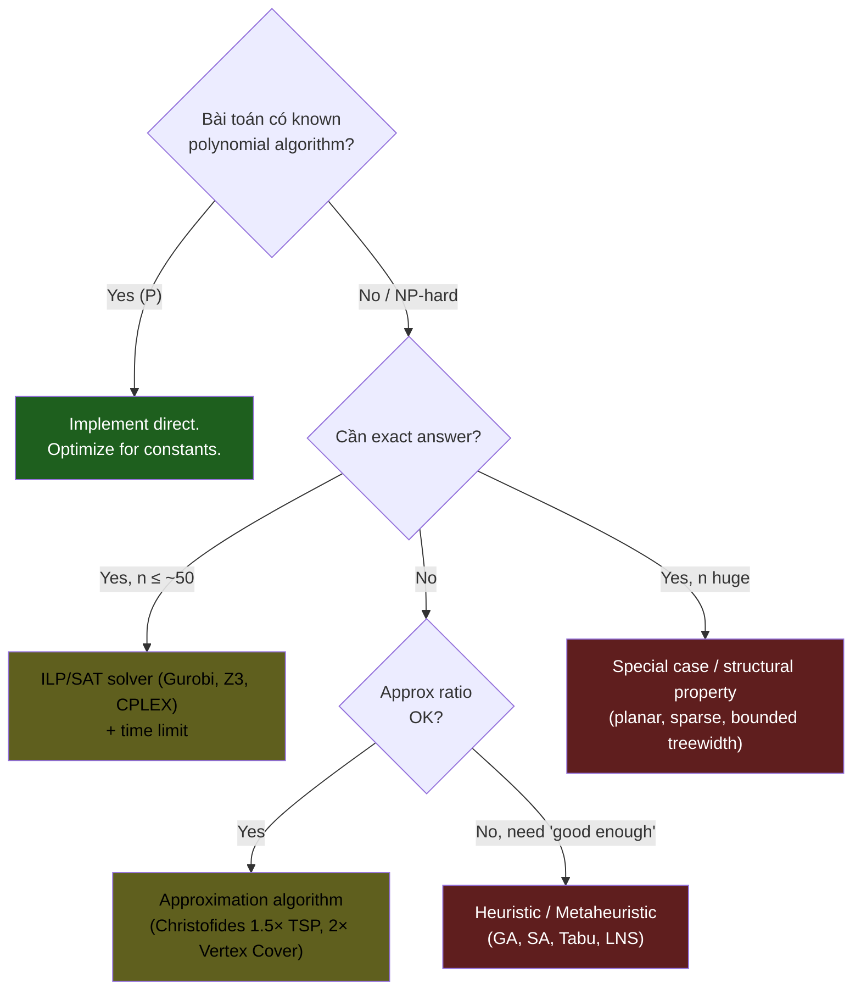

# KU F01 / 18 — Algorithmic complexity classes (P, NP)

> Một số problems **dễ giải** (P), một số **dễ verify nhưng khó giải** (NP), một số **không thể giải hiệu quả** (NP-complete, NP-hard). Hiểu mức này = biết khi nào problem "không có algorithm tốt" → dùng heuristic, approximation.

**Module:** [F01 — CS Fundamentals](./README.md)
**Prereqs:** [F01/09 Time vs space complexity](./09-time-vs-space-complexity.md)
**Related KUs:** [F12 System Design](../../semester-2-systems-theory/F12-system-design-fundamentals/)
**Đọc trong:** ~12 phút
**Mức độ:** Foundational

---

## 🎯 Nó là gì? (Analogy đời sống)

3 loại bài toán đời thường:

### P (Polynomial time) — Dễ giải
- **"Sắp xếp 1000 cuốn sách theo ABC."** → có algorithm O(n log n) → giải nhanh.
- **"Tìm đường ngắn nhất A→B."** → Dijkstra O((V+E) log V) → giải nhanh.

### NP (Nondeterministic Polynomial) — Dễ verify, khó giải
- **"Có lịch đi du lịch ghé hết 100 thành phố tổng dưới 2000km?"** (Traveling Salesman Problem).
- **Verify:** cho lịch trình, đo tổng km → easy.
- **Solve:** thử mọi permutation → 100! ≈ 10^158 cách → impossible.

### NP-complete — Hardest in NP
- TSP, 3-SAT, Vertex Cover, Hamiltonian Cycle.
- Tất cả "tương đương" — nếu giải 1 cái polynomial → giải hết.

### NP-hard — At least as hard as NP
- Halting Problem (decide program will halt) — **undecidable**.

---

## 🧩 The Crux of the Problem  *(v3 — OSTEP-style framing)*

> **Core question:** Một số bài toán bạn **giải** rất khó nhưng nếu ai đó cho lời giải, bạn **verify** trong vài giây — tại sao có sự bất đối xứng đó? Và có cách để biến "verify dễ" thành "solve dễ" không?
>
> **Why hard:** Brute-force TSP cho 50 thành phố = 50! ≈ 3×10⁶⁴ permutation. Universe có ~10⁸⁰ atoms. Brute-force vô vọng. Nhưng nếu ai cho 1 lịch trình, bạn cộng quãng đường → biết nó tổng dưới 2000km hay không trong **mili-giây**.
>
> **What we need:** Một **complexity hierarchy** phân loại bài toán theo "khó solve" (P, NP, NP-hard) tách bạch với "khó verify" — để engineer **biết khi nào dừng tìm exact algorithm** và chuyển sang **heuristic / approximation**.

→ Nếu không biết "bài toán này NP-hard" → bạn sẽ tốn 6 tháng tối ưu code, trong khi đáng lẽ chỉ cần đổi sang approximation thuật toán đã được chứng minh tốt 1.5×-optimal.

---

## 📜 Lịch sử ngắn  *(v3 — etymology + invention)*

- **Khái niệm "tractable" (giải được trong thời gian hợp lý)** lần đầu chính thức hoá bởi **Alan Cobham** (1965, *"The Intrinsic Computational Difficulty of Functions"*) và **Jack Edmonds** (1965, *"Paths, Trees, and Flowers"*) — đề xuất polynomial time = "good algorithm".
- **Stephen Cook** (1971, Toronto) công bố *"The Complexity of Theorem-Proving Procedures"* — **Cook-Levin theorem**: SAT là NP-complete, mở ra ngành **complexity theory**.
- **Leonid Levin** (1973, Moscow) độc lập chứng minh tương đương ở Liên Xô — dùng từ "universal search problem". Phải đến những năm 1990s phương Tây mới biết, vì vậy gọi chung là **Cook-Levin**.
- **Richard Karp** (1972, Berkeley, *"Reducibility Among Combinatorial Problems"*) chứng minh 21 bài toán classic (TSP, Knapsack, Vertex Cover, Hamiltonian Cycle...) đều NP-complete. → **Karp's 21 problems** = foundational reference.
- **"P vs NP"** trở thành 1 trong 7 **Millennium Prize Problems** của Clay Mathematics Institute (2000) với giải thưởng **$1 triệu USD** cho người chứng minh được P = NP hoặc P ≠ NP.
- **Today (2026):** Open problem suốt 55 năm. ~98% computer scientists tin P ≠ NP (Gasarch poll 2019). Toàn bộ cryptography hiện đại (RSA, ECDSA) dựa vào giả thuyết này.

→ "NP-hard" không phải buzzword — nó là kết tinh của 60 năm research toán học. Hiểu lịch sử → biết khi đọc paper "X is NP-hard" tức là **không có hy vọng** tìm polynomial algorithm trừ khi P = NP (= revolution của thế kỷ).

---

## 🧮 Pseudocode — Polynomial-time reduction proof  *(v3 — Erickson UIUC style)*

Chứng minh **Vertex Cover NP-complete** bằng reduction từ **3-SAT** (Karp 1972):

```
REDUCE_3SAT_TO_VC(formula φ = C₁ ∧ C₂ ∧ ... ∧ Cₘ over n variables):
    《Build graph G và integer k》
    G ← empty graph
    《Cho mỗi variable xᵢ → 2 vertex (xᵢ, ¬xᵢ) nối nhau》
    for i ← 1 to n
        ADD_VERTEX(G, xᵢ)
        ADD_VERTEX(G, ¬xᵢ)
        ADD_EDGE(G, xᵢ, ¬xᵢ)
    《Cho mỗi clause Cⱼ = (a ∨ b ∨ c) → triangle nối a, b, c》
    for j ← 1 to m
        let Cⱼ = (a ∨ b ∨ c)
        ADD_EDGE(G, a, b)
        ADD_EDGE(G, b, c)
        ADD_EDGE(G, a, c)
    《Cho mỗi literal trong clause → nối với variable vertex tương ứng》
    for j ← 1 to m
        for each literal ℓ in Cⱼ
            ADD_EDGE(G, ℓ_in_clause, ℓ_variable_vertex)
    k ← n + 2m
    return (G, k)

CLAIM: φ satisfiable ⟺ G có vertex cover size ≤ k
```

**Tại sao đây là proof:**
1. REDUCE chạy trong **polynomial time** O(n + m).
2. Nếu giải được Vertex Cover trong polynomial time → giải được 3-SAT trong polynomial time.
3. 3-SAT là NP-complete (Cook-Levin) → Vertex Cover cũng NP-complete.

→ **Erickson Algorithms Chapter 12 (NP-Hardness)** có hàng chục reduction tương tự, build chain: 3-SAT → IndepSet → VertexCover → HamCycle → TSP.

---

## 📊 Complexity hierarchy — cost table cho engineer  *(v3 — practical guide)*

| Class | Definition | Solving worst-case | Verification | Examples | Engineering action |
|---|---|---|---|---|---|
| **P** | Solvable in poly time | poly | poly | Sorting, Shortest path, Linear prog | Use direct exact algorithm |
| **NP** | Verifiable in poly time | (no bound) | poly | TSP decision, Knapsack | Decide based on input size + variant |
| **NP-complete** | Hardest in NP, all NP reducible to it | likely exponential | poly | SAT, Vertex Cover, Hamiltonian | **Don't try exact for large n** |
| **NP-hard** | ≥ as hard as NP-complete | likely exponential | (no bound) | TSP optimization, Halting | Approximation / heuristic |
| **co-NP** | Complement verifiable poly | (unknown vs NP) | poly | TAUT (tautology checking) | Special cases sometimes tractable |
| **PSPACE** | Solvable poly space | exponential time OK | exponential | Quantified SAT, 2-player games | Special algorithms (alpha-beta) |
| **EXPTIME** | Solvable exp time | exponential | (no bound) | Generalized chess | Heuristic only |
| **Undecidable** | No algorithm exists for all input | ∞ | ∞ | Halting Problem | Abandon — change problem formulation |

**Hierarchy:** `P ⊆ NP ⊆ PSPACE ⊆ EXPTIME ⊆ EXPSPACE ⊆ ...`

**Engineering decision tree:**



---

## ❌ Bad example / anti-pattern  *(v3 — "Martin's algorithm" style)*

### Anti-pattern 1 — Brute-force NP-hard for n > 30

```python
# ❌ TSP exact brute-force cho 50 cities
from itertools import permutations
def tsp_brute_force(cities):
    best = float('inf')
    for perm in permutations(cities):
        cost = sum_distance(perm)
        if cost < best: best = cost
    return best
# 50! ≈ 3 × 10^64 permutations
# Universe heat death trước khi xong
```

**Tại sao bad:** Vi phạm hiểu biết về complexity class. Senior pick **Christofides 1.5-approximation** O(n³) cho cùng input → 1 giây.

### Anti-pattern 2 — "Tôi sẽ chứng minh P = NP để giải"

```
"Bài toán scheduling NP-hard? Không sao, tôi sẽ optimize Python code."
"NP-hard? Buy more compute → solve."
```

**Tại sao bad:** Optimize constants không thay đổi complexity class. NP-hard với n=100 cần ~10^30 ops dù Python hay C++ → vô vọng. Buy compute = 10^30 → 10^29 = vẫn vô vọng. → Phải đổi **approach** (approximation, heuristic), không phải **implementation**.

### Anti-pattern 3 — Misuse "exponential" cho không-NP

```python
# ❌ Naive fibonacci O(2ⁿ) → conclude "Fibonacci là NP-hard"
def fib(n):
    if n <= 1: return n
    return fib(n-1) + fib(n-2)
```

**Tại sao bad:** Fibonacci **trong P** (compute trong O(n) iterative hoặc O(log n) matrix exponentiation). Naive implementation chậm KHÔNG có nghĩa bài toán NP-hard. **NP-hardness là property của bài toán**, không phải implementation. Phân biệt: "thuật toán exponential" ≠ "bài toán exponential".

### Anti-pattern 4 — Confuse decision vs optimization

```
"TSP optimization (find shortest tour) là NP-complete."  ❌
```

**Tại sao bad:** NP-complete là **decision problem** ("có tour ≤ k không?"). **Optimization version** (find shortest) là **NP-hard** (không nhất thiết trong NP vì verify cần biết "đây là min" → cần solve lại). Distinction quan trọng cho proof.

---

**P (Polynomial)** = problems solvable in O(n^k) time với k constant. "Tractable".

**NP (Nondeterministic Polynomial)** = problems whose **solution can be verified** in polynomial time.

**NP-complete** = problems in NP, all NP problems reducible to it. Hardest in NP.

**NP-hard** = problems at least as hard as NP-complete. May not be in NP (e.g., undecidable).

**Big question: P = NP?**
- Open problem since 1971 (Cook-Levin theorem).
- If P = NP → revolutionary, can solve TSP fast.
- Most computer scientists believe P ≠ NP.

**Nguồn:**
- Garey & Johnson, *"Computers and Intractability"* (1979).
- Cook-Levin theorem (1971).
- Clay Math Millennium Prize.

---

## 🔤 Terminology box

| Thuật ngữ | Tiếng Anh | Giải thích 1 câu |
|---|---|---|
| P | P (Polynomial time) | Solvable in polynomial time |
| NP | NP | Verifiable in polynomial time |
| NP-complete | NP-complete | Hardest in NP |
| NP-hard | NP-hard | At least as hard as NP |
| Tractable | Tractable | Can solve in reasonable time |
| Intractable | Intractable | Cannot solve in reasonable time |
| Reduction | Reduction | Convert problem A → B |
| Polynomial reduction | Polynomial reduction | Reduction in polynomial time |
| Cook-Levin | Cook-Levin theorem | SAT is NP-complete |
| Decidable | Decidable | Algorithm exists for all inputs |
| Undecidable | Undecidable | No algorithm can solve |
| Halting problem | Halting problem | Famously undecidable |
| Approximation algorithm | Approximation algorithm | Get within X% of optimal |
| Heuristic | Heuristic | Practical good-enough solution |
| Parameterized complexity | Parameterized complexity | Complexity in terms of parameters |

---

## 💡 Real-world examples

### P problems (easy)
- Sorting
- Shortest path (Dijkstra, BFS)
- Maximum flow
- Linear programming
- Primality testing (AKS 2002)
- Connected components

### NP-complete (hard)
- **TSP** (Traveling Salesman) — find shortest tour
- **3-SAT** — satisfy boolean formula
- **Knapsack** (0/1) — pack items max value within weight
- **Graph coloring** — color vertices, neighbors different
- **Hamiltonian Cycle** — find cycle visit each vertex once
- **Vertex Cover** — smallest set covering all edges
- **Set Cover** — smallest collection covering universe
- **Subset Sum** — find subset sum equal target

### NP-hard (but not NP)
- **Halting Problem** — undecidable
- **TSP optimization** (not decision) — NP-hard, not NP

### Real-world impact

- **Compiler optimization**: many problems are NP-hard → use heuristics
- **Scheduling**: NP-hard → use greedy / genetic algorithms
- **Network design**: NP-hard → approximation
- **Cryptography**: based on hardness assumptions (factoring, discrete log — believed NP)

---

## 🚀 What to do when problem is NP-hard

### Approach 1 — Approximation algorithm
Find solution within X% of optimal in polynomial time.
- TSP: Christofides 1.5-approximation
- Vertex Cover: 2-approximation (greedy)

### Approach 2 — Heuristic
Practical good-enough solutions without guarantee.
- Genetic algorithms
- Simulated annealing
- Tabu search

### Approach 3 — ILP / SAT solver
Use industrial solvers (Gurobi, CPLEX, Z3) for small instances. Surprisingly effective in practice.

### Approach 4 — Special cases
Some special structures admit polynomial algorithm.
- TSP on planar graph: PTAS
- 2-SAT (instead of 3-SAT): polynomial

### Approach 5 — Reduce problem scope
Solve smaller version. Accept partial solution.

### Approach 6 — Quantum (future)
Some NP problems may be faster on quantum computers (Grover's algorithm for unstructured search).

→ Today: 2026 quantum advantage exists for select problems, not general NP.

---

## 🔧 Reductions show NP-completeness

Show problem X is NP-complete by:
1. X ∈ NP (verify in polynomial time)
2. Reduce known NP-complete (e.g., 3-SAT) to X in polynomial time.

Famous reductions:
- 3-SAT ≤ Vertex Cover ≤ Hamiltonian Cycle ≤ TSP
- 3-SAT ≤ Subset Sum ≤ Knapsack

---

## 💡 Trong DE / AI 2026

| Problem | Class |
|---|---|
| Query optimization (general) | NP-hard → cost-based estimator + heuristics |
| Schema design | NP-hard normalization |
| Workload scheduling (DAG) | NP-hard → greedy |
| Bin packing (capacity planning) | NP-hard → first-fit decreasing |
| K8s scheduler | NP-hard → score-based heuristic |
| ML feature selection | NP-hard → greedy forward selection |
| Network optimization | NP-hard → ILP solver |
| Job shop scheduling | NP-hard |
| Knapsack-style cost optimization | NP-hard |
| LLM agent task planning | Often NP-hard → MCTS, beam search |

→ Most "real-world hard problems" are NP-hard → industrial uses approximation + heuristic, NOT exact algorithm.

---

## ⚠️ Common pitfalls

### Pitfall 1 — Try to solve NP-hard exactly

❌ Brute force TSP 50 cities → universe heat death.

✅ Use approximation or heuristic. Or accept smaller scope.

### Pitfall 2 — Confuse worst case with average

NP-hard worst-case slow. Many instances solvable in practice (SAT solvers).

→ Real-world data often has structure.

### Pitfall 3 — Assume P=NP for design

❌ Hope future algorithm fixes it.

✅ Design around NP-hardness now.

---

## 🌱 Advanced topics

### A1. PSPACE, EXPTIME

Beyond NP. PSPACE = polynomial space. EXPTIME = exponential time. EXPSPACE = exponential space.

Hierarchy: P ⊆ NP ⊆ PSPACE ⊆ EXPTIME.

### A2. Co-NP

Problems whose **non-solution** verifiable in polynomial time. NP vs co-NP relationship unclear.

### A3. Randomized complexity

BPP (Bounded-error Probabilistic Polynomial) = randomized polynomial. AKS primality moved primality from BPP to P (2002).

### A4. Quantum complexity (BQP)

Some NP-incomplete problems faster on quantum (factoring — Shor's algorithm). Quantum doesn't solve NP-complete polynomially (believed).

### A5. P vs NP — what would change

If P=NP:
- Cryptography breaks (factoring, RSA)
- TSP, scheduling efficient
- AI revolution (many ML problems are NP)

→ Most believe P ≠ NP. Cryptography depends on it.

---

## 🧠 Self-test

1. P vs NP: difference + example each.
2. NP-complete: definition + 3 examples.
3. Halting problem: P, NP, or NP-hard?
4. TSP: how to handle in practice (5 approaches)?
5. P=NP implications for cryptography?
6. Why most computer scientists believe P ≠ NP?

---

## 🔗 Liên kết

- **[F01/09 Time vs space complexity](./09-time-vs-space-complexity.md)** — foundation
- **[F12 System Design](../../semester-2-systems-theory/F12-system-design-fundamentals/)** — real-world heuristics

---

## 🌐 Đọc thêm — refs cụ thể vào library  *(v3 — pointers chính xác)*

📚 **Trong [library/books/cs-fundamentals/](../../../../library/books/cs-fundamentals/):**

- **Erickson Algorithms (UIUC, CC BY 4.0)** → `Erickson_2019_Algorithms_UIUC.pdf` **Chapter 12 (NP-Hardness)** — 50+ trang reduction proofs cho TSP, SAT, IndepSet, VertexCover, HamCycle. Bài đọc bắt buộc cho ai muốn hiểu NP-hardness sâu.
- **Sedgewick Princeton slides** → `Sedgewick_Princeton_NPCompleteness.pdf` — visual treatment Cook-Levin theorem + Karp's 21 problems.
- **MIT Math for CS** → `Lehman_MIT_MathForCS.pdf` — chapter on graph theory + relations cần để hiểu reductions.

📖 **Sách commercial (mua / library):**
- **Garey & Johnson (1979)** *"Computers and Intractability: A Guide to the Theory of NP-Completeness"* — **bible** của NP-completeness, ~300 NP-complete problems catalog.
- **Arora & Barak** *"Computational Complexity: A Modern Approach"* — graduate-level.
- **Sipser** *"Introduction to the Theory of Computation"* — undergraduate-friendly.

📄 **Paper gốc:**
- Cook (1971), *"The Complexity of Theorem-Proving Procedures"*, STOC. [DOI 10.1145/800157.805047](https://doi.org/10.1145/800157.805047).
- Karp (1972), *"Reducibility Among Combinatorial Problems"* — Karp's 21 problems.
- Cobham (1965), *"The Intrinsic Computational Difficulty of Functions"*.
- Edmonds (1965), *"Paths, Trees, and Flowers"*.
- Clay Mathematics Institute Millennium Prize: [claymath.org/millennium-problems/p-vs-np-problem](https://www.claymath.org/millennium-problems/p-vs-np-problem).
- Gasarch (2019), *"The P=?NP Poll"* — survey opinion của computer scientists.

---

**🎉 Đã đọc xong F01/18 — bạn hoàn thành toàn bộ Module F01 CS Fundamentals (18/18)!**

Tiếp theo:
- ✅ Tick checklist
- ➡️ Đi sang [F02 Programming Paradigms](../F02-programming-paradigms/)
