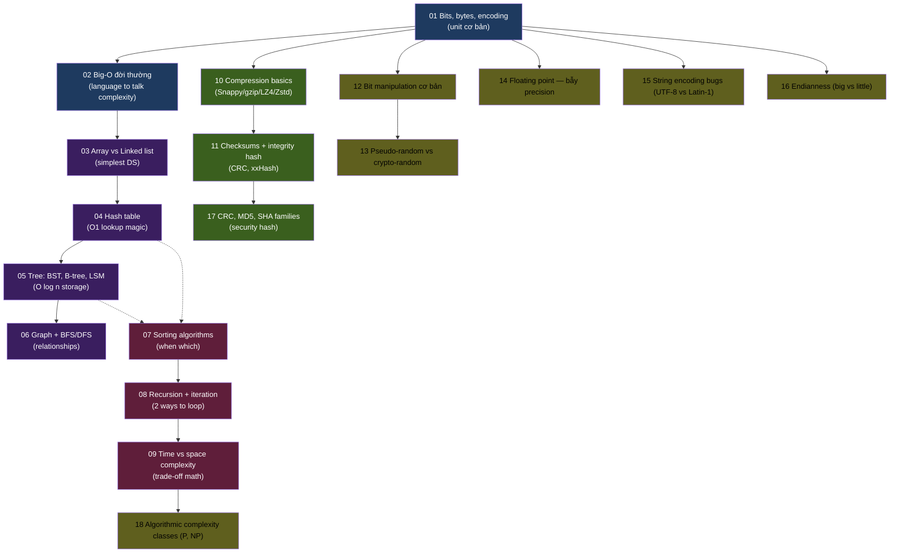

# F01 — CS Fundamentals

> **Vốn chung của mọi engineer.** Bytes / Big-O / data structures / algorithms / encoding / compression. Đây là **bộ từ điển** mọi tool (Postgres, Kafka, Iceberg, ClickHouse, Python) đều xài. Không có F01 = đọc bất kỳ doc nào cũng như đọc tiếng nước ngoài.

**Học kỳ:** Wave 1 — HK1 Engineering Core
**Số KUs:** 18
**Ưu tiên:** ⭐⭐⭐
**Prerequisites:** [F00 Mental Models](../F00-mental-models/)
**Đọc trong:** ~3.5 giờ tổng
**Words tổng:** ~54,000 (chuẩn v2 university-grade)

---

## 🎯 Sau khi học xong F01

- **Đọc EXPLAIN ANALYZE** của Postgres và hiểu vì sao query chậm (B-tree, hash join, sort).
- **Hiểu vì sao Kafka chọn append-only log** thay vì update-in-place (sequential write speed).
- **Đoán complexity** của bất kỳ algorithm/operation nào (O(1) lookup hash, O(log n) tree, O(n) scan).
- **Debug encoding bug** (UTF-8 vs Latin-1, "Mojibake" Tiếng Việt).
- **Pick compression đúng** (Snappy fast vs Zstd small vs LZ4 balanced).
- **Tránh floating point trap** trong tính tiền/giá ($0.1 + $0.2 ≠ $0.3 trong float).
- **Đọc đoạn code CS** ở textbook / paper mà không khựng.

---

## 🧭 Vì sao thứ tự này (dependency)

**Giải thích chuỗi:**

| Phase | KUs | Vì sao |
|---|---|---|
| **Base** (KU 01-02) | Bits/Big-O | Đơn vị + ngôn ngữ talk complexity. Không có 2 cái này = mọi cái sau như tiếng Lào. |
| **Data Structures** (KU 03-06) | Array → Hash → Tree → Graph | Từ đơn giản đến phức tạp. Mỗi DS giải 1 query pattern. |
| **Algorithms** (KU 07-09) | Sorting → Recursion → Complexity math | Dùng DS để giải vấn đề. Math complexity formalize trade-off. |
| **Encoding & Integrity** (KU 10-11, 17) | Compression → Checksums → Hash families | Bytes → giảm size → verify integrity. |
| **Advanced/Pitfalls** (KU 12-18) | Bit ops, random, float, encoding bugs, endian, complexity classes | Edge cases + traps mà junior thường mắc. |

---

## 📋 KU list (18 KUs)

| # | KU | Đọc | Prerequisites | Status |
|---:|---|---:|---|:---:|
| 01 | [Bits, bytes, encoding](./01-bits-bytes-encoding.md) | 12' | F00 | ✅ |
| 02 | [Big-O notation đời thường](./02-big-o-notation.md) | 12' | KU 01 | ✅ |
| 03 | [Array vs Linked list](./03-array-vs-linked-list.md) | 12' | KU 02 | ✅ |
| 04 | Hash table — nguyên lý + collision | 12' | KU 03 | ⏳ |
| 05 | Tree: BST, B-tree, B+tree, LSM | 14' | KU 04 | ⏳ |
| 06 | Graph + BFS/DFS | 12' | KU 03 | ⏳ |
| 07 | Sorting algorithms — khi nào dùng cái nào | 12' | KU 03, 04 | ⏳ |
| 08 | Recursion + iteration | 10' | KU 07 | ⏳ |
| 09 | Time vs space complexity | 10' | KU 02, 08 | ⏳ |
| 10 | Compression basics (Snappy, gzip, LZ4, Zstd) | 12' | KU 01 | ⏳ |
| 11 | Checksums + hash for integrity | 10' | KU 01, 10 | ⏳ |
| 12 | Bit manipulation cơ bản | 10' | KU 01 | ⏳ |
| 13 | Pseudo-random vs crypto-random | 10' | KU 12 | ⏳ |
| 14 | Floating point — bẫy precision | 12' | KU 01 | ⏳ |
| 15 | String encoding bugs (UTF-8 vs Latin-1) | 10' | KU 01 | ⏳ |
| 16 | Endianness (big vs little) | 8' | KU 01 | ⏳ |
| 17 | CRC, MD5, SHA hash families | 12' | KU 11 | ⏳ |
| 18 | Algorithmic complexity classes (P, NP) | 12' | KU 09 | ⏳ |

---

## 📚 Sách tham khảo từ library

- **CLRS — Introduction to Algorithms** (Cormen, Leiserson, Rivest, Stein) — bible cho algorithms. Phần 1-3 cover đủ cho F01.
- **Bhargava — Grokking Algorithms** (Manning, 2016) — illustrated version, dễ tiếp cận hơn CLRS.
- **CS Foundations chương 1-3** trong sách OS / Distributed.

---

## 🗺 Navigation

- ⬆️ [Semester 1](../README.md)
- 🏠 [Learning home](../../../README.md)
- 📐 [Full curriculum](../../../CURRICULUM.md)
