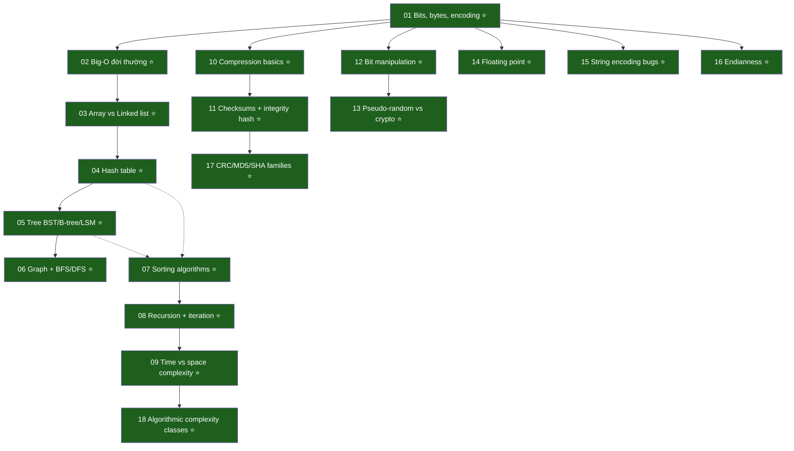

# F01 — CS Fundamentals

> **🎉 Module COMPLETE: 18/18 KUs at v2 university-grade.**
> **📈 Pilot upgrade v3 (2026-05-21): 3 KUs (02, 04, 18) đã thêm "Crux/History/Pseudocode/Cost table/Bad example/Recurrence" patterns.**
>
> **Vốn chung của mọi engineer.** Bytes / Big-O / data structures / algorithms / encoding / compression. Đây là **bộ từ điển** mọi tool (Postgres, Kafka, Iceberg, ClickHouse, Python) đều xài.

**Học kỳ:** Wave 1 — HK1 Engineering Core
**Số KUs:** 18/18 ✅ (3 đã v3, 15 còn v2)
**Ưu tiên:** ⭐⭐⭐
**Prerequisites:** [F00 Mental Models](../F00-mental-models/)
**Đọc trong:** ~3.5 giờ tổng (v2) — ~5 giờ khi full v3
**Words:** ~38,000 ở chuẩn v2 → ~55,000 khi full v3

> 📋 **v3 Style guide:** [F01_STYLE_v3.md](./F01_STYLE_v3.md) — pedagogy patterns học từ **Erickson UIUC + OSTEP Wisconsin + Sedgewick Princeton** trong [library/books/cs-fundamentals/](../../../../library/books/cs-fundamentals/).
>
> ⚖️ **Lưu ý phạm vi:** F01 là **DE-practical subset** của full undergraduate CS. Để full CS rigor, đọc thêm sách trong [library/books/cs-fundamentals/INDEX.md](../../../../library/books/cs-fundamentals/INDEX.md) (83 PDFs free từ Wisconsin, MIT, UIUC, Stanford, CMU, Princeton).

---

## 🎯 Sau khi học xong F01

- **Đọc EXPLAIN ANALYZE** của Postgres và hiểu vì sao query chậm (B-tree, hash join, sort).
- **Hiểu vì sao Kafka chọn append-only log** thay vì update-in-place (sequential write speed).
- **Đoán complexity** của bất kỳ algorithm/operation nào (O(1) lookup hash, O(log n) tree, O(n) scan).
- **Debug encoding bug** (UTF-8 vs Latin-1, "Mojibake" Tiếng Việt).
- **Pick compression đúng** (Snappy fast vs Zstd small vs LZ4 balanced).
- **Tránh floating point trap** trong tính tiền/giá ($0.1 + $0.2 ≠ $0.3 trong float).
- **Đọc đoạn code CS** ở textbook / paper mà không khựng.
- **Biết khi nào problem NP-hard** → dùng heuristic thay vì giải exact.

---

## 🧭 Dependency map

---

## 📋 KU list (18/18 ✅)

Legend: ✅ v2 (DE-practical) · ⭐ v3 (university-grade + Crux/History/Pseudocode/Cost table/Bad example/Recurrence)

| # | KU | Đọc | Level |
|---:|---|---:|:---:|
| 01 | [Bits, bytes, encoding](./01-bits-bytes-encoding.md) | 12' | ✅ |
| 02 | [Big-O notation đời thường](./02-big-o-notation.md) | 18' | ⭐ |
| 03 | [Array vs Linked list](./03-array-vs-linked-list.md) | 12' | ✅ |
| 04 | [Hash table — collision + Robin Hood](./04-hash-table.md) | 18' | ⭐ |
| 05 | [Tree: BST, B-tree, B+tree, LSM](./05-tree-bst-btree.md) | 14' | ✅ |
| 06 | [Graph + BFS/DFS](./06-graph-bfs-dfs.md) | 10' | ✅ |
| 07 | [Sorting algorithms](./07-sorting-algorithms.md) | 12' | ✅ |
| 08 | [Recursion + iteration](./08-recursion-iteration.md) | 10' | ✅ |
| 09 | [Time vs space complexity](./09-time-vs-space-complexity.md) | 10' | ✅ |
| 10 | [Compression (Snappy/gzip/LZ4/Zstd)](./10-compression-basics.md) | 12' | ✅ |
| 11 | [Checksums + integrity hash](./11-checksums-integrity.md) | 10' | ✅ |
| 12 | [Bit manipulation cơ bản](./12-bit-manipulation.md) | 10' | ✅ |
| 13 | [Pseudo-random vs crypto](./13-pseudo-random-vs-crypto.md) | 10' | ✅ |
| 14 | [Floating point — bẫy precision](./14-floating-point.md) | 12' | ✅ |
| 15 | [String encoding bugs (UTF-8 vs Latin-1)](./15-string-encoding-bugs.md) | 10' | ✅ |
| 16 | [Endianness (big vs little)](./16-endianness.md) | 8' | ✅ |
| 17 | [CRC, MD5, SHA hash families](./17-hash-families.md) | 12' | ✅ |
| 18 | [Algorithmic complexity classes (P, NP)](./18-complexity-classes.md) | 18' | ⭐ |

**Tổng F01:** 18 KUs · 3 ⭐ v3 + 15 ✅ v2 · ~4 giờ đọc · ~46,000 từ hiện tại.

**Roadmap full v3:** apply 6 v3 sections (Crux/History/Pseudocode/Cost table/Bad example/Recurrence) lên 15 KU còn lại theo `F01_STYLE_v3.md`. ETA: 2 phases (DS+algo trước, encoding+low-level sau).

---

## 📚 Sách tham khảo từ library

📚 **Tải sẵn miễn phí từ trường đại học lớn — xem [library/books/cs-fundamentals/INDEX.md](../../../../library/books/cs-fundamentals/INDEX.md):**

- **Erickson Algorithms (UIUC, CC BY 4.0)** → `Erickson_2019_Algorithms_UIUC.pdf` — full 470-trang textbook. Sách chính cho KU 02, 07, 08, 18.
- **Sedgewick Princeton slides** (18 PDFs) — visual lectures cho mọi data structure + algorithm. KU 03-07.
- **Open Data Structures (Morin, Carleton)** — Python + Java + C++. KU 03-06.
- **OSTEP (Wisconsin, 41 chapters)** — Operating Systems chuyên sâu, supplement cho KU 09 (locality of reference).
- **CSAPP samples (CMU)** — cho KU 01 bits, KU 14 floating point, KU 16 endianness.
- **Beej's Guides** — cho KU 16 endianness (network byte order).
- **Lehman MIT Math for CS** — cho KU 18 graph reductions + proofs.

📖 **Sách commercial (mua / library):**

- **CLRS — Introduction to Algorithms** — bible cho algorithms (Chapters 1-12, 18, 22-26).
- **Bhargava — Grokking Algorithms** (Manning 2016) — illustrated, dễ tiếp cận.
- **Stevens — TCP/IP Illustrated Vol 1** — for KU 16 endianness.
- **Goldberg — "What Every Computer Scientist Should Know About Floating-Point"** — for KU 14.
- **Joel Spolsky — "Unicode and Character Sets"** — for KU 15.

---

## 🗺 Navigation

- ⬆️ [Semester 1](../README.md)
- 🏠 [Learning home](../../../README.md)
- ➡️ Next: [F02 Programming Paradigms](../F02-programming-paradigms/)
