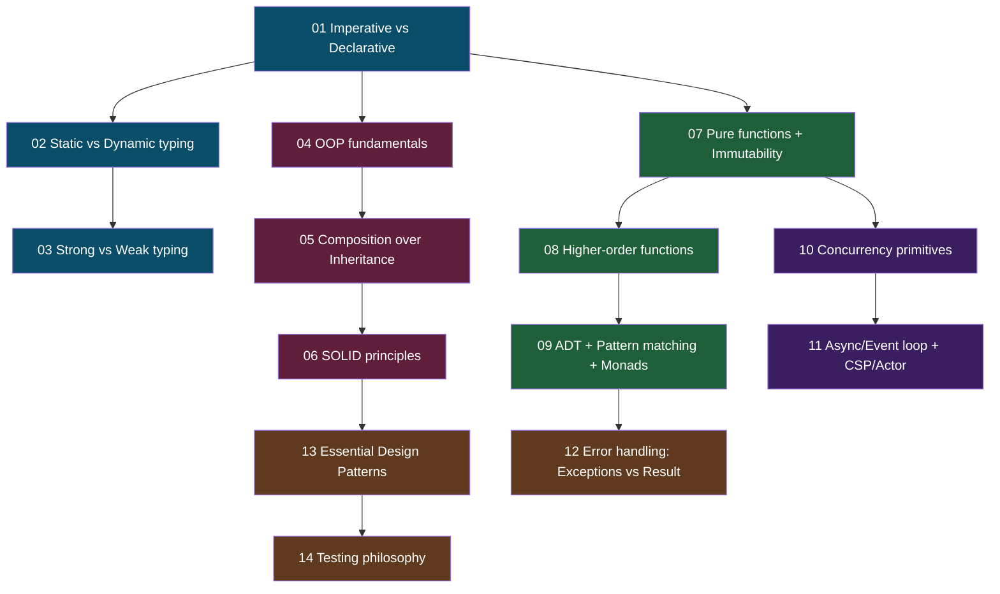

# F02 — Programming Paradigms

> **Cách *suy nghĩ* về code — không phải syntax.** Sau F01 bạn biết cách CS tools chạy. F02 dạy cách *suy nghĩ* và *thiết kế* code: OOP vs FP, immutability, concurrency, type systems, error handling, patterns. Đây là vốn cho mọi quyết định kiến trúc.

**Học kỳ:** Wave 1 — HK1 Engineering Core
**Số KUs:** 14 (tất cả v3 university-grade từ đầu)
**Ưu tiên:** ⭐⭐⭐
**Prerequisites:** [F00 Mental Models](../F00-mental-models/) · [F01 CS Fundamentals](../F01-cs-fundamentals/)
**Đọc trong:** ~5-6 giờ tổng
**Words target:** ~75,000

> 📚 **Apply METHODOLOGY §8b RESEARCH-FIRST.** Đã download 19 PDFs đa ngôn ngữ vào [library/books/programming-paradigms/](../../../../library/books/programming-paradigms/) trước khi viết.

> 🎓 **Pedagogy chuẩn từ:**
> - **PLAI** — Shriram Krishnamurthi (Brown University, CC BY-NC-SA)
> - **SICP** — Abelson & Sussman (MIT, CC BY-SA 4.0) — đã có trong cs-fundamentals
> - **Real World Haskell** — O'Sullivan, Stewart, Goerzen (CC BY-NC 3.0)
> - **CSP** — Tony Hoare (1985, free authorized PDF)
> - **Refactoring.Guru Design Patterns** — multilingual (8 ngôn ngữ EN/ZH/JA/KO/FR/ES/RU/PL/UK)

---

## 🎯 Sau khi học xong F02

- **Pick đúng paradigm** cho từng vấn đề (Imperative cho perf-critical inner loop, FP cho data pipeline, OOP cho UI domain model).
- **Đọc Spark code (Scala/Python) hiểu vì sao** DataFrame immutable + lazy evaluation.
- **Hiểu vì sao Kafka idempotency** = applied functional concept (pure function + idempotent operation).
- **Debug race condition** trong Flink keyed state — biết concurrency model nào dùng (CSP-style channel vs actor vs STM).
- **Đọc Iceberg / Delta Lake design** — vì sao append-only + ADT-style metadata.
- **Refactor code legacy** dùng essential GoF patterns + SOLID + Refactoring.Guru catalog.
- **Code review level senior** — biết nói "đây vi phạm SRP / OCP / DRY" với reasoning.
- **Quyết định ngôn ngữ project mới** — polyglot strategy (Rust cho hot path, Python cho glue, SQL cho analytics).

---

## 🧭 Dependency map

Dependency reasoning:
- **K01-03** = paradigm landscape, foundation cho phân loại
- **K04-06** = OOP từ basic → composition → SOLID (mỗi cái là refinement)
- **K07-09** = FP từ pure functions → HOF → ADT/monad (build up abstraction)
- **K10-11** = concurrency cần FP context (immutability avoid race)
- **K12-14** = wisdom — error handling, patterns, testing

---

## 📋 KU list (14 KUs)

Legend: ⭐ v3 university-grade (6 pedagogy patterns từ PLAI + SICP + Erickson + OSTEP + Sedgewick)

### Section A — Paradigm landscape (3 KUs)

| # | KU | Đọc | Status |
|---:|---|---:|:---:|
| 01 | [Imperative vs Declarative paradigm](./01-imperative-vs-declarative.md) | 14' | ⏳ |
| 02 | [Static vs Dynamic typing](./02-static-vs-dynamic-typing.md) | 14' | ⏳ |
| 03 | [Strong vs Weak typing](./03-strong-vs-weak-typing.md) | 12' | ⏳ |

### Section B — Object-Oriented Programming (3 KUs)

| # | KU | Đọc | Status |
|---:|---|---:|:---:|
| 04 | [OOP fundamentals](./04-oop-fundamentals.md) | 18' | ⏳ |
| 05 | [Composition over Inheritance](./05-composition-over-inheritance.md) | 14' | ⏳ |
| 06 | [SOLID principles](./06-solid-principles.md) | 18' | ⏳ |

### Section C — Functional Programming (3 KUs)

| # | KU | Đọc | Status |
|---:|---|---:|:---:|
| 07 | [Pure functions + Immutability](./07-pure-functions-immutability.md) | 16' | ⏳ |
| 08 | [Higher-order functions (map/reduce/filter)](./08-higher-order-functions.md) | 14' | ⏳ |
| 09 | [ADT + Pattern matching + Monads](./09-adt-pattern-matching-monads.md) | 20' | ⏳ |

### Section D — Concurrency models (2 KUs)

| # | KU | Đọc | Status |
|---:|---|---:|:---:|
| 10 | [Concurrency primitives (threads/locks/race)](./10-concurrency-primitives.md) | 18' | ⏳ |
| 11 | [Async/Event loop + CSP/Actor models](./11-async-event-loop-csp-actor.md) | 18' | ⏳ |

### Section E — Practical wisdom (3 KUs)

| # | KU | Đọc | Status |
|---:|---|---:|:---:|
| 12 | [Error handling: Exceptions vs Result/Either](./12-error-handling.md) | 14' | ⏳ |
| 13 | [Essential Design Patterns (GoF subset)](./13-design-patterns.md) | 20' | ⏳ |
| 14 | [Testing philosophy + Property-based testing](./14-testing-philosophy.md) | 14' | ⏳ |

**Tổng F02:** 14 KUs · ~5-6 giờ đọc · ~75,000 từ target.

---

## 📚 Sách tham khảo từ library

📚 **Trong [library/books/programming-paradigms/](../../../../library/books/programming-paradigms/):**

| File | Tác giả | Dùng cho KU |
|---|---|---|
| `Krishnamurthi_PLAI_Brown.pdf` ⭐ | Shriram Krishnamurthi (Brown, CS173) | K01-09 (toàn paradigm) |
| `Thompson_Haskell-Craft-3ed.pdf` | Simon Thompson | K07-09 (FP) |
| `Mena_Practical-Haskell-2ed.pdf` | Alejandro Mena | K07-09 (FP) |
| `Hoare_CSP-CACM-Original.pdf` | Tony Hoare (1978) | K10-11 (concurrency) |
| `Nystrom_Game-Programming-Patterns_sample.pdf` | Robert Nystrom | K13 (patterns) |
| `RefactoringGuru_Design-Patterns-Demo_*.pdf` (8 langs) | Alexander Shvets | K13 (multilingual!) |
| `Jeszenszky_Design-Patterns-UnideDebrecen.pdf` | Péter Jeszenszky | K13 |
| `Pragmatic_Functional-Sample-from-7Concurrency.pdf` | Paul Butcher | K10-11 |
| `UPenn_Programming-Paradigms-Lecture.pdf` | UPenn Lecture | K01 overview |
| `arXiv-2508_FP-vs-OOP-Architectural.pdf` | arXiv 2025 | K01 + K07 |
| `arXiv-cs-0603016_OO-Modeling-Programming-Paradigms.pdf` | arXiv | K01 |

📚 **Liên quan từ [cs-fundamentals/](../../../../library/books/cs-fundamentals/):**

| File | Dùng cho KU |
|---|---|
| `Abelson-Sussman_SICP_MIT.pdf` ⭐ | K07-09 (FP bible) |
| `Nystrom_CraftingInterpreters_sample.pdf` | K01 + K13 |

📖 **Sách commercial reference (mua / library):**
- **Clean Code (Martin)** — K06 SOLID + K14 testing
- **Pragmatic Programmer (Hunt-Thomas)** — K05 + K06
- **Design Patterns (GoF — Gamma et al.)** — K13
- **Effective Java (Bloch)** — K04 + K06
- **Refactoring (Fowler)** — K13

---

## 🗺 Navigation

- ⬆️ [Semester 1](../README.md)
- 🏠 [Learning home](../../../README.md)
- ⬅️ Previous: [F01 CS Fundamentals](../F01-cs-fundamentals/)
- ➡️ Next: [F03 Modern Python for Data](../F03-modern-python-for-data/)
