# 📘 Semester 1 — Engineering Core (Wave 1)

> 5 module xây nền tảng engineering. **Thứ tự được thiết kế theo dependency — không random.**

---

## 🧭 Vì sao thứ tự này?

```mermaid
flowchart LR
    classDef done fill:#1e5f1e,color:#fff
    classDef next fill:#5f5f1e,color:#000

    F00["F00 Mental Models<br/>(tư duy nền)"]:::done
    F01["F01 CS Fundamentals<br/>(bytes, Big-O, DS, algo)"]:::next
    F02["F02 Programming Paradigms<br/>(OOP/FP/async)"]:::next
    F03["F03 Modern Python<br/>(typing, polars, Arrow)"]:::next
    F04["F04 Type Systems<br/>(JSON Schema, Pydantic)"]:::next

    F00 -->|"tư duy → kỹ thuật"| F01
    F01 -->|"data structures → paradigm chọn đúng"| F02
    F02 -->|"paradigm → ngôn ngữ cụ thể"| F03
    F03 -->|"Python → validation layer"| F04
```

**Giải thích chuỗi:**

| → | Vì sao |
|---|---|
| **F00 → F01** | Mental models trước (trade-off, idempotency, eventual) là **góc nhìn** để hiểu kỹ thuật. Học CS fundamentals mà chưa có mental model thì học vẹt. |
| **F01 → F02** | Hiểu data structures + complexity trước → biết khi nào FP (immutable) thắng OOP (mutable), khi nào async > sync (I/O bound). Không hiểu DS thì không paradigm-chọn đúng. |
| **F02 → F03** | Paradigm khái niệm trước, ngôn ngữ cụ thể sau. Python là **implementation** của paradigm — học Python mà không hiểu OOP/FP thì viết code Python tệ. |
| **F03 → F04** | Type systems & validation = Python có rồi mới làm. Pydantic + JSON Schema = layer trên Python. |

---

## 📚 Modules theo thứ tự khuyến nghị

| # | Module | KUs | Prerequisites | Đọc | Status |
|---:|---|---:|---|---:|---|
| F00 | [Mental Models](./F00-mental-models/) | 12 | (none — start here) | ~2.5h | ✅ **DONE** |
| F01 | [CS Fundamentals](./F01-cs-fundamentals/) | 18 | F00 | ~3.5h | ⏳ pending |
| F02 | [Programming Paradigms](./F02-programming-paradigms/) | 14 | F01 | ~2.5h | ⏳ pending |
| F03 | [Modern Python for Data](./F03-modern-python-for-data/) | 12 | F02 | ~2.5h | ⏳ pending |
| F04 | [Type Systems & Validation](./F04-type-systems-validation/) | 8 | F03 | ~1.5h | ⏳ pending |

**Tổng HK1:** 5 modules · 64 KUs · ~12.5 giờ đọc · ~150,000 từ.

---

## 🎯 Sau khi xong HK1

- **Tư duy** kỹ sư senior — trade-off, failure, idempotency
- **CS fundamentals** đủ để debug + design tool nào
- **Paradigm awareness** — biết khi nào FP > OOP, async > sync
- **Python production-grade** — async, typing, polars, Arrow
- **Validate everywhere** — JSON Schema, Pydantic, Pandera

---

## 🛤 Cherry-pick paths (nếu đã có kinh nghiệm)

| Profile | Skip / Đọc |
|---|---|
| **Senior dev đã rành OOP/FP** | Skim F02; focus F00, F01, F03, F04 |
| **Python expert** | Skim F03; focus F00-F02, F04 |
| **Newcomer to engineering** | Đọc tất cả tuần tự, không skip |
| **Math/CS background** | Skim F01 sections data structures basic; focus encoding/compression/complexity classes |

---

## ➡️ Sau HK1

Đi sang [Semester 2 — Systems & Theory](../semester-2-systems-theory/): từ programming-level lên system-level (OS, network, databases, distributed theory).
