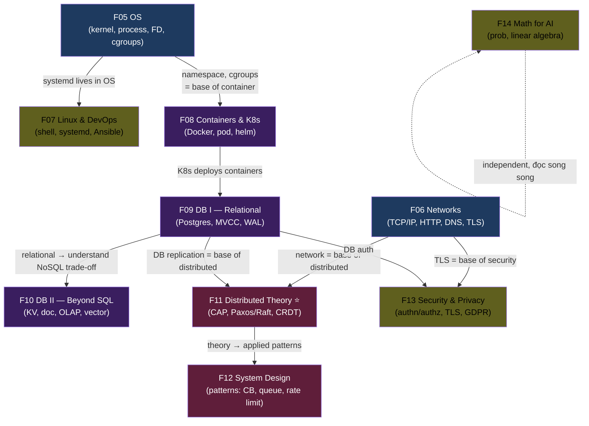

# 📘 Semester 2 — Systems & Theory (Wave 2)

> 10 module. **Thứ tự được thiết kế theo dependency** — đi từ bare metal (OS) lên đến distributed theory + system design. Mỗi module xây dựa trên module trước.

---

## 🧭 Vì sao thứ tự này?

---

## 🧱 Giải thích chuỗi dependencies

### Group 1 — Bare metal foundation (F05 → F06)
- **F05 OS** đầu tiên: kernel space vs user space, FD, cgroups, namespaces — đây là **đất nền** của mọi tool data (container, DB, network service đều dùng OS primitives).
- **F06 Networks** song song hoặc sau F05: TCP/IP needs OS sockets. HTTP/2/3, TLS, DNS, BGP — kỹ năng đọc/debug network bắt buộc.

### Group 2 — DevOps + Containers (F07 → F08)
- **F07 Linux & DevOps** dùng F05 OS: shell, systemd, cron, Ansible.
- **F08 Containers & K8s** dùng F05 (cgroups + namespaces) + F06 (container networking). Học F08 mà không hiểu F05 = học vẹt.

### Group 3 — Databases (F09 → F10)
- **F09 Relational DBs** đầu tiên: Postgres, MVCC, WAL, replication — đây là **mental model** cho mọi DB.
- **F10 Beyond SQL** sau F09: hiểu relational rồi mới hiểu **vì sao** NoSQL trade-off (key-value, doc, OLAP, time-series, vector). Học NoSQL trước = lạc đường.

### Group 4 — Distributed Theory & Design (F11 → F12)
- **F11 Distributed Theory ⭐** module cốt yếu nhất. Cần F06 (network unreliable), F09 (DB replication), F05 (process pauses, clock skew). Học CAP/Paxos/Raft mà không hiểu unreliable network = không hiểu.
- **F12 System Design** dùng F11: CB pattern, bulkhead, rate limit, queue — đều là **applied** distributed theory.

### Group 5 — Cross-cutting (F13, F14)
- **F13 Security** đọc song song — touch F06 (TLS), F09 (DB auth), F08 (K8s secrets).
- **F14 Math** độc lập — đọc khi cần cho F14 + sau (cho ML modules ở HK4).

---

## 📚 Modules theo thứ tự khuyến nghị

| # | Module | KUs | Prerequisites | Ưu tiên |
|---:|---|---:|---|---|
| F05 | [Operating Systems](./F05-operating-systems/) | 18 | F00, F01-F02 | ⭐⭐⭐ |
| F06 | [Computer Networks](./F06-computer-networks/) | 20 | F01-F02 | ⭐⭐⭐ |
| F07 | [Linux & DevOps](./F07-linux-devops/) | 16 | F05 | ⭐⭐ |
| F08 | [Containers & K8s Basics](./F08-containers-k8s-basics/) | 14 | F05, F06 | ⭐⭐⭐ |
| F09 | [Databases I — Relational](./F09-databases-relational/) | 18 | F05 (storage), F06 (network) | ⭐⭐⭐ |
| F10 | [Databases II — Beyond SQL](./F10-databases-beyond-sql/) | 16 | F09 | ⭐⭐⭐ |
| F11 | [Distributed Systems Theory ⭐](./F11-distributed-systems-theory/) | 22 | F05, F06, F09 | ⭐⭐⭐⭐ |
| F12 | [System Design Fundamentals](./F12-system-design-fundamentals/) | 20 | F11 | ⭐⭐⭐ |
| F13 | [Security & Privacy](./F13-security-privacy/) | 16 | F06, F09 | ⭐⭐ |
| F14 | [Math for Data + AI](./F14-math-for-data-ai/) | 14 | F01 (Big-O) | ⭐⭐ |

**Tổng HK2:** 10 modules · 174 KUs · ~31 giờ đọc · ~440,000 từ.

---

## ⭐ Module quan trọng nhất HK2

**F11 Distributed Systems Theory** (22 KUs) là **foundation cho toàn bộ Year 2** — mọi data tool (Kafka, Flink, Iceberg, Postgres replication) đều distributed. Không vững F11 = mọi module HK3+ học vẹt.

→ Đầu tư F11 **không hối hận**. Đọc kỹ + làm self-test 3 mức.

---

## 🛤 Cherry-pick paths (nếu đã có kinh nghiệm)

| Profile | Skip / Đọc |
|---|---|
| **Senior backend dev** | Skim F05-F08; focus F09-F12 + F13 |
| **DBA / DBE chuyển sang DE** | Skim F09-F10; focus F11, F12, F05, F06 |
| **DevOps engineer chuyển sang DE** | Skim F05, F07, F08; focus F09-F12 |
| **Newcomer to distributed** | Đọc tất cả tuần tự — không skip F11 |

---

## ➡️ Sau HK2

Đi sang [Semester 3 — Data Engineering Deep](../../year-2-specialization/semester-3-data-engineering-deep/): từ theory lên **applied data engineering** (modeling, streaming, lakehouse, batch, serving).
