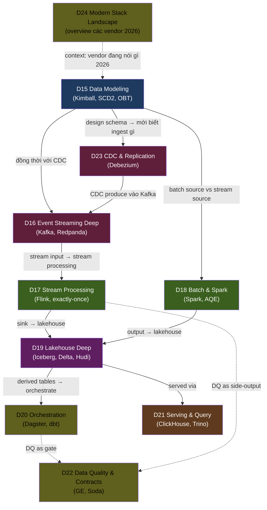

# 📕 Semester 3 — Data Engineering Deep (Wave 3)

> 10 module xương sống của Data Engineering 2026. **Thứ tự theo data flow tự nhiên** — từ modeling (design) → ingestion (CDC + streaming) → processing (stream + batch) → storage (lakehouse) → orchestration → serving + quality.

---

## 🧭 Vì sao thứ tự này? — theo **data flow tự nhiên**

---

## 🧱 Giải thích chuỗi dependencies

### Group 1 — Context (D24 đọc trước hoặc đan xen)
- **D24 Modern Data Stack 2026** đầu tiên (overview) hoặc đan xen: hiểu vendor landscape (Snowflake, Databricks, BigQuery, Fabric) trước khi đào sâu open source. Đây là **landscape map** giúp đặt context.

### Group 2 — Design first (D15)
- **D15 Data Modeling** quan trọng nhất sau D24: nếu schema thiết kế dở, mọi pipeline downstream phải gánh tech debt. Kimball, SCD2, OBT — học trước khi build.

### Group 3 — Ingestion (D23 → D16)
- **D23 CDC** trước hoặc song song D16: hiểu **cách dữ liệu vào system** (log-based CDC vs trigger vs batch).
- **D16 Event Streaming Deep**: nếu CDC → produces vào Kafka, học Kafka deep trước khi xử lý stream.

### Group 4 — Processing (D17 + D18)
- **D17 Stream Processing** (Flink) dùng D16 Kafka input.
- **D18 Batch & Spark** song song — nếu workload có cả batch + stream, học cả 2.

### Group 5 — Storage (D19)
- **D19 Lakehouse Deep** sau D17/D18: cả stream + batch sink vào lakehouse. Cần hiểu Iceberg/Delta/Hudi trade-off.

### Group 6 — Orchestration + Serving (D20 + D21)
- **D20 Orchestration** dùng D19 lakehouse + D17/D18 jobs. Dagster asset-based map vào lakehouse natural.
- **D21 Serving & Query Engines** parallel: ClickHouse, Trino đọc từ lakehouse / stream.

### Group 7 — Cross-cutting (D22)
- **D22 Data Quality & Contracts** xuyên suốt — không phải module cuối, đọc song song D17-D21.

---

## 📚 Modules theo thứ tự khuyến nghị

| # | Module | KUs | Prerequisites | Ưu tiên |
|---:|---|---:|---|---|
| D24 | [Modern Data Stack 2026](./D24-modern-data-stack-2026/) | 14 | (none, đọc làm landscape) | ⭐⭐ |
| D15 | [Data Modeling](./D15-data-modeling/) | 16 | F09, F10 | ⭐⭐⭐ |
| D23 | [CDC & Replication](./D23-cdc-replication/) | 10 | F09, D16 | ⭐⭐ |
| D16 | [Event Streaming Deep](./D16-event-streaming-deep/) | 22 | F11 | ⭐⭐⭐ |
| D17 | [Stream Processing Deep](./D17-stream-processing-deep/) | 22 | D16, F04, F11 | ⭐⭐⭐ |
| D18 | [Batch Processing & Spark](./D18-batch-processing-spark/) | 18 | F09, F11 | ⭐⭐⭐ |
| D19 | [Lakehouse Deep](./D19-lakehouse-deep/) | 20 | D15, D17, D18, F10 (Parquet) | ⭐⭐⭐ |
| D20 | [Orchestration Deep](./D20-orchestration-deep/) | 16 | D19, F03 | ⭐⭐⭐ |
| D21 | [Serving & Query Engines](./D21-serving-query-engines/) | 18 | D19, F10 | ⭐⭐⭐ |
| D22 | [Data Quality & Contracts](./D22-data-quality-contracts/) | 12 | D17, D19, D20 | ⭐⭐ |

**Tổng HK3:** 10 modules · 168 KUs · ~30 giờ đọc · ~450,000 từ.

---

## 🛤 Cherry-pick paths

| Profile | Path |
|---|---|
| **DE switch từ traditional ETL** | D24 → D15 → D23 → D18 → D19 → D20 → D21 (skim D16, D17) |
| **Streaming-focused** | D16 → D17 → D19 → D22 → D21 (skim D18) |
| **Analytics Engineer (dbt-focused)** | D24 → D15 → D20 → D19 → D21 → D22 |
| **Full deep** | Đọc tất cả theo thứ tự trên |

---

## ➡️ Sau HK3

Đi sang [Semester 4 — AI + Operations + Architecture](../semester-4-ai-ops-architecture/): từ DE core lên **AI/ML stack + production operations + architect-level skills**.
