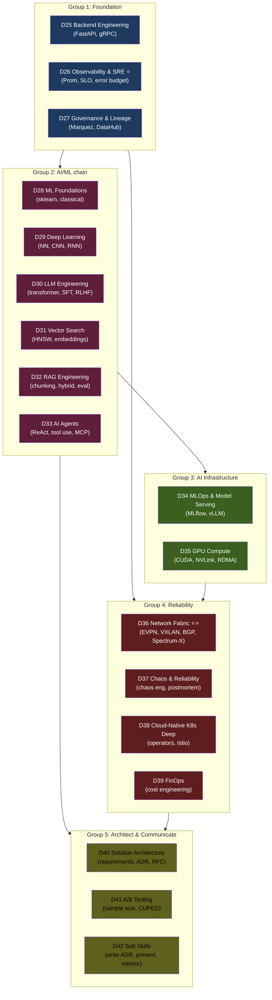

# 📕 Semester 4 — AI + Operations + Architecture (Wave 4)

> 18 module **chuyên sâu nhất**. **Thứ tự theo dependency** chia thành 5 groups: Foundation → AI/ML chain → AI Infrastructure → Reliability → Architecture & Communication.

---

## 🧭 Vì sao thứ tự này?

---

## 🧱 Giải thích 5 groups + dependencies

### Group 1 — Foundation (D25 → D26 → D27)
Đọc trước AI vì:
- **D25 Backend Engineering** extends F12 system design — bạn cần đọc trước khi serve AI models. FastAPI/gRPC patterns dùng cho mọi serving (ML + LLM + data API).
- **D26 Observability & SRE ⭐** cross-cutting — mọi production system cần monitoring. Đọc trước MLOps (D34) + Chaos (D37).
- **D27 Governance & Lineage** tiếp tục D15 data modeling + D19 lakehouse — dataset đã có rồi cần govern.

### Group 2 — AI/ML chain (D28 → D29 → D30 → D31 → D32 → D33)
**Strict ordering** vì depend chain rõ ràng:
- **D28 ML Foundations** classical (sklearn) → cần trước khi DL.
- **D29 Deep Learning** dùng D28 concepts (overfitting, optimizer, loss).
- **D30 LLM Engineering** dùng D29 (transformer = special NN).
- **D31 Vector Search** dùng D30 (embedding = output của LLM).
- **D32 RAG** combines D30 + D31.
- **D33 Agents** dùng D30 (tool calling) + D32 (retrieval).

**Không thể skip** trong chain này. Học LLM mà không hiểu DL = học vẹt.

### Group 3 — AI Infrastructure (D34, D35)
- **D34 MLOps & Model Serving** sau D28-D30: cần biết train + deploy models trước khi học pipeline lifecycle.
- **D35 GPU Compute** sau D29 deep learning: GPU = base của DL training. Cần D30 (LLM) để hiểu vì sao distributed training matters.

### Group 4 — Reliability (D36 → D37 → D38 → D39)
- **D36 Network Fabric ⭐⭐** **differentiator** của project DSX Air — extends F06 networks deep. Đọc sau Foundation group, trước chaos.
- **D37 Chaos & Reliability** extends D26 (observability) + F11 (distributed failures). Cần D36 để chaos test network-level.
- **D38 K8s Deep** extends F08 (basics) — operators, Istio, GitOps. Có thể đọc sớm hơn nếu cần.
- **D39 FinOps** cross-cutting — đọc lúc nào cũng được, nhưng best sau khi đã có cost data.

### Group 5 — Architect & Communicate (D40, D41, D42)
**Capstone-prep group** — đọc cuối:
- **D40 Solution Architecture** dùng mọi previous module (architect = synthesizer).
- **D41 A/B Testing** dùng F14 (math) + D28 (ML).
- **D42 Soft Skills** cross-cutting — ADR writing, presenting, mentoring.

---

## 📚 Modules theo thứ tự khuyến nghị

| Group | # | Module | KUs | Prerequisites | Ưu tiên |
|---|---:|---|---:|---|---|
| **G1** | D25 | [Backend Engineering](./D25-backend-engineering/) | 16 | F12 | ⭐⭐ |
| G1 | D26 | [Observability & SRE ⭐](./D26-observability-sre/) | 20 | F12, F11 | ⭐⭐⭐ |
| G1 | D27 | [Governance & Lineage](./D27-governance-lineage/) | 12 | D15, D19 | ⭐⭐ |
| **G2** | D28 | [ML Foundations](./D28-ml-engineering-foundations/) | 18 | F01, F14 | ⭐⭐⭐ |
| G2 | D29 | [Deep Learning](./D29-deep-learning-basics/) | 14 | D28, F14 | ⭐⭐ |
| G2 | D30 | [LLM Engineering ⭐](./D30-llm-engineering/) | 18 | D29 | ⭐⭐⭐ |
| G2 | D31 | [Vector Search](./D31-vector-search-embeddings/) | 16 | D30, F10 | ⭐⭐⭐ |
| G2 | D32 | [RAG Engineering](./D32-rag-engineering-deep/) | 14 | D30, D31 | ⭐⭐⭐ |
| G2 | D33 | [AI Agents](./D33-ai-agents-tool-use/) | 12 | D30, D32 | ⭐⭐ |
| **G3** | D34 | [MLOps & Model Serving](./D34-mlops-model-serving/) | 16 | D28-D30, D26 | ⭐⭐ |
| G3 | D35 | [GPU Compute](./D35-gpu-compute-ai-infra/) | 14 | D29, D30 | ⭐⭐ |
| **G4** | D36 | [Network Fabric ⭐⭐](./D36-network-fabric/) | 16 | F06 | ⭐⭐⭐⭐ |
| G4 | D37 | [Chaos & Reliability](./D37-chaos-reliability/) | 14 | D26, F11 | ⭐⭐ |
| G4 | D38 | [Cloud-Native K8s Deep](./D38-cloud-native-k8s-deep/) | 16 | F08 | ⭐⭐ |
| G4 | D39 | [FinOps](./D39-finops-cost-engineering/) | 8 | (cross-cutting) | ⭐ |
| **G5** | D40 | [Solution Architecture](./D40-solution-architecture/) | 10 | All previous | ⭐⭐ |
| G5 | D41 | [A/B Testing](./D41-experimentation-ab-testing/) | 10 | F14, D28 | ⭐ |
| G5 | D42 | [Soft Skills](./D42-soft-skills-communication/) | 12 | (cross-cutting) | ⭐⭐ |

**Tổng HK4:** 18 modules · 256 KUs · ~45 giờ đọc · ~680,000 từ.

---

## ⭐⭐⭐⭐ Module quan trọng nhất HK4

**D36 Network Fabric ⭐⭐⭐⭐** = **differentiator** của project DSX Air. Không có module này, repo mất unique angle. Đây là phần khai thác sweet spot của NVIDIA DSX Air (EVPN/VXLAN simulated fabric).

**D30 LLM Engineering ⭐** = core cho mọi AI engineer 2026.

**D26 Observability & SRE ⭐** = cross-cutting foundation cho mọi production system.

---

## 🛤 Cherry-pick paths

| Profile | Path |
|---|---|
| **AI/LLM-focused** | D28 → D29 → D30 → D31 → D32 → D33 → D34 → D35 |
| **DE → Solution Architect** | D27 → D40 → D26 → D36 → D37 → D42 |
| **DE → AI Platform** | D26 → D28 → D30 → D31 → D32 → D33 → D34 |
| **Operations focus** | D26 → D38 → D36 → D37 → D39 |
| **Full curriculum** | Đọc theo group order: G1 → G2 → G3 → G4 → G5 |

---

## ➡️ Sau HK4

Đi sang [Capstone](../../capstone/): 10 lab projects end-to-end consolidate everything. **Đây là portfolio cuối.**
