# Library Manifest

> Catalogue chính thức tất cả sách + paper trong thư viện. Mỗi entry map tới module(s) trong [CURRICULUM.md](../learning/CURRICULUM.md).

**Tổng:** 58 sách + 5 paper + 5 Microsoft courses · ~3 GB · 13 categories + courses
**Cập nhật:** 2026-05-20

---

## 📊 Tổng quan theo category

| Category | Files | Map vào module |
|---|---:|---|
| [data-engineering](#-data-engineering-17-books) | 17 | F09 · D15 · D16 · D17 · D18 · D19 · D20 · D22 |
| [microsoft-fabric](#-microsoft-fabric-21-files) | 21 | D24 Modern Data Stack · D19 Lakehouse |
| [distributed-systems](#-distributed-systems-2-books) | 2 | F11 Distributed Theory · F12 System Design |
| [ai-ml](#-ai--ml-5-books) | 5 | D28 · D29 · D30 · D32 |
| [data-modeling](#-data-modeling-4-books) | 4 | D15 Data Modeling · D19 Lakehouse |
| [sre-observability](#-sre--observability-2-books) | 2 | D26 Observability & SRE · D37 Chaos |
| [cloud-azure](#-cloud--azure-1-book) | 1 | D24 · D40 Solution Architecture |
| [blockchain](#-blockchain-1-book) | 1 | (out of scope) |
| [web-scraping](#-web-scraping-1-book) | 1 | F03 Modern Python |
| [papers](#-research-papers-5) | 5 | D28-D33 LLM/RAG/Agents |

Categories còn trống (cần bổ sung sau): `networking`, `streaming`, `system-design`.

---

## 📘 Data Engineering (17 books)

| File | Tác giả / Source | Năm | Map vào |
|---|---|---:|---|
| `Reis-Housley_2022_Fundamentals-of-Data-Engineering.pdf` ⭐ | Joe Reis, Matt Housley (O'Reilly) | 2022 | F00 · D15-D22 (xương sống DE) |
| `Reis-Housley_2022_Fundamentals-of-Data-Engineering_v2.pdf` | Reis-Housley alt edition | 2022 | (dup chính, để verify khác biệt) |
| `Reis-Housley_2022_Fundamentals-of-Data-Engineering_Concepts-Summary.pdf` | Reis-Housley concepts companion | 2022 | (compendium) |
| `Konieczny_2025_Data-Engineering-Design-Patterns.pdf` | Bartosz Konieczny | 2025 | D15 · D17 · D19 · F12 |
| `Nwokwu_2025_Data-Engineering-for-Beginners.pdf` | Frank Nwokwu | 2025 | F00 (intro) |
| `Bonifield_2025_Data-Engineering-for-Cybersecurity.pdf` | Bonifield | 2025 | D27 · F13 (security angle) |
| `Kretz_2020_Data-Engineering-Cookbook.pdf` | Andreas Kretz | 2020 | F00 · D24 |
| `Databricks_Big-Book-of-Data-Engineering.pdf` | Databricks (vendor whitepaper) | 2024 | D18 Spark · D19 Lakehouse |
| `Databricks_Data-Engineering-with-Databricks.pdf` | Databricks | 2024 | D18 · D24 |
| `MSFT_Data-Pipeline-Reference.pdf` | Microsoft (reference doc) | 2024 | D24 Modern Stack |
| `Marz-Warren_2015_Big-Data-Principles.pdf` ⭐ | Nathan Marz, James Warren | 2015 | F11 · D17 (Lambda arch gốc) |
| `Chambers-Zaharia_2018_Spark-The-Definitive-Guide.pdf` ⭐ | Bill Chambers, Matei Zaharia | 2018 | D18 Spark deep |
| `Crickard_2020_Data-Engineering-with-Python.pdf` | Paul Crickard | 2020 | F03 · D20 |
| `Densmore_2021_Data-Pipelines-Pocket-Reference.pdf` | James Densmore | 2021 | D20 Orchestration |
| `OReilly_2021_97-Things-Every-Data-Engineer-Should-Know.pdf` | Multi-author (O'Reilly) | 2021 | F00 · D42 Soft Skills |
| `VanWyk_2020_Python-Data-Cleaning-Cookbook.epub` | Michael Walker (alias VanWyk?) | 2020 | F03 · D22 Data Quality |
| `Malaska_2018_Rebuilding-Reliable-Data-Pipelines.pdf` | Ted Malaska | 2018 | D20 · D37 Chaos |
| `Delta-Lake-Definitive-Guide_Databricks-Compliments.pdf` ⭐ | Denny Lee, Tristen Wentling et al. (O'Reilly / Databricks compliments) | 2024 | D18 Spark · D19 Lakehouse — Delta specifics |

**Nguồn Delta Lake:** [delta.io/pdfs/dldg_databricks.pdf](https://delta.io/pdfs/dldg_databricks.pdf) — official Apache Delta project domain, free.

⭐ = sách "phải đọc" cho module tương ứng.

---

## 📗 Microsoft Fabric (21 files)

> Microsoft Fabric là platform 2024-2026 — quan trọng nếu làm Fabric. Cover toàn bộ D24 Modern Data Stack.

| File | Loại | Map vào |
|---|---|---|
| `Arshad-Ali_2024_Learn-Microsoft-Fabric.pdf` | Sách (Arshad Ali) | D24 intro Fabric |
| `Ghosh_2024_Mastering-Microsoft-Fabric.pdf` | Sách (Ghosh) | D24 deep Fabric |
| `Venkatesan_2025_Architecting-PowerBI-in-Fabric.epub` | Sách (Venkatesan) | D24 (Power BI side) |
| `MSFT_Fabric_Fundamentals.pdf` | MSFT official | D24 starter |
| `MSFT_Fabric_Essential-Guide-for-Decision-Makers.pdf` | MSFT official | D24 |
| `MSFT_Fabric_OneLake-Guide.pdf` | MSFT official | D19 Lakehouse + D24 |
| `MSFT_Fabric_CICD-Guide.pdf` | MSFT official | D20 DataOps |
| `MSFT_Fabric_Data-Engineering_FULL.pdf` ⭐ | MSFT official (full) | D24 (compendium) |
| `MSFT_Fabric_Data-Engineering_part-1.pdf` → `part-8.pdf` | MSFT official (8 part split) | D24 (cherry-pick chapter) |
| `MSFT_Fabric_Data-Science-Reference.pdf` | MSFT reference | D24 + ML |
| `MSFT_Fabric_Data-Warehouse-Reference.pdf` | MSFT reference | F09 · D15 · D24 |
| `MSFT_Fabric_Database-Reference.pdf` | MSFT reference | F09 · D24 |
| `MSFT_Fabric_Real-Time-Intelligence-Reference.pdf` | MSFT reference | D17 · D24 |
| `Dataweekender_Fabric-Data-Architectures.pdf` | Community whitepaper | D24 architecture patterns |

---

## 📙 Distributed Systems (2 books)

| File | Tác giả | Năm | Map vào |
|---|---|---:|---|
| `Kleppmann_2017_Designing-Data-Intensive-Applications.pdf` ⭐⭐⭐ | Martin Kleppmann (O'Reilly) | 2017 | F11 Distributed Theory (bible) |
| `Burns_2018_Designing-Distributed-Systems-Patterns.pdf` | Brendan Burns (Microsoft) | 2018 | F11 · F12 System Design Patterns |

⭐⭐⭐ DDIA là **bài đọc bắt buộc** cho mọi senior data engineer — coi như "Kinh Thánh" của ngành.

---

## 🤖 AI / ML (7 books)

| File | Tác giả / Source | Năm | Map vào |
|---|---|---:|---|
| `Brunton-Kutz_2019_Data-Driven-Science-and-Engineering.zip` | Brunton, Kutz | 2019 | F14 Math · D28 ML Foundations |
| `ConfidentAI_Guide-to-GenAI-Evaluation.pdf` | Confident AI (vendor whitepaper) | 2024 | D30 LLM · D32 RAG eval |
| `ConfidentAI_LLM-Evaluation-Metrics_Ultimate-Guide.pdf` | Confident AI | 2024 | D30 · D32 |
| `ConfidentAI_LLM-Evaluators_Tutorial-BestPractices.pdf` | Confident AI | 2024 | D30 · D32 · D33 Agents |
| `MGF-for-Agentic-AI.pdf` | (need to verify author) | 2024 | D33 AI Agents |
| `OpenAI_2025_Practical-Guide-to-Building-Agents.pdf` ⭐ | OpenAI (official guide) | 2025 | D33 AI Agents — primary |
| `Anthropic_2025_Building-Effective-AI-Agents.pdf` ⭐ | Anthropic (official guide) | 2025 | D33 AI Agents — primary |

**Nguồn:**
- OpenAI guide: [cdn.openai.com](https://cdn.openai.com/business-guides-and-resources/a-practical-guide-to-building-agents.pdf) — official, free
- Anthropic guide: [resources.anthropic.com](https://resources.anthropic.com/hubfs/Building%20Effective%20AI%20Agents-%20Architecture%20Patterns%20and%20Implementation%20Frameworks.pdf) — official, free

---

## 🏛 Data Modeling (4 books)

| File | Tác giả | Năm | Map vào |
|---|---|---:|---|
| `Kimball-Ross_2013_The-Data-Warehouse-Toolkit.pdf` ⭐⭐⭐ | Ralph Kimball, Margy Ross | 2013 | D15 Data Modeling (bible dimensional) |
| `Data-Modeling-Exercises.pdf` | (Power BI training) | — | D15 |
| `Data-Modeling-for-PowerBI_color.pdf` | (Power BI training, color slides) | — | D15 |
| `Data-Modeling-for-PowerBI_grey.pdf` | (Power BI training, grey slides) | — | D15 |

⭐⭐⭐ Kimball là bài đọc bắt buộc cho data modeling.

---

## 🔧 SRE & Observability (2 books)

| File | Tác giả | Năm | Map vào | Nguồn |
|---|---|---:|---|---|
| `Google_2016_Site-Reliability-Engineering.pdf` ⭐⭐⭐ | Google SRE team (Betsy Beyer et al.) | 2016 | D26 SRE · D37 Chaos | [captn3m0 SRE ebook generator](https://github.com/captn3m0/google-sre-ebook) — converts free sre.google HTML |
| `Google_2018_The-Site-Reliability-Workbook.pdf` ⭐ | Google SRE team | 2018 | D26 · D37 | same source |

Google publishes these books for **free reading** at [sre.google/books/](https://sre.google/books/). The PDFs here come from a community converter (captn3m0).

---

## ☁️ Cloud / Azure (1 book)

| File | Tác giả | Năm | Map vào |
|---|---|---:|---|
| `Mertens_2023_Azure-Data-AI-Architect-Handbook.pdf` | Olivier Mertens, Breght Van Baelen (Packt) | 2023 | D24 · D40 Solution Architecture |

---

## 🔗 Blockchain (1 book)

| File | Tác giả | Năm | Map vào |
|---|---|---:|---|
| `MattZand_2021_Hands-On-Hyperledger-Fabric-V2.pdf` | Matt Zand | 2021 | (ngoài scope chính — reference) |

---

## 🕷 Web Scraping (1 book)

| File | Loại | Map vào |
|---|---|---|
| `Newbies-Data-Scraping-Quick-Guide.pdf` | Quick guide | F03 Modern Python (data acquisition) |

---

## 📄 Research Papers (5)

| File | Source | Map vào |
|---|---|---|
| `arXiv-2009.01325v3_Learning-to-Summarize-from-Human-Feedback.pdf` | OpenAI (Stiennon et al., 2020) | D30 LLM — RLHF gốc |
| `arXiv-2506.13023v2_Practical-Guide-Evaluating-LLMs.pdf` | arXiv 2025 | D30 · D32 LLM eval |
| `arXiv-2507.21504v1_LLM-Agents-Evaluation-Survey.pdf` | arXiv 2025 | D33 AI Agents |
| `arXiv-2601.04171v1_Agentic-Rubrics-for-SWE-Agents.pdf` | arXiv 2026 | D33 |
| `IJCET-2025_Metadata-Driven-ETL-Frameworks.pdf` | IJCET journal 2025 | D20 Orchestration |

---

## 🗺 Coverage map theo curriculum

```mermaid
flowchart LR
    classDef good fill:#1e5f1e,color:#fff
    classDef partial fill:#5f5f1e,color:#000
    classDef weak fill:#5f1e1e,color:#fff

    F00["F00 Mental Models<br/>3 books"]:::good
    F01["F01 CS Fund<br/>0 books"]:::weak
    F02["F02 Programming<br/>0 books"]:::weak
    F03["F03 Modern Python<br/>3 books"]:::partial
    F11["F11 Distributed<br/>2 books ⭐"]:::good
    F12["F12 System Design<br/>1 book"]:::partial
    F14["F14 Math AI<br/>1 book"]:::partial
    D15["D15 Data Modeling<br/>4 books ⭐"]:::good
    D17["D17 Stream Proc<br/>2 books"]:::partial
    D18["D18 Spark<br/>2 books ⭐"]:::good
    D19["D19 Lakehouse<br/>~5 books"]:::good
    D20["D20 Orchestration<br/>3 books"]:::good
    D22["D22 Data Quality<br/>1 book"]:::partial
    D24["D24 Modern Stack<br/>21 books (Fabric heavy)"]:::good
    D26["D26 SRE Obs<br/>2 books ⭐"]:::good
    D28["D28 ML Foundations<br/>1 book"]:::partial
    D30["D30 LLM Eng<br/>3 books + papers"]:::partial
    D32["D32 RAG<br/>3 books + papers"]:::partial
    D33["D33 Agents<br/>1 book + papers"]:::partial
    D37["D37 Chaos<br/>1 book + 1 SRE"]:::good
    D40["D40 Solution Arch<br/>1 book"]:::partial
```



🟢 = đủ tốt (≥ 2 sách hoặc 1 sách bible)
🟡 = partial (chỉ 1 sách, hoặc whitepaper)
🔴 = thiếu

---

## ⚠️ Gap analysis — module thiếu sách

Cần bổ sung sau (sách hay nhất cho mỗi gap):

| Module | Sách nên có | Nguồn lấy |
|---|---|---|
| F01 CS Fundamentals | "Crash Course in Computation" (Bhargava) hoặc CLRS | mua / library |
| F02 Programming Paradigms | "Clean Code" (Martin) · "Design Patterns" (GoF) | mua / library |
| F05 Operating Systems | "Operating Systems: Three Easy Pieces" (Arpaci-Dusseau) | [pages.cs.wisc.edu/~remzi/OSTEP/](https://pages.cs.wisc.edu/~remzi/OSTEP/) FREE |
| F06 Computer Networks | "Computer Networking: A Top-Down Approach" (Kurose) hoặc "TCP/IP Illustrated" (Stevens) | mua |
| F07 Linux & DevOps | "The Linux Command Line" (Shotts) | [linuxcommand.org](https://linuxcommand.org/) FREE |
| F08 Containers/K8s | "Kubernetes the Hard Way" (Hightower) | [GitHub Kelsey Hightower](https://github.com/kelseyhightower/kubernetes-the-hard-way) FREE |
| F09 Databases I | "Database Internals" (Petrov) hoặc PostgreSQL docs | docs FREE |
| F13 Security | OWASP Top 10 PDF | [owasp.org](https://owasp.org/Top10/) FREE |
| D13 Event Streaming | "Kafka: The Definitive Guide" 2nd ed | [Confluent free signup](https://www.confluent.io/resources/ebook/kafka-the-definitive-guide/) FREE |
| D14 Stream Processing | "Streaming Systems" (Akidau) | mua (no legal free) |
| D19 Lakehouse | "Apache Iceberg: The Definitive Guide" (Shiran) | [Dremio free signup](https://hello.dremio.com/wp-apache-iceberg-the-definitive-guide-reg.html) FREE |
| D29 Deep Learning | "Deep Learning" (Goodfellow et al.) | [deeplearningbook.org](https://www.deeplearningbook.org/) FREE HTML |
| D30 LLM Engineering | "Build a Large Language Model From Scratch" (Raschka) | mua |
| D31 Vector Search | (chưa có sách chuyên) | papers + docs |
| D34 MLOps | "Designing Machine Learning Systems" (Chip Huyen) | mua / library |
| D36 Network Fabric | "BGP in the Data Center" (Dinesh Dutt) hoặc "Cloud Native Networking" | mua |
| D38 Cloud-Native K8s | "Kubernetes Up & Running" (Burns) | mua |

---

## 📥 Cách bổ sung sách

### Cách 1 — Tải miễn phí legitimate

1. Vào URL trong cột "Nguồn lấy" ở bảng trên.
2. Tải PDF (nhiều cuốn yêu cầu signup email free — OK).
3. Rename theo convention: `<Author>_<Year>_<Title>.pdf`.
4. Đặt vào category phù hợp trong `library/books/<category>/`.
5. Update MANIFEST này.

### Cách 2 — Mua sách (cho cuốn không có free)

Khuyến nghị mua eBook của những cuốn này (giá ~$30-50, đầu tư xứng đáng):
- **Streaming Systems** — Akidau (D14 bible)
- **Database Internals** — Petrov (F09)
- **BGP in the Data Center** — Dinesh Dutt (D36 ★ relevant project này nhất)
- **Designing Machine Learning Systems** — Chip Huyen (D34)

### Cách 3 — Mượn library / công ty

Nhiều công ty có O'Reilly subscription / Packt subscription tập thể. Dùng nó.

---

## 🚫 KHÔNG làm

- ❌ Không tải PDF từ libgen, z-library, sci-hub, pdfdrive (vi phạm bản quyền).
- ❌ Không up sách bản quyền lên GitHub public.
- ❌ Không share PDF có DRM hoặc bị crack.

`library/books/` đã được **gitignored** — sách không bao giờ leak lên GitHub. Manifest này thì OK push (chỉ là danh mục).

---

## 📝 Quy ước đặt tên

```
<Author-Lastname>_<Year>_<Short-Title-Slug>.pdf

Ví dụ:
✓ Kleppmann_2017_Designing-Data-Intensive-Applications.pdf
✓ Reis-Housley_2022_Fundamentals-of-Data-Engineering.pdf
✓ MSFT_Fabric_Data-Engineering_part-1.pdf   (vendor doc)
✓ arXiv-2009.01325v3_Learning-to-Summarize-from-Human-Feedback.pdf
✗ designing-data-intensive-applications (z-lib.org).pdf
✗ Book-1.pdf
```

---

## 🎓 Free open-source courses (5)

Cloned từ Microsoft GitHub (all MIT-licensed open courses):

| Folder | Lessons | Map vào |
|---|---|---|
| `courses/msft-generative-ai-for-beginners/` | 21 lessons | D29 DL · D30 LLM Engineering |
| `courses/msft-ai-agents-for-beginners/` | 12 lessons | D33 AI Agents |
| `courses/msft-ai-for-beginners/` | 24 lessons (12 weeks) | F14 Math · D28 ML · D29 DL |
| `courses/msft-data-science-for-beginners/` | 24 lessons | F03 Python · D22 Quality · D41 A/B |
| `courses/msft-ml-for-beginners/` | 24 lessons | D28 ML Foundations |

Mỗi course là markdown lessons + code examples + quizzes. Đọc trực tiếp trên file system hoặc render bằng `mkdocs serve`.

GitHub upstream (cập nhật mới hơn nếu cần):
- [microsoft/generative-ai-for-beginners](https://github.com/microsoft/generative-ai-for-beginners)
- [microsoft/ai-agents-for-beginners](https://github.com/microsoft/ai-agents-for-beginners)
- [microsoft/AI-For-Beginners](https://github.com/microsoft/AI-For-Beginners)
- [microsoft/Data-Science-For-Beginners](https://github.com/microsoft/Data-Science-For-Beginners)
- [microsoft/ML-For-Beginners](https://github.com/microsoft/ML-For-Beginners)

---

## 📝 Provenance — nguồn legitimate đã dùng

Mọi file trong library này đến từ 1 trong 5 nguồn sau:

1. **Bộ sưu tập cá nhân của bạn** (Downloads folder) — bạn đã sở hữu trước đó
2. **Repo cá nhân `nguyensyduc060299/Data-Engineer-Books`** — public GitHub repo
3. **GitHub release của captn3m0/google-sre-ebook** — converter free từ sre.google HTML
4. **CDN chính thức của publisher:** cdn.openai.com, resources.anthropic.com, delta.io
5. **GitHub Microsoft official** (MIT-licensed open courses)

**Đã không dùng:**
- ❌ Libgen, z-library, sci-hub, pdfdrive, pdfcoffee — pirate sources, system tự động block
- ❌ sitic.org WordPress upload — bị block vì không phải nguồn primary

---

**Owner:** Aric Nguyen
**License personal use only.** Manifest này commit lên GitHub OK. Sách thực tế không lên GitHub (đã gitignore).
