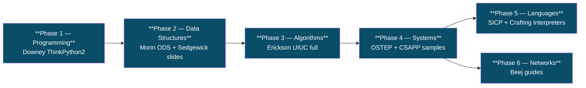

# 📚 CS Fundamentals — University-grade Free Textbooks

> **Bộ sưu tập sách CS bản gốc miễn phí từ các trường đại học lớn (Wisconsin, MIT, Stanford, UIUC, CMU, Princeton) + tác giả free-license (Downey, Morin, Chacon).** Đây là **lớp foundation sâu hơn** module F01 — dành cho bạn nào muốn full undergraduate CS rigor.

---

## 🎯 Vì sao thư mục này tồn tại?

- Module **[F01 CS Fundamentals](../../../learning/year-1-foundations/semester-1-engineering-core/F01-cs-fundamentals/)** trong chương trình học của repo này = **DE-practical subset** (18 KUs ~38k từ, đủ vốn DE engineer).
- Nhưng nếu bạn muốn **deep CS** ngang sinh viên CS chính quy → đọc thêm các sách trong folder này.
- Tất cả là **bản chính thức free** từ tác giả / trường đại học. Không có sách lậu.

---

## 📖 Tài liệu (theo nhóm)

### 1️⃣ Operating Systems — OSTEP (Wisconsin, free official)

> **Operating Systems: Three Easy Pieces** by Remzi & Andrea Arpaci-Dusseau, University of Wisconsin-Madison.
> Licence: free for personal/educational use ([source](https://pages.cs.wisc.edu/~remzi/OSTEP/)).
> 3 trụ: **Virtualization** (CPU, memory) · **Concurrency** (threads, locks) · **Persistence** (file systems).

| Section | Files |
|---|---|
| Intro + Dialogue | `OSTEP_intro.pdf`, `OSTEP_preface.pdf`, `OSTEP_dialogue-*.pdf` |
| CPU virtualization | `OSTEP_cpu-*.pdf` (intro, api, mechanisms, sched, mlfq, lottery, multi) |
| Memory virtualization | `OSTEP_vm-*.pdf` (mechanism, segmentation, freespace, paging, tlbs, smalltables, beyondphys, vax, complete) |
| Concurrency | `OSTEP_threads-*.pdf` (intro, api, locks, locks-usage, cv, sema, bugs, events) |
| Persistence | `OSTEP_file-*.pdf` (intro, devices, disks, raid, implementation, ffs, integrity, journaling, lfs, ssd, naming, distributed, nfs, afs) |
| Distributed | `OSTEP_dist-intro.pdf` |

**Mapping vào curriculum:** [F06 Computer Networks](../../../learning/year-1-foundations/semester-2-systems-theory/F06-computer-networks/) · [F09 Concurrency](../../../learning/year-1-foundations/semester-2-systems-theory/) · [F12 System Design](../../../learning/year-1-foundations/semester-2-systems-theory/F12-system-design-fundamentals/).

---

### 2️⃣ Algorithms — Erickson UIUC (CC BY 4.0, free official)

> **Algorithms** by Jeff Erickson, University of Illinois Urbana-Champaign.
> Licence: Creative Commons Attribution 4.0 ([source](https://jeffe.cs.illinois.edu/teaching/algorithms/)).
> Toàn bộ textbook ~470 trang. Rigorous proofs + practical examples.

`Erickson_2019_Algorithms_UIUC.pdf` (24 MB).

**Mapping:** [F01 KU 02 Big-O](../../../learning/year-1-foundations/semester-1-engineering-core/F01-cs-fundamentals/02-big-o-notation.md) · [F01 KU 07 Sorting](../../../learning/year-1-foundations/semester-1-engineering-core/F01-cs-fundamentals/07-sorting-algorithms.md) · [F01 KU 18 Complexity classes](../../../learning/year-1-foundations/semester-1-engineering-core/F01-cs-fundamentals/18-complexity-classes.md).

---

### 3️⃣ Algorithms (lecture slides) — Sedgewick Princeton

> Companion lecture slides cho **Algorithms 4e** của Sedgewick & Wayne, Princeton.
> Slides free để dạy/học ([source](https://algs4.cs.princeton.edu/lectures/)).

| Chủ đề | File |
|---|---|
| Fundamentals overview | `Sedgewick_Princeton_Overview.pdf` |
| Stacks & Queues | `Sedgewick_Princeton_StacksQueues.pdf` |
| Analysis of algorithms | `Sedgewick_Princeton_Analysis.pdf` |
| Elementary sorts | `Sedgewick_Princeton_ElementarySorts.pdf` |
| Mergesort / Quicksort | `Sedgewick_Princeton_Mergesort.pdf`, `Sedgewick_Princeton_Quicksort.pdf` |
| Priority queues | `Sedgewick_Princeton_PriorityQueues.pdf` |
| Symbol tables / BST | `Sedgewick_Princeton_SymbolTables.pdf`, `Sedgewick_Princeton_BST.pdf` |
| Balanced BST / Hash tables | `Sedgewick_Princeton_BalancedBST.pdf`, `Sedgewick_Princeton_HashTables.pdf` |
| Graphs (undirected / directed) | `Sedgewick_Princeton_UndirectedGraphs.pdf`, `Sedgewick_Princeton_DirectedGraphs.pdf` |
| MST / Shortest paths | `Sedgewick_Princeton_MST.pdf`, `Sedgewick_Princeton_ShortestPaths.pdf` |
| Tries / Data compression | `Sedgewick_Princeton_Tries.pdf`, `Sedgewick_Princeton_DataCompression.pdf` |
| NP-completeness | `Sedgewick_Princeton_NPCompleteness.pdf` |

**Mapping:** F01/04-07 (data structures + sorting) · F01/10 (compression) · F01/18 (NP).

---

### 4️⃣ Programming language design — SICP (MIT, CC BY-SA 4.0)

> **Structure and Interpretation of Computer Programs** by Abelson & Sussman, MIT 6.001.
> Licence: CC BY-SA 4.0 ([source](https://web.mit.edu/6.001/6.037/sicp.pdf)).
> Classic — abstractions, higher-order functions, evaluators, metalinguistic abstraction.

`Abelson-Sussman_SICP_MIT.pdf` (7 MB).

**Mapping:** [F02 Programming paradigms](../../../learning/year-1-foundations/semester-1-engineering-core/F02-programming-paradigms/) (functional, recursion, evaluators).

---

### 5️⃣ Crafting Interpreters — Nystrom (free sample)

> **Crafting Interpreters** by Robert Nystrom — full book free at craftinginterpreters.com.
> Sample PDF + full HTML free ([source](https://craftinginterpreters.com/)).

`Nystrom_CraftingInterpreters_sample.pdf`.

**Mapping:** [F02 Programming paradigms](../../../learning/year-1-foundations/semester-1-engineering-core/F02-programming-paradigms/) · [F11 Compilers/parsers](../../../learning/).

---

### 6️⃣ Data Structures — Open Data Structures (Morin, CC BY)

> **Open Data Structures** by Pat Morin (Carleton University).
> Licence: CC BY ([source](https://opendatastructures.org/)).
> 3 ngôn ngữ: Python · Java · C++.

| File | Ngôn ngữ |
|---|---|
| `Morin_OpenDataStructures_python.pdf` | Python |
| `Morin_OpenDataStructures_java.pdf` | Java |
| `Morin_OpenDataStructures_cpp.pdf` | C++ |

**Mapping:** F01/03-06 (array, linked list, hash table, tree, graph).

---

### 7️⃣ Computer Systems — CSAPP samples (CMU)

> **Computer Systems: A Programmer's Perspective** 3e by Bryant & O'Hallaron, Carnegie Mellon.
> Sample chapters + preface free ([source](https://csapp.cs.cmu.edu/)).

`CSAPP3e_preface_CMU.pdf`, `CSAPP3e_intro_CMU.pdf`, `CSAPP3e_talk_CMU.pdf`, `CSAPP2e_ch1preview_CMU.pdf`.

**Mapping:** F01/01 (bits/bytes) · F01/14 (floating point) · F01/16 (endianness).

---

### 8️⃣ Think series — Allen Downey (Olin, Free CC)

> **Think Python, Think OS, Think Stats, Think DSP** by Allen B. Downey (Olin College).
> Green Tea Press — free CC license ([source](https://greenteapress.com/)).

| File | Chủ đề |
|---|---|
| `Downey_ThinkPython2.pdf` | Python intro (đọc cùng F03) |
| `Downey_ThinkOS.pdf` | OS as a CS topic (đọc cùng OSTEP) |
| `Downey_ThinkStats2.pdf` | Statistics + probability cho ML |
| `Downey_ThinkDSP.pdf` | Digital signal processing |

**Mapping:** [F03 Modern Python](../../../learning/year-1-foundations/semester-1-engineering-core/F03-modern-python-for-data/) · [F08 OS basics](../../../learning/year-1-foundations/semester-2-systems-theory/F08-os-fundamentals/) (placeholder) · [ML foundations](../../../learning/year-2-specialization/semester-4-ai-ops-architecture/).

---

### 9️⃣ Network programming — Beej (free official)

> **Beej's Guides** by Brian "Beej" Hall — concrete C tutorials.
> Free official ([source](https://beej.us/)).

| File | Chủ đề |
|---|---|
| `Beej_NetworkProgramming_C.pdf` | Sockets, IPC sang network |
| `Beej_IPC.pdf` | Inter-Process Communication (pipes, fifo, shm, sem) |
| `Beej_C_Programming.pdf` | C reference |

**Mapping:** [F06 Networks](../../../learning/year-1-foundations/semester-2-systems-theory/F06-computer-networks/) · [D36 Network Fabric ★](../../../learning/year-2-specialization/semester-4-ai-ops-architecture/) (deeper).

---

### 🔟 Tools — Pro Git, Eloquent JavaScript

> Free + CC.

| File | Chủ đề |
|---|---|
| `Chacon_ProGit2.pdf` | Pro Git 2e — Chacon & Straub (CC BY-NC-SA) |
| `Haverbeke_EloquentJavaScript.pdf` | Eloquent JavaScript 3e — Haverbeke (CC BY-NC) |

**Mapping:** general tooling.

---

## 🗺 Reading order khuyến nghị

→ Mỗi phase đi cùng modules tương ứng trong [learning/](../../../learning/).

---

## 🔗 Liên quan

- [F01 CS Fundamentals (curriculum)](../../../learning/year-1-foundations/semester-1-engineering-core/F01-cs-fundamentals/) — module v2 university-grade Vietnamese, 18 KUs ~38k từ.
- [library MANIFEST](../../MANIFEST.md) — toàn bộ library.
- [library SCAN_INDEX](../../SCAN_INDEX.md) — scan log.

---

## ⚖️ Licence note

Tất cả file trong folder này là **bản chính thức free** từ tác giả/trường đại học. Mọi licence được giữ nguyên (CC BY 4.0, CC BY-SA 4.0, CC BY-NC, free for educational use). **Không phân phối lại — folder này là local mirror cá nhân để học.** Để dùng cho lớp học hoặc redistribute → check licence từng cuốn.
